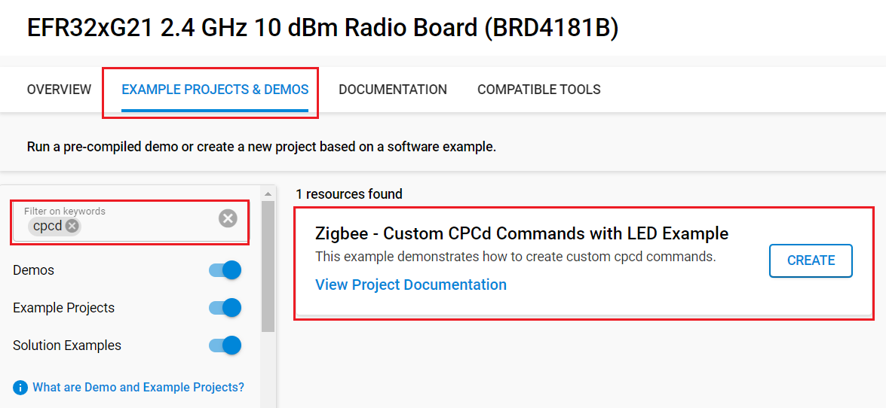
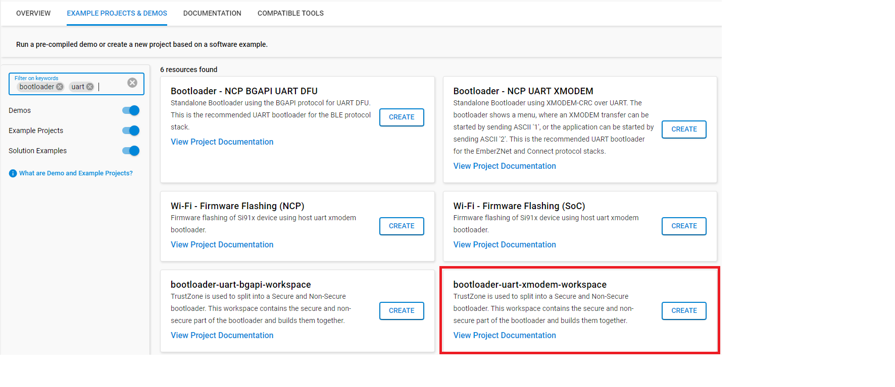
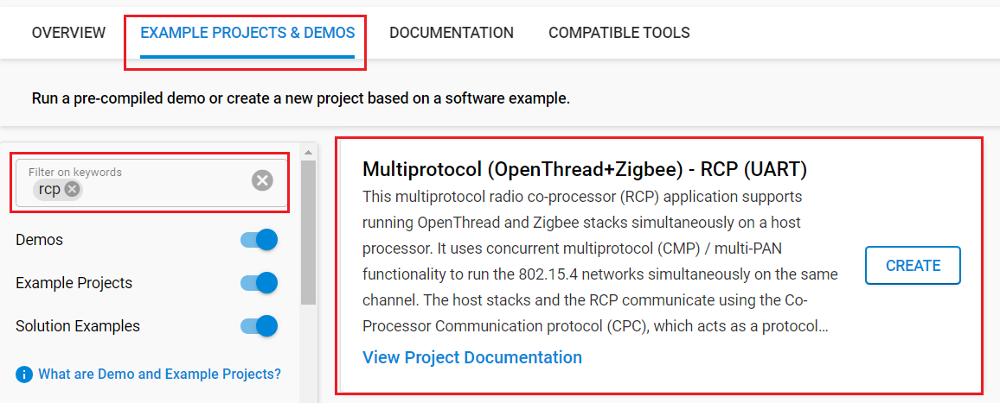

# Zigbee - Custom CPCd Command Project with LED Example #

## Overview ##

This example demonstrates how to create custom cpcd commands. The application allows the user to type either '1' or '0' from the primary (host) to turn on or off the LED on the secondary (RCP). Similarily, button 0 on the RCP will toggle the LED on the RCP. Pressing 'q' will terminate the application.

For the purpose of this example, *primary* and *host* as well as *secondary* and *RCP* will be used interchangably.

This sample application works by first initializing and connecting to cpcd via the API call: cpc_init. It then opens a user endpoint using the API call: cpc_open_endpoint.

Commands that wish to write to the RCP from the host will use: cpc_write_endpoint

When writing, the maximum buffer size is determined by the secondary and writing buffers larger than this limit will fail. This value can be queried with cpc_get_endpoint_max_write_size.

Commands that involve reading data from the RCP on the Host will use: cpc_read_endpoint

When reading, the buffer must be at least SL_CPC_READ_MINIMUM_SIZE bytes.

Both APIs will return a negative value in case of error, otherwise it will return the number of bytes read/written.

## SDK version ##

- [SiSDK v2024.12.0](https://github.com/SiliconLabs/simplicity_sdk/releases/tag/v2024.12.0)

## Software Required ##

- [Simplicity Studio v5 IDE](https://www.silabs.com/developers/simplicity-studio)

## Required Hardware ##

- 1x [BRD4002A WSTK board](https://www.silabs.com/development-tools/wireless/wireless-pro-kit-mainboard?tab=overview)
- 1x [EFR32xG21 Wireless 2.4 GHz +10 dBm Radio Board](https://www.silabs.com/development-tools/wireless/slwrb4181b-efr32xg21-wireless-gecko-radio-board?tab=overview)
- 1x Raspberry Pi 4 with CPCd installed

> [!TIP]
> Refer to [this](https://github.com/SiliconLabs/cpc-daemon/blob/main/readme.md#compiling-cpcd) to compile, install and run CPCd on Raspberry Pi

## Connections Required ##

- EFR32xG24 board (BRD4186C) connected to WPK board (BRD4002A) to form the RCP
- Connect the RCP to the Rasperry Pi 4 via UART (using the USB cable)
- SSH connection to the Raspberry Pi

## Setup ##

### On the Secondary (RCP) ###

You can either create a project based on an example project or start with a 'Zigbee - RCP' example project.

#### Create a project based on an example project ####

> [!NOTE]
> Make sure that the [zigbee_applications](https://github.com/SiliconLabs/zigbee_applications) repository is added to [Preferences > Simplicity Studio > External Repos](https://docs.silabs.com/simplicity-studio-5-users-guide/latest/ss-5-users-guide-about-the-launcher/welcome-and-device-tabs).

1. From the Launcher Home, add the BRD4186C to My Products, click on it, and click on the **EXAMPLE PROJECTS & DEMOS** tab. Find the example project filtering by "cpcd".

2. Click **Create** button on the **Zigbee - Custom CPCd Commands with LED Example** project. Example project creation dialog pops up -> click Create and Finish and Project should be generated.

   

3. Build and flash the project to the RCP board

#### Start with a Zigbee - RCP example project ####

1. Build and flash a bootloader to the BRD4186C board (in this case: bootloader-uart-xmodem)

   

2. From the Launcher Home, add the BRD4186C to My Products, click on it, and click on the **EXAMPLE PROJECTS & DEMOS** tab. Find the example project filtering by "rcp". Click **Create** button on the **Multiprotocol (OpenThread+Zigbee) - RCP (UART)**  to generate project.

   

3. Open the .slcp file. Select the **SOFTWARE COMPONENTS** tab and install the software components:

   - [OpenThread] → [Stack (RCP)] → Turn off 'MultiPAN RCP'
   - [Services] → [Co-Processor Communication] → [Secondary Device] → [CPC SECURITY NONE]
   - [Services] → [Command Line Interface] → [CLI Instance(s)] → use the instance name: example
   - [Platform] → [Driver] → [LED] → [Simple LED] → use the default instances name: **led0**
   - [Platform] → [Driver] → [Button] → [Simple Button] → use the default instances name: **btn0**

4. Copy the files from the `rcp` folder into the project root folder (overwriting existing files).

5. Build and flash the project to your board

6. Connect the RCP to the Host via UART (USB cable)

### On the Primary (Host) ###

1. Copy '*custom_cpc_host*' directory to the host. This can be done using something like *scp*
2. SSH to the host
3. Copy the *sl_cpc.h* header file from '*/usr/local/include*' to overwrite the existing one in '*custom_cpc_host*' directory
4. cd to the *custom_cpc_host* directory
5. Run the command: `sudo make -f Makefile`
6. From the current terminal, start cpcd (/usr/local/bin/cpcd)
7. Open another terminal, start the host app ( ./cpcledbutton)

## How It Works ##

1. Press any key to bring up the menu
2. press '1' or '0' on the host to turn on the led on the secondary
3. press 'btn0' on the secondary to toggle the led and notify the host
4. press 'q' to exit the application and close the endpoint
