# ZigBee - AC Clamp Meter Example #

## Overview ##
This project demonstrates how to use **AC current click** sensor with the **EFR32xG24 Explorer Kit** and integrate it into a Zigbee Home Automation (ZHA) on Home Assistant (HA) using Simplicity Studio 5. 
The application implements a Zigbee router device that periodically measures AC current, calculates power and energy values, and reports them to Home Assistant via standard Zigbee clusters. Home Assistant acts as the Zigbee coordinator via using ZHA integration and provides visualization and monitoring of the reported values.

## Table of Contents ##
- [ZigBee - AC Clamp Meter Example](#zigbee---ac-clamp-meter-example)
  - [Overview](#overview)
  - [Table of Contents](#table-of-contents)
  - [Purpose/Scope](#purposescope)
  - [How It Works](#how-it-works)
      - [Measurement and Calculation](#measurement-and-calculation) 
      - [Reporting Behavior](#reporting-behavior)
      - [Zigbee Implementation](#zigbee-implementation)
         - [Zigbee Device Role](#zigbee-device-role)
         - [Zigbee Clusters](#zigbee-clusters)
      - [User Interaction and Network Control](#user-interaction-and-network-control)
  - [Prerequisites](#prerequisites)
   - [Hardware Requirements](#hardware-requirements)
      - [Connections Required](#connections-required)
   - [Software Requirements](#software-requirements)
   - [SDK version](#sdk-version)
   - [Setup](#setup)
      - [Setting up the Raspberry Pi](#setting-up-the-raspberry-pi)
      - [Accessing Home Assistant](#accessing-home-assistant)
      - [Setting up the NCP environment](#setting-up-the-ncp-environment)
         - [Creating and Flashing the Bootloader](#creating-and-flashing-the-bootloader)
         - [Creating and Configuring the Zigbee NCP Project](#creating-and-configuring-the-zigbee-ncp-project)
         - [Adding Zigbee Home Automation Integration](#adding-zigbee-home-automation-integration)
      - [Creating the Zigbee AC Clamp Meter Application](#creating-the-zigbee-ac-clamp-meter-application)
         - [Using the Example Project](#using-the-example-project)
         - [Creating the Project from Zigbee – Minimal](#creating-the-project-from-zigbee--minimal)
      - [Commissioning the Router Device](#commissioning-the-router-device)
  - [Testing and Validation](#testing-and-validation)
    - [Attribute Reporting in Home Assistant](#attribute-reporting-in-home-assistant)
    - [Router Device Logging](#router-device-logging)
  - [Resources](#resources)
  - [Report Bugs \& Get Support](#report-bugs--get-support)

## Purpose/Scope ##
The AC Current Click is a non-invasive AC current measurement solution based on electromagnetic induction. The sensing probe consists of a split-core current transformer that clamps around a conductor, allowing current measurement without direct electrical contact.

Because the sensor is galvanically isolated and non-intrusive, it is well suited for measuring mains current or other high-voltage installations.

Using the measured AC current and a fixed nominal voltage value (230 V), this example calculates:

- Instantaneous power (W)
- Total energy consumption (Wh)

The Zigbee router device reports these values to Home Assistant using standard Zigbee clusters.

## How It Works ##
### Measurement and Calculation ###
- AC current is sampled every 1 second
- Instantaneous power is calculated using the following equation:

>                          P = U × I
Where:
- **U** is the nominal voltage (230 V)
- **I** is the measured AC current
- Each calculated power value is accumulated internally

### Reporting Behavior ###
| Parameter                 | Reporting Interval |
| ------------------------- | ------------------ |
| Average current and power | Every 10 seconds   |
| Total accumulated power   | Every 30 seconds   |

Energy consumption (kWh) is calculated by Home Assistant based on the reported power values.

### Zigbee Implementation ###
#### Zigbee Device Role ####
- **Device type**: Router
- **Network integration**: Zigbee Home Automation (ZHA)

#### Zigbee Clusters ####
| Cluster                | Purpose                                |
| ---------------------- | -------------------------------------- |
| Electrical Measurement | Reporting RMS current and active power |
| Simple Metering        | Reporting total energy consumption     |

### User Interaction and Network Control ###
The Explorer Kit push buttons are used to control Zigbee network behavior:
- **Button 0**
   - Initiates network steering to join an available Zigbee network
- **Button 1**
   - Leaves the current Zigbee network

LED indications on the Explorer Kit provide visual feedback during commissioning and network operation.

## Prerequisites ##

### Hardware Requirements ###
1. Raspberry Pi 4 Model B or Raspberry Pi 5 Model B
2. Wireless Pro Kit Mainboard (BRD4002A Rev A06)
3. EFR32xG24 Radio Board (BRD4187C)
4. EFR32xG24 Explorer Kit (BRD2703A Rev A02)
5. AC Current Click (Mikroe)
6. AC Current Sensor – 30 A (STC-013-030)

#### Connections Required ####
The following picture shows the system view of how it works.
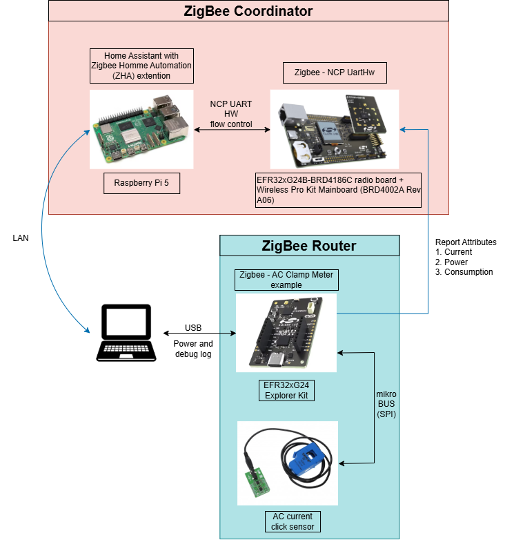

System components:
- The Raspberry Pi runs Home Assistant OS and acts as the Zigbee coordinator host
- The EFR32xG24 radio board runs the Zigbee NCP firmware
- The EFR32xG24 Explorer Kit runs the router application and interfaces with the AC Current Click via the mikroBUS SPI interface
- The Explorer Kit is powered and logged through a USB connection to a host PC

### Software Requirements ###
- Simplicity Studio 5
  - Download the [Simplicity Studio v5 IDE](https://www.silabs.com/developers/simplicity-studio)
  - Follow the [Simplicity Studio User Guide](https://docs.silabs.com/simplicity-studio-5-users-guide/1.1.0/ss-5-users-guide-getting-started/install-ss-5-and-software#install-ssv5) to install Simplicity Studio 5 IDE

## SDK version ##

- [SiSDK v2025.6.2](https://docs.silabs.com/sisdk-release-notes/2025.6.2/sisdk-release-notes-overview/)

## Setup ##
This section describes how to configure the Zigbee coordinator, Home Assistant environment, and Zigbee router application.

### Setting up the Raspberry Pi ###
1. Download and install the [Raspberry Pi Imager](https://www.raspberrypi.com/software/)
2. Launch the Raspberry Pi Imager and select your Raspberry Pi model.
3. Select the operating system:
   - Click **Choose OS**
   - Navigate to **Other specific-purpose OS** > **Home automation** > **Home Assistant**
   - Select the Home Assistant OS that matches your Raspberry Pi hardware (RPi 4, or RPi 5)
4. Select the target storage device (SD card)
   - **Note**: All existing data on the SD card will be erased.
5.  Click **Next** to write the Home Assistant OS image to the SD card.
6.  Once the process completes, eject the SD card and insert it into the Raspberry Pi.
7. Connect the following:
   - Ethernet cable (internet access required)
   - HDMI cable (optional, for console access)
   - Power supply
8.  Power on the Raspberry Pi and wait for Home Assistant OS to complete initialization.
When the following screen appears, Home Assistant will be accessible within a few minutes:
   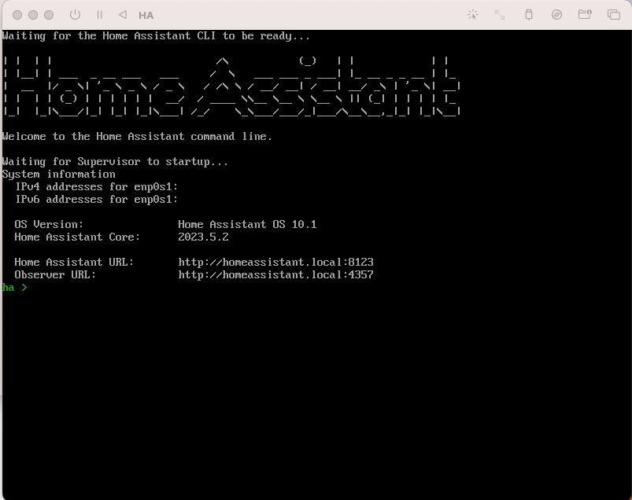

> **IMPORTANT**  
> Home Assistant provides multiple installation methods. For this example, Home Assistant Operating System is required.

> **WARNING**  
> Do not use Home Assistant Container, as add-on installation is not supported in Docker-based deployments.
> 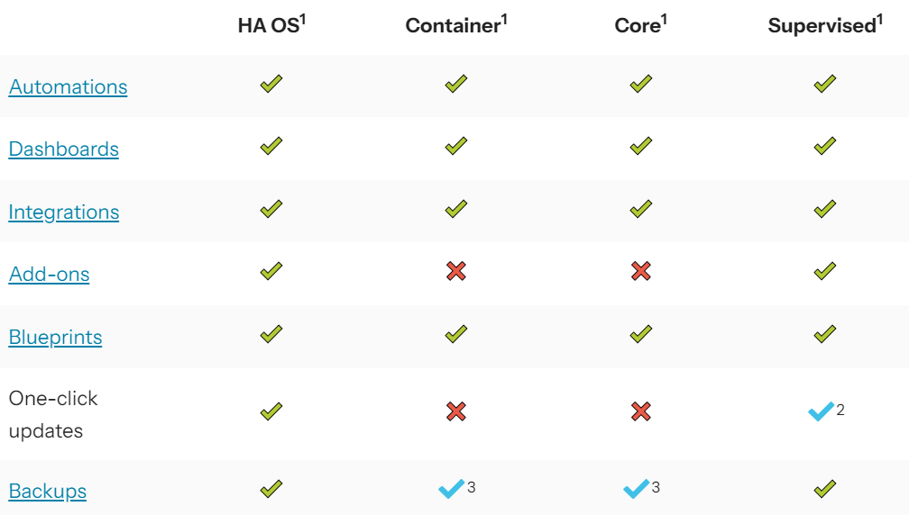

### Accessing Home Assistant ###

1. From a web browser on the same network, navigate to: http://homeassistant.local:8123
   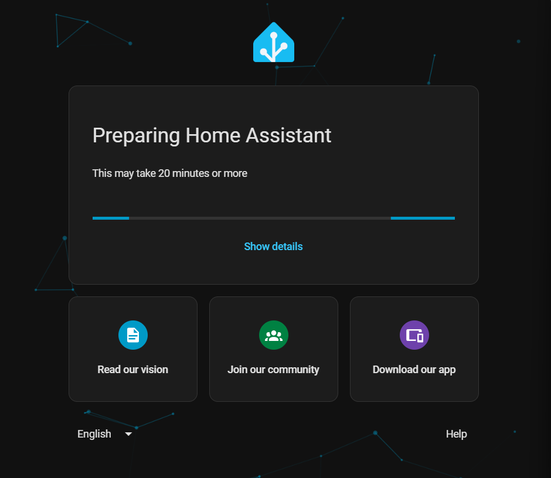
2. Complete the initial Home Assistant onboarding process:
   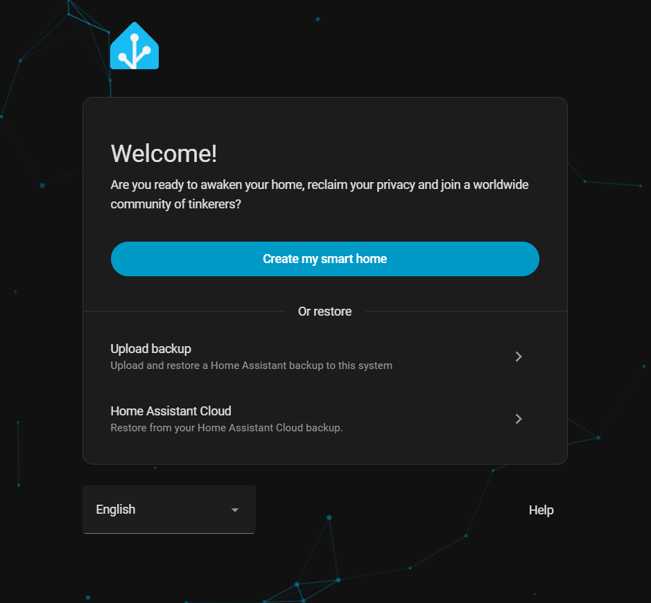
   - Select **Create My Smart Home**
   - Create a user account
   - Select the system location (used for time-based automations)
3. fter setup completes, the Home Assistant dashboard is displayed:
   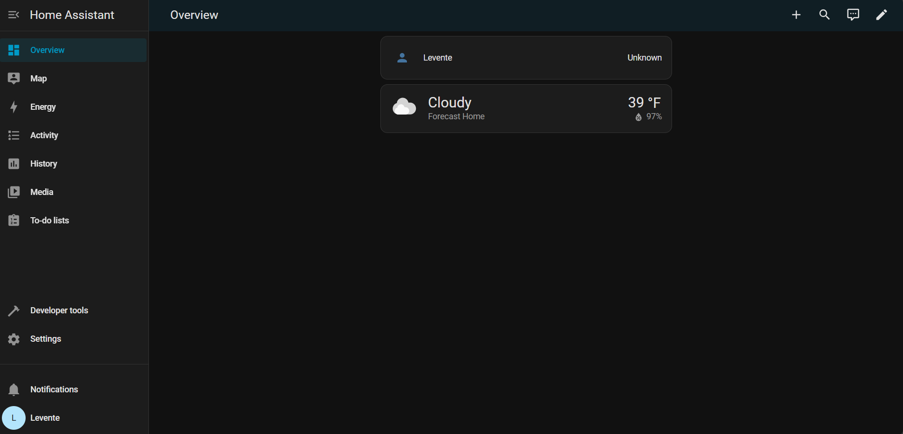
4. Open your User Profile and configure:
   - Time zone
   - Date and time format
5. Enable Advanced Mode in the user profile settings.
   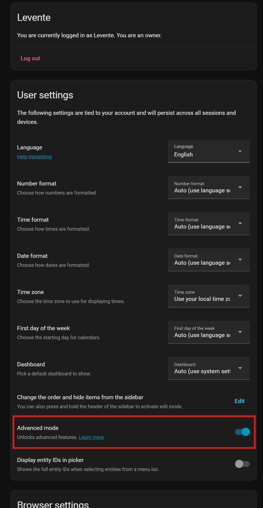

### Setting up the NCP environment ###
> **Note**  
> Example NCP configuration files for ZHA can be found in the [silabs-firmware-builder](https://github.com/NabuCasa/silabs-firmware-builder/tree/main/manifests/nabucasa) repository maintained by Nabu Casa.

#### Creating and Flashing the Bootloader ###
1. Connect the EFR32xG24 radio board to the Wireless Pro Kit Mainboard (BRD4002A).
2. Launch Simplicity Studio 5 and switch to the Launcher perspective.
   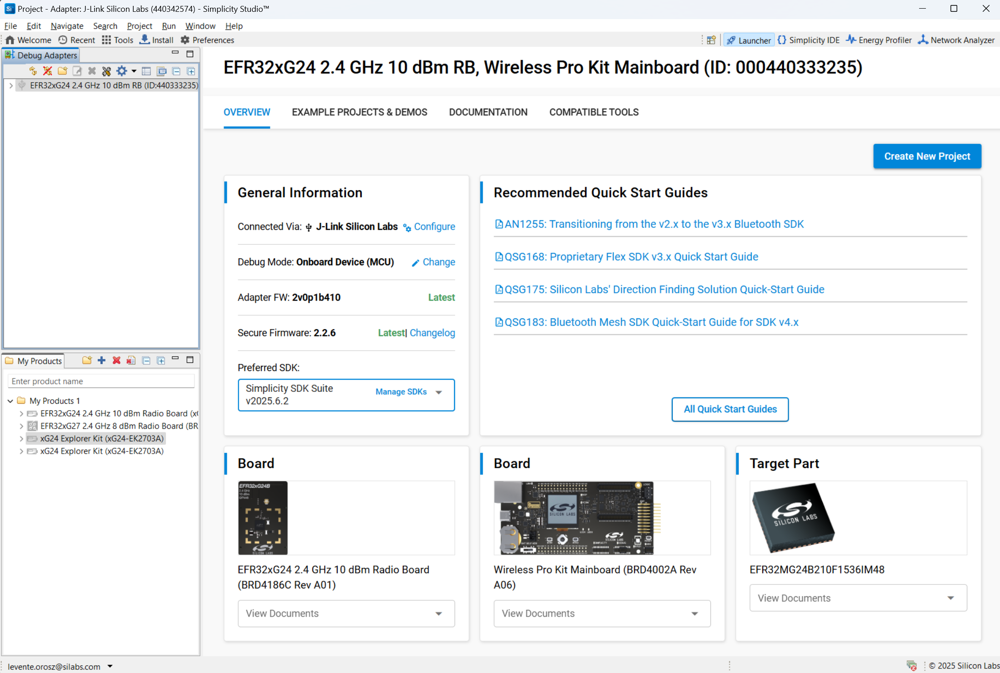
3. Navigate to **File > New > Silicon Labs Project Wizard**.
   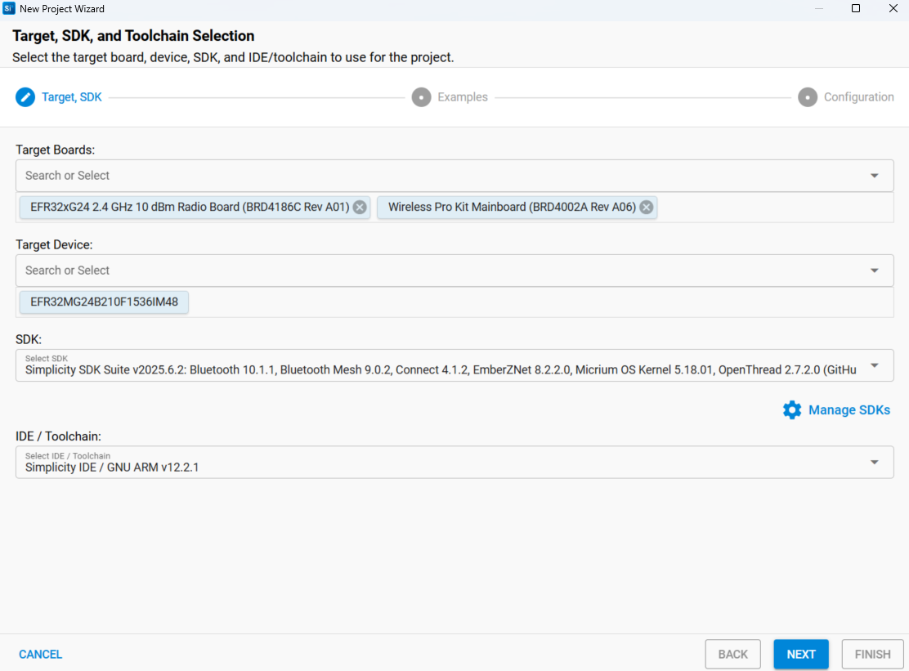
4. Select
   - **Simplicity SDK v 2025.6.x** 
   - **GNU ARM Toolchain v.12.2.x**
5. Search for **Bootloader – SoC Internal Storage bootloader**.
   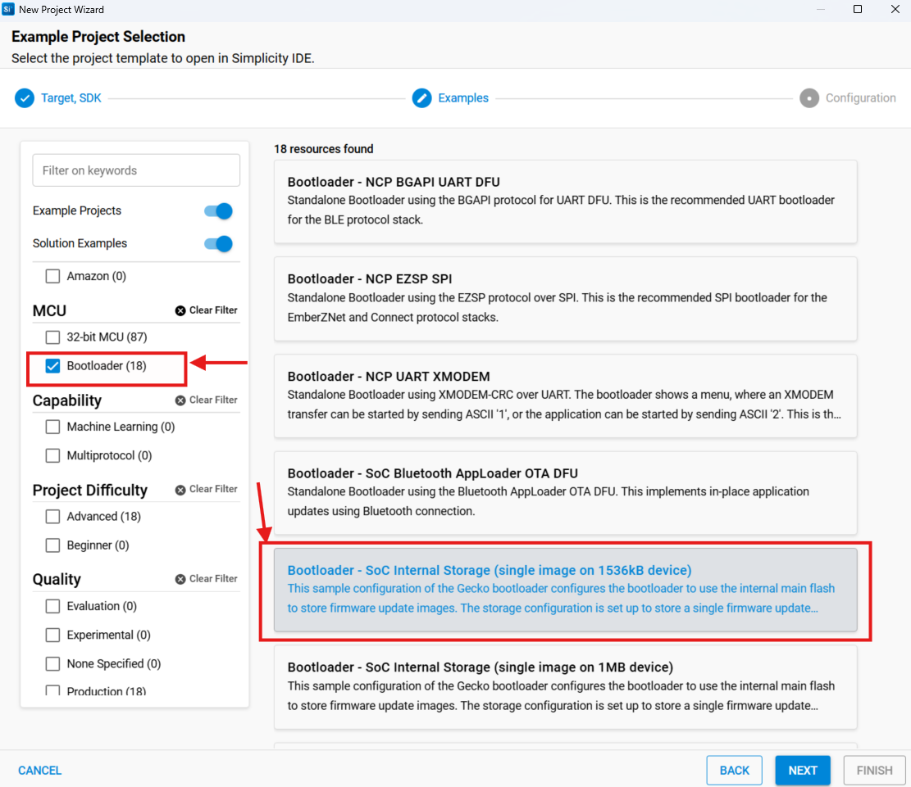
6. Create the project, build it, and flash the bootloader image to the radio board.

#### Creating and Configuring the Zigbee NCP Project ####
1. Return to the **Launcher** perspective.
2. Create a new project using the **Zigbee – NCP UartHw** example.
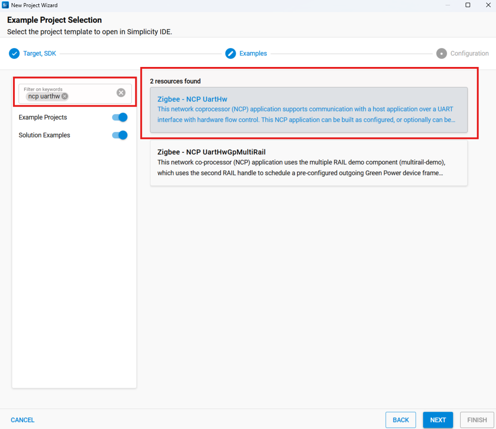
3. Open the .slcp file and modify the following software components:
   - [Zigbee] → [Stack] → [Pro Core] → [Pro Stack (Common)]
      - Address table size: `32`
      - Neighbor  table size: `26`
      - Broadcast Table Size: `64`
      - APS Unicast Message Queue Size: `64`
   - [Zigbee] → [Stack] → [Source route]
      - Source route table Size (SoC or NCP): `200`
   - [Services] → [IO Stream] → [Driver] →[IO Stream: USART]
      - Receive Buffer Size: `128`
4. Build the project and flash it to the radio board.
5. Disconnect the Wireless Starter Kit from the PC and connect it to the Raspberry Pi via USB.

#### Adding Zigbee Home Automation Integration ####
1. Open the Home Assistant frontend.
2. Navigate to **Settings > Devices & services > Add integration**.
3. Select **Zigbee Home Automation** integration.  
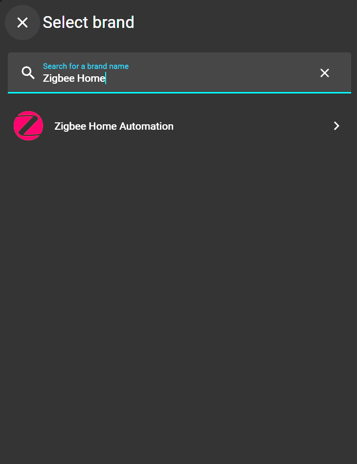
4. Select the serial port corresponding to the NCP device 
(for example: **`/dev/ttyACM0 - J-Link Pro OB - CDC, s/n: 000440333326 - Silicon Labs`**).  
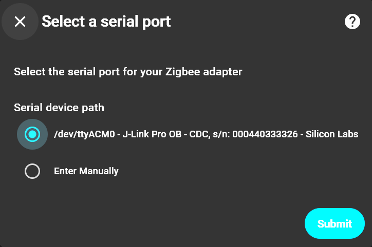
5. Choose **Set up automatically (recommended)** to create a new Zigbee network.  
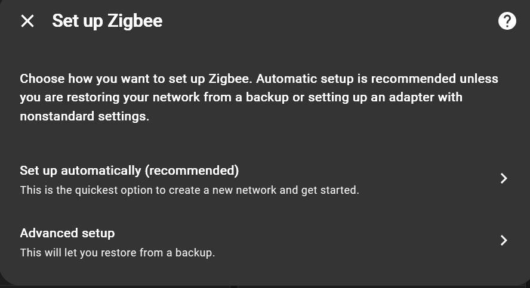
6. Complete the setup and verify that the coordinator control panel is displayed.  
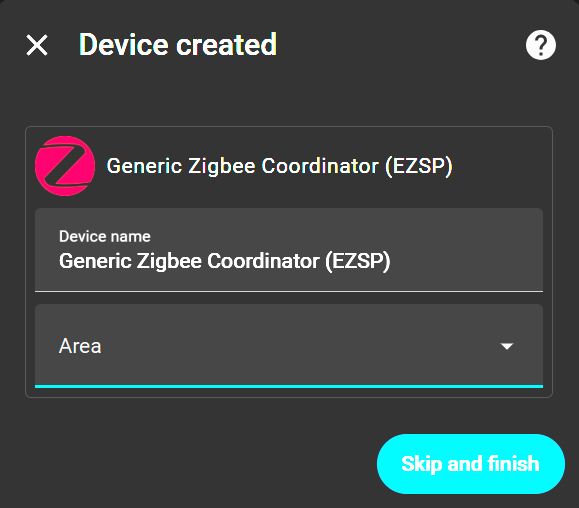
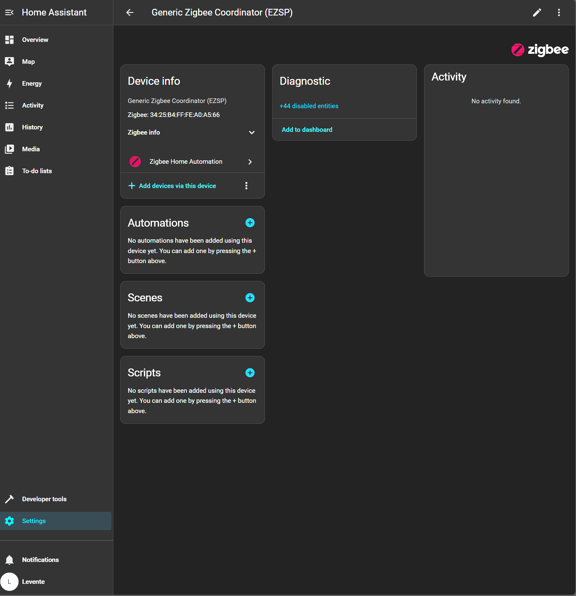

### Creating the Zigbee AC Clamp Meter Application ###
#### Using the Example Project ####
> **Note**  
> Ensure the following repository is added under [Preferences > Simplicity Studio > External Repos](https://docs.silabs.com/simplicity-studio-5-users-guide/latest/ss-5-users-guide-about-the-launcher/welcome-and-device-tabs#example-projects-demos-tab):
> - [zigbee_applications](https://github.com/SiliconLabs/zigbee_applications)
>
>Check that the following repository is added to Simplicity SDK as SDK extention [Preferences > Simplicity Studio > SDKs > Simplicity SDK Suite v2025.6.2](https://github.com/SiliconLabsSoftware/third_party_hw_drivers_extension/tree/bca3dd9cdb8e5f3871a3efdefcde315f13739c1e?tab=readme-ov-file#how-to-add-to-simplicity-studio-ide) 
> - [third_party_hw_drivers_extention v4.4.1](https://github.com/SiliconLabsSoftware/third_party_hw_drivers_extension/releases/tag/v4.4.1)
> 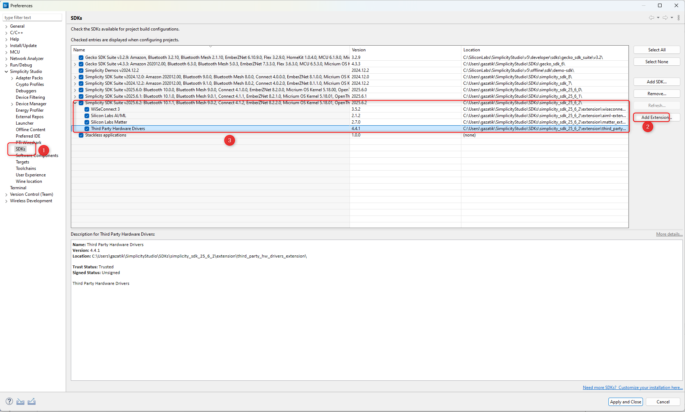

1. Connect the **EFR32xG24 Explorer Kit** to the PC.
2. In Simplicity Studio, open **Example Projects & Demos**.
3. Search for **Zigbee – AC Clamp Meter Example** and create the project.
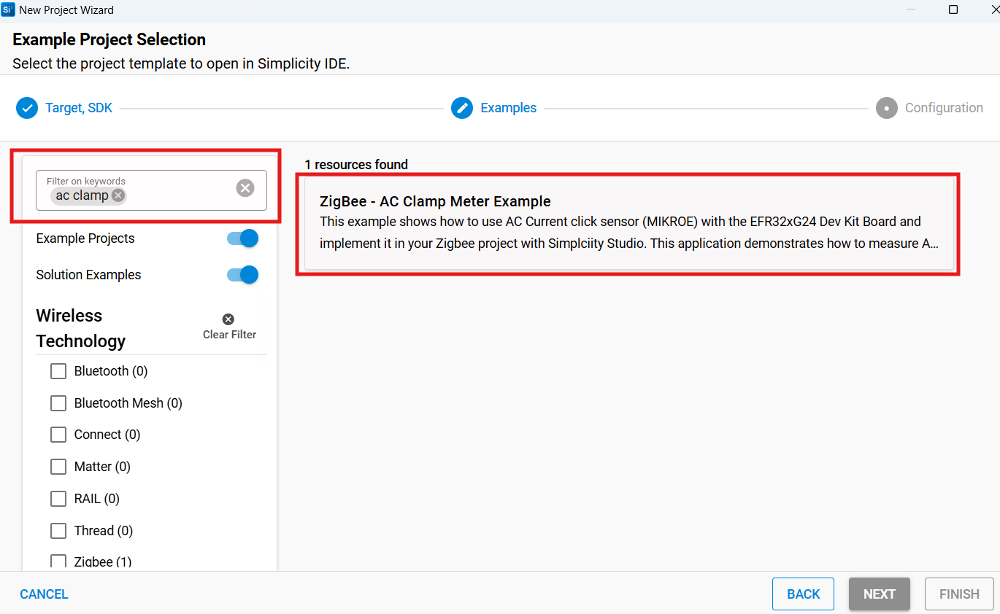
4. Build and flash the project to the Explorer Kit.

>**Note**  
>The bootloader is required for this example.

#### Creating the Project from Zigbee – Minimal ####
1. Create a **Zigbee - Minimal** project.
2. Copy the contents of the `src` and  `inc` directories into the project root.
3. Open the `.slcp` file:
   - Select the **SOFTWARE COMPONENTS** tab 
   - Disable all filters
   - Enable the Third Party Hardware Driver extension
   - Install the required software components:
      - [Third Party Hardware Drivers] → [Sensors] → [AC Current Click (Mikroe)]
      - [Platform] → [Driver] → [Button] → [Simple Button] → use default instance name: btn0 and btn1
      - [Zigbee] → [Utility] → [Zigbee Device Config] → change [Primary Network Device Type] to 'Coordinator or Router'
      - [Zigbee] → [Cluster Library] → [Common] → [Reporting]
      - [Zigbee] → [Cluster Library] → [Common] → [Basic Server Cluster]
      - [Zigbee] → [Cluster Library] → [Smart Energy] → [Simple Metering Server]
      - [Zigbee] → [Zigbee 3.0] → [Find and Bind Initiator]
      - [Zigbee] → [Zigbee Light Link] → [ZLL Identify Server]

4. Replace the existing **zcl_config.zap** file in the `config/zcl` folder with the provided `config/zcl` folder configuration.
5. Build and flash the project.

### Commissioning the Router Device ##
1. Prepare the AC measurement setup:
   - Power the target load
   - Clamp the sensor around the phase conductor
2. In Home Assistant, navigate to Zigbee Home Automation → Add Device.
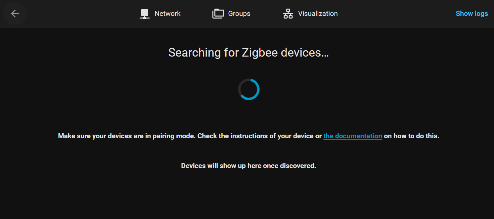
3. Press **Button 0** on the Router device to start network steering.
4. When commissioning completes:
   - The device LED stops blinking
   - The device appears in the ZHA interface
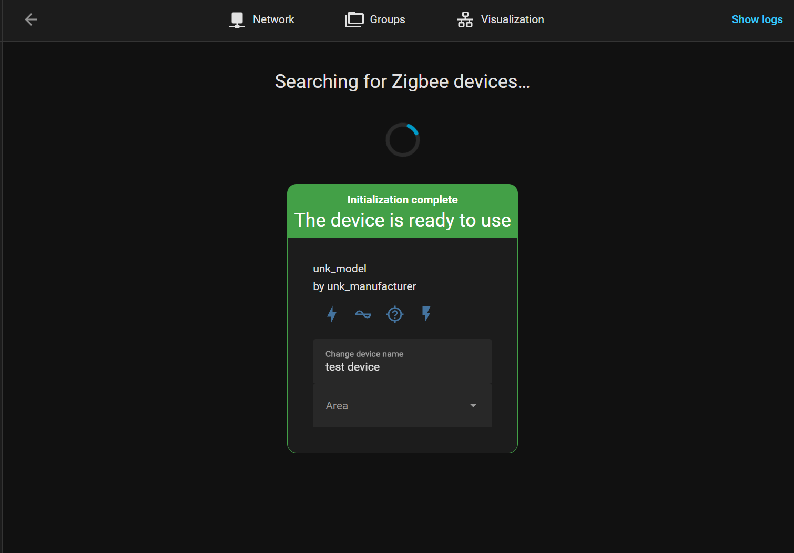
5. Assign a device name and verify the device is listed.
6. Go back to the ZHA panel and check that the device is appeared on the page:
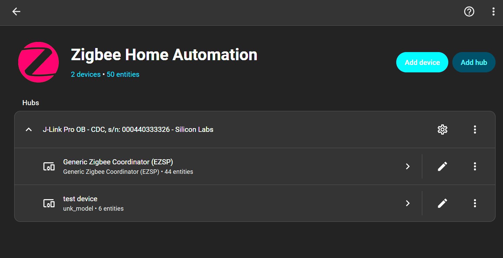

## Testing and Validation ##
### Attribute Reporting in Home Assistant ###
Once joined to the network, open the device in the ZHA interface.
- **Current and Power** are updated every **10 seconds**
- **Energy Consumption** is updated every **30 seconds**

Current values are reported in **mA**. To correct the display unit in Home Assistant:

1. Open the **Current** in the Sensors panel
2. Click the settings icon
3. Set **Unit of measurement** to mA
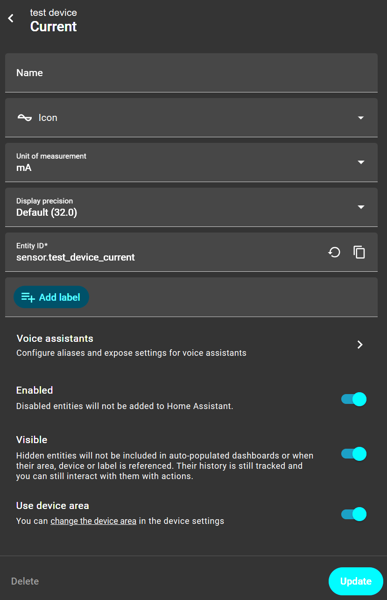

The power consumtion is reported in kWh so if you want to see the exact value then you need to modify the unit of measurement as you did in case of the current.

When the device leaves the network, all attributes are shown as **Unavailable**.
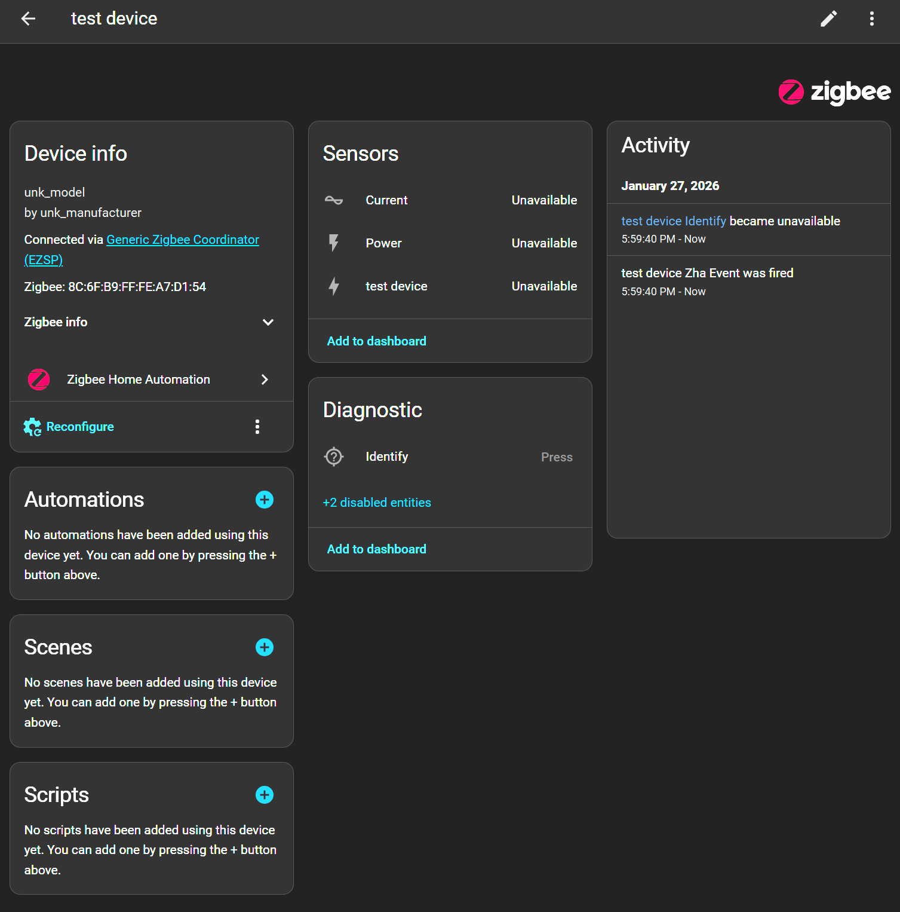

### Router Device Logging ###
All measurement and reporting steps are logged via the serial CLI interface. These logs can be observed using a serial terminal connected to the Explorer Kit.

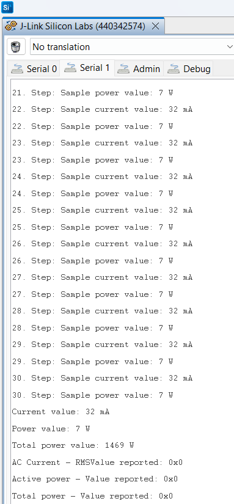

## Resources ##
- [AC Current Click](https://www.mikroe.com/ac-current-click)
- [AC Current sensor](https://www.mikroe.com/ac-current)
- [Home Assistant website](https://www.home-assistant.io/getting-started/concepts-terminology/)
- [silabs-firmware-builder](https://github.com/NabuCasa/silabs-firmware-builder/tree/main/manifests/nabucasa)
- [Raspberry Pi Imager](https://www.raspberrypi.com/software/)
- [Simplicity Studio v5 IDE](https://www.silabs.com/developers/simplicity-studio)
- [Simplicity Studio User Guide](https://docs.silabs.com/simplicity-studio-5-users-guide/1.1.0/ss-5-users-guide-getting-started/install-ss-5-and-software#install-ssv5)
- [SiSDK v2025.6.2](https://docs.silabs.com/sisdk-release-notes/2025.6.2/sisdk-release-notes-overview/)

## Report Bugs & Get Support ##
You are always encouraged and welcome to report any issues you find via the [Silicon Labs Community](https://www.silabs.com/community)