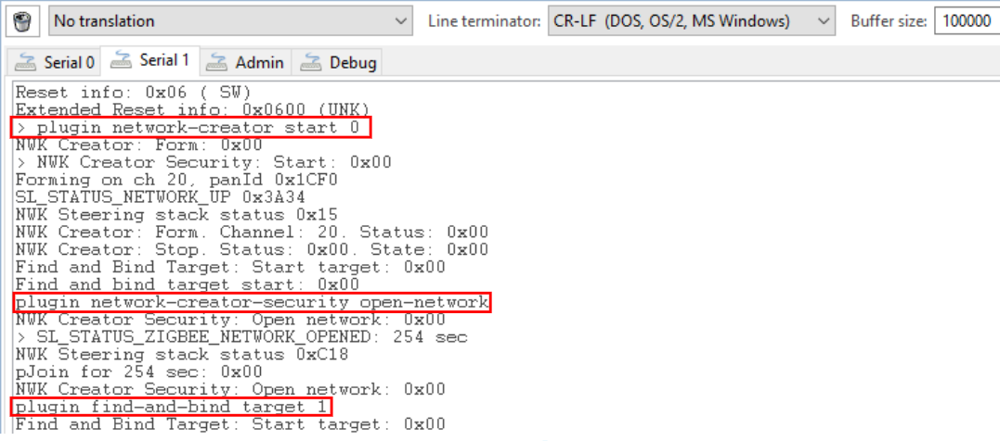

# Zigbee - Battery Monitor #

## Summary ##

This project aims to implement a Zigbee Battery Monitor application that supports Silicon Labs series 2 integrated with the Zigbee wireless stack.

Here is how the application works:

### End Device Operation ###

1. Utilize the PRS to link the radio signal `Radio Tx Complete` with a GPIO pin, causing the GPIO pin to go high when a packet is transmitted.
2. Configure the GPIO to generate an interrupt upon a high-level signal.
3. Upon interrupt service, trigger an event to initiate IADC reading.
4. Both the PRS channel and the GPIO pin are configurable.
5. The end device periodically sends a power configuration report to the coordinator.

### Coordinator Device Operation ###

1. The Coordinator periodically receives reports from the end device.
2. Analyze the power configuration report to determine the battery voltage.

## SDK version ##

- [SiSDK v2025.6.0](https://github.com/SiliconLabs/simplicity_sdk/releases/tag/v2025.6.0)

## Software Required ##

- [Simplicity Studio v5 IDE](https://www.silabs.com/developers/simplicity-studio)

## Hardware Required ##

- 2 x [BRD4002A Wireless Pro Kit Mainboard](https://www.silabs.com/development-tools/wireless/wireless-pro-kit-mainboard?tab=overview)
- 2 x Silicon Labs Series 2 radio board that are capable of Zigbee, such as: [BRD4183A](https://www.silabs.com/development-tools/wireless/slwrb4183a-efr32xg22-wireless-gecko-radio-board?tab=overview)
- 1 x CR2302 Battery

## Connections Required ##

The following picture shows how to connect the hardware for this application.

## Setup ##

### Zigbee Coordinator - Power Configuration Client ###

To create a Coordinator, you can either create a project based on an example project or start with a "Zigbee - Minimal" project based on your hardware.

#### **Create the Zigbee Coordinator based on an example project** ####

> [!NOTE]
> Make sure that the [zigbee_applications](https://github.com/SiliconLabs/zigbee_applications) repository is added to [Preferences > Simplicity Studio > External Repos](https://docs.silabs.com/simplicity-studio-5-users-guide/latest/ss-5-users-guide-about-the-launcher/welcome-and-device-tabs).

1. From the Launcher Home, add your hardware to My Products tabs, click on it, and click on the EXAMPLE PROJECTS & DEMOS tab. Find the example project filtering by "battery monitor coordinator".

2. Create a **Zigbee - Battery Monitor Coordinator** project in Simplicity Studio. This example projects creation dialog pops up -> click Create and Finish and the project should be generated.

3. Build and flash this example to your board.

   

> [!TIP]
> Currently, the project appears for tested devices. It is expected to work with other devices, provided that they are Zigbee and SiSDK capable, please refer to the section right below to create this project from "Zigbee - Minimal" for other devices.

#### **Create a Zigbee Coordinator with a "Zigbee - Minimal" project** ####

1. Create a **Zigbee - Minimal** project in Simplicity Studio.

2. Copy the file `src/coordinator/app.c` into the project root folder (overwriting existing file).

3. Open the .slcp file:

   - Select the **SOFTWARE COMPONENTS** tab and install these software components:
     - [Zigbee] → [Zigbee 3.0] → [Find and Bind Target]
     - [Zigbee] → [Zigbee 3.0] → [Network Creator]
     - [Zigbee] → [Zigbee 3.0] → [Network Creator Security]
     - [Zigbee] → [Utility] → [Zigbee Device Config] → change [Primary Network Device Type] to 'Coordinator or Router'
     - [Zigbee] → [Bootloader] → [Zigbee Application Bootloader] → Uninstall

4. Copy the **zcl_config.zap** file in the `config/coordinator/zcl` folder into the `config/zcl` folder in your project (overwriting existing).

5. Build and flash this project to your board.

### Zigbee Sleepy End Device - Power Configuration Server ###

To create a Sleepy End Device, you can either create a project based on an example project or start with a "Zigbee - Minimal" project based on your hardware.

#### Create a Zigbee Sleepy End Device project based on an example project ####

> [!NOTE]
> Make sure that the [zigbee_applications](https://github.com/SiliconLabs/zigbee_applications) repository is added to [Preferences > Simplicity Studio > External Repos](https://docs.silabs.com/simplicity-studio-5-users-guide/latest/ss-5-users-guide-about-the-launcher/welcome-and-device-tabs).

1. From the Launcher Home, add your hardware to My Products, click on it, and click on the **EXAMPLE PROJECTS & DEMOS** tab. Find the example project filtering by "battery monitor".

2. Based on your hardware, the **Zigbee - Battery Monitor End Device** will appear. Click **Create** button on it. This example projects creation dialog pops up -> click Create and Finish and the project should be generated.

   

3. Open the 'battery_monitor.c' file, change the channel, Port, and Pin to be compatible with your board.

   

4. Build and flash this example to your board.

> [!TIP]
> Currently, the project appears for tested devices. It is expected to work with other devices, provided that they are Zigbee and SiSDK capable, please refer to the section right below to create this project from "Zigbee - Minimal" for other devices.

#### Create a Zigbee Sleepy End Device project with a "Zigbee - Minimal" project ####

1. Create a **Zigbee - Minimal** project in Simplicity Studio.

2. Copy all attached files in the `src/end_device` folder into the project root folder (overwriting existing)

3. Open the 'battery_monitor.c' file, change the channel, Port, and Pin corresponding with PRS module on your board.

   

4. Open the .slcp file:

   - Select the **SOFTWARE COMPONENTS** tab and install these software components:
     - [Zigbee] → [Stack] → [Pro Core] → uninstall [Pro Stack]
     - [Zigbee] → [Stack] → [Pro Core] → install [Pro Leaf Stack]
     - [Zigbee] → [Zigbee 3.0] → [Network Steering]
     - [Zigbee] → [Zigbee 3.0] → [Find and Bind Initiator]
     - [Zigbee] → [Cluster Library] → [Common] → [Reporting]
     - [Zigbee] → [Utility] → [Zigbee Device Config] → change [Primary Network Device Type] to 'Sleepy End Device'
     - [Zigbee] → [Utility] → [End Device Support]
     - [Zigbee] → [Bootloade] → [Zigbee Application Bootloader] → Uninstall

5. Copy the **zcl_config.zap** file in the `config/end_device/zcl` folder into the `config/zcl` folder in your project (overwriting existing).

6. Build and flash this project to your board.

## How It Works ##

1. **Form** a network with the coordinator, also **open the network** and **bind** with the incoming device at the same time with the following command.

    *plugin network-creator start 0*

    *plugin network-creator-security open-network*

    *plugin find-and-bind target 1*

   

2. In the sleepy end device side, start to join into the network and bind endpoint 1 of the sleepy end device to the coordinator by the following command.

    *plugin network-steering start 0*

   

3. After joining the network, the sleepy end device will periodically report its battery voltage in less than 10 seconds.

   
