# Zigbee - Door Lock Tutorial #


## Overview ##

This lab demonstrates how to create a Door Lock & Door Controller application in Simplicity Studio 5.10. In this lab, the trainee will learn how to create a project, do some simple configurations, use events and tokens, as well as learn about how callbacks are structured within the EmberZNet 8.1.1 framework.

## SDK version ##

- [Simplicity SiSDK v2024.12.2](https://github.com/SiliconLabs/simplicity_sdk/releases/tag/v2024.12.2)

## Hardware Required ##

3x WSTK (BRD4001), 3x EFR32MG21 Radio Board (BRD4180B)

## Connections Required ##

Connect the radio boards to the WSTK mainboards. Connect your device via serial connection to a computer.

## Setup ##

> [!NOTE]
> Make sure that the [zigbee_applications](https://github.com/SiliconLabs/zigbee_applications) repository is added to [Preferences > Simplicity Studio > External Repos](https://docs.silabs.com/simplicity-studio-5-users-guide/latest/ss-5-users-guide-about-the-launcher/welcome-and-device-tabs).

## Door Lock Demo Projects ##

This tutorial will go over how to build these applications from scratch, but there are demo applications that already exist that have the same functionality.

From the Launcher Home, add your hardware to My Products, click on it, and click on the EXAMPLE PROJECTS & DEMOS tab. Find the example project with the filter "lock".
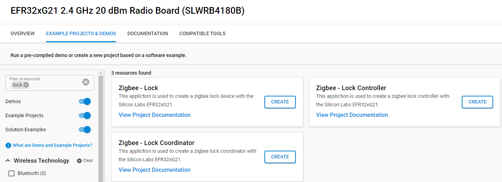  
If you want to use the demo application you can click CREATE and build the project and flash it to your board. The rest of the tutorial will go over how to build this application from Zigbee Minimal

## Building Zigbee Door Lock Coordinator, Zigbee Lock Controller, and Zigbee Lock ##

### Create Zigbee Lock Coordinator: zigbee_lock_coordinator ###

First Launch Simplicity Studio. In the Launcher Tab choose the device of your choice and click "Start". Click on "Create New Project"
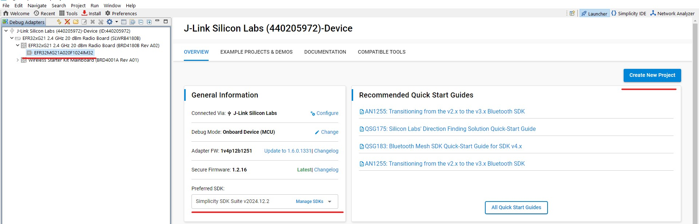  
Click on the "Zigbee" checkbox on the left

Select the "ZigbeeMinimal" project

Click "Next"->Rename the project “zigbee_lock_coordinator”

Click on "Finish" to create your project.
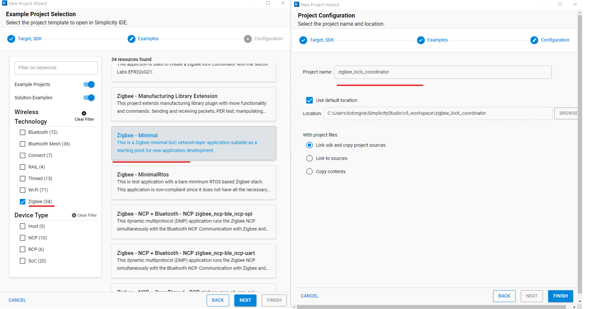

Configure the Zigbee Device

In the Project Configurator click on "Software Components" to see all the components installed in the zigbee_lock_coordinator.

In the search box type "Zigbee Device Config" and click on the Configure button in the Zigbee Device Config component.

In the "Primary Network Device Type" select "Coordinator or Router"

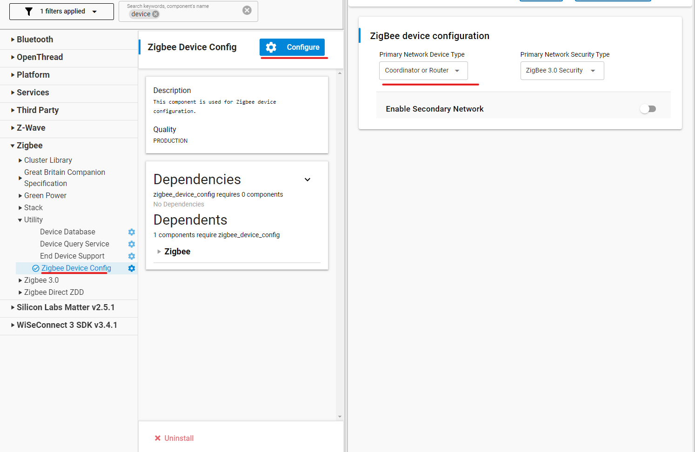

Configure Endpoint

Back to zigbee_lock_coordinator.slcp, select “CONFIGURATION TOOLS” box in the top bar, open “ZCL Advanced Platform (ZAP)”.

Select the ZCL Advanced Platform (ZAP) and click Open. Click on “EDIT ENDPOINT”. In the Device box, search “HA Home Gateway” and Click SAVE

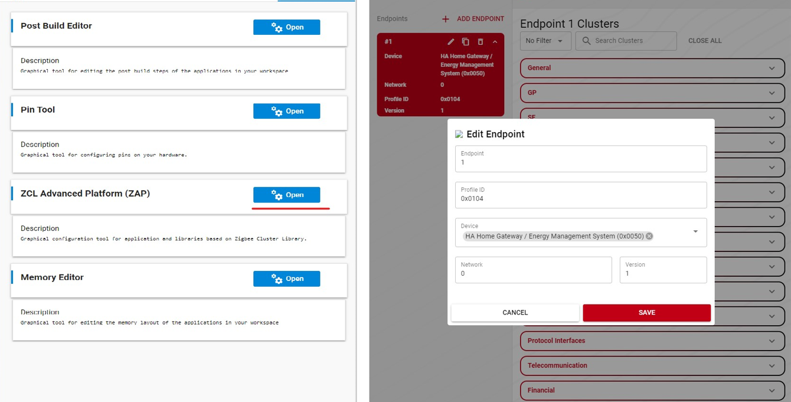

We have now successfully added an endpoint. In the main screen, click on the General dropdown to see the enabled clusters.

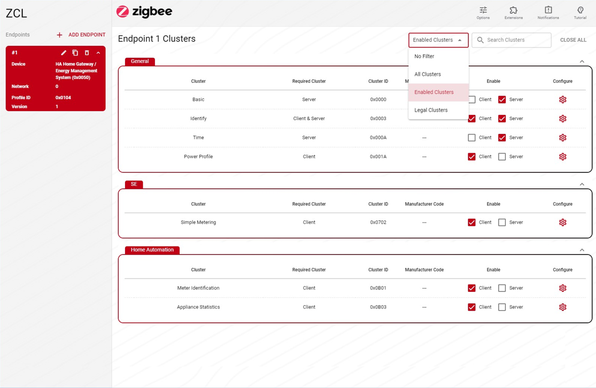

>[!Important]
>Once you have finished configuring the clusters in the ZAP Tool, make sure to SAVE the configuration.

Configure the Component

- Open the .slcp file in the project. Select the *SOFTWARE COMPONENTS* tab.
  - Install the following components:  
    - **[Zigbee] → [Cluster Library] -> [Common] → [Basic Server Cluster]** component.

    - **[Zigbee] → [Cluster Library] -> [Common] → [Identify Feedback]** component.

    - **[Zigbee] → [Network Form and Join] → [Scan Dispatch]** component.

    - **[Zigbee] → [Stack] → [ Security Link Keys]** component.

    - **[Zigbee] → [Stack] → [ Source Route]** component.

    - **[Zigbee] → [Zigbee 3.0] → [Network Creator]** component.

    - **[Zigbee] → [Zigbee 3.0] → [Network Creator Security]** component.

    - **[Zigbee] → [Zigbee 3.0] → [Network Steering]** component.

    - **[Zigbee] → [Zigbee 3.0] → [Update TC Link Key]** component.

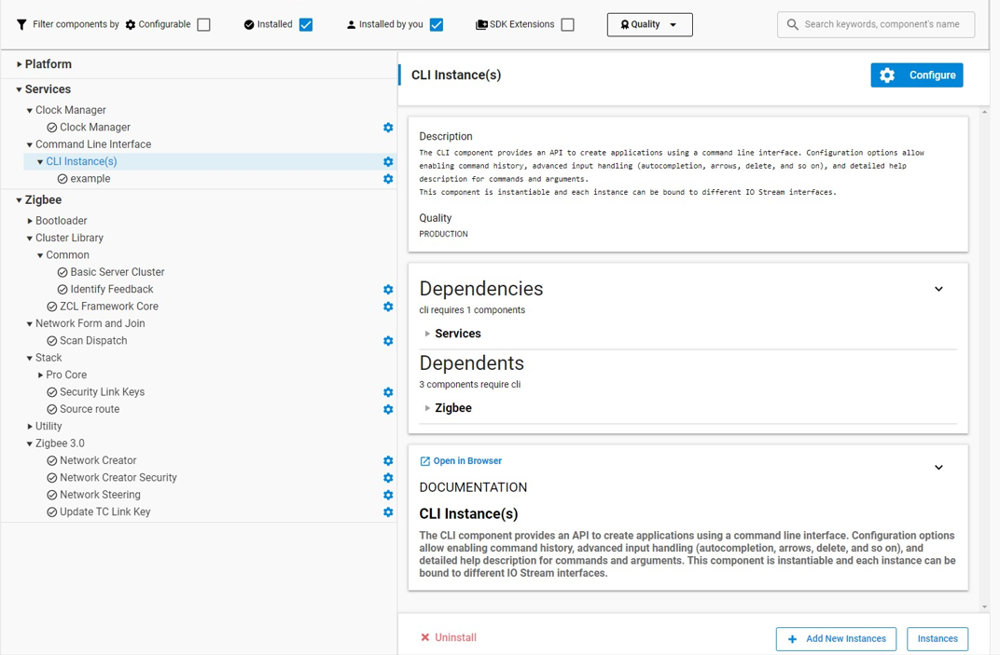

Save and build project

## Create Zigbee Lock Controller: zigbee_lock_controller ##

Launch Simplicity Studio. In the launcher Tab choose the device of your choice and click "Start". Click on "Create New project"

Click on the "Zigbee" checkbox on the left

Select the "ZigbeeMinimal" project

Click "Next"->Rename the project “zigbee_lock_controller”

Click on "Finish" to create your project.
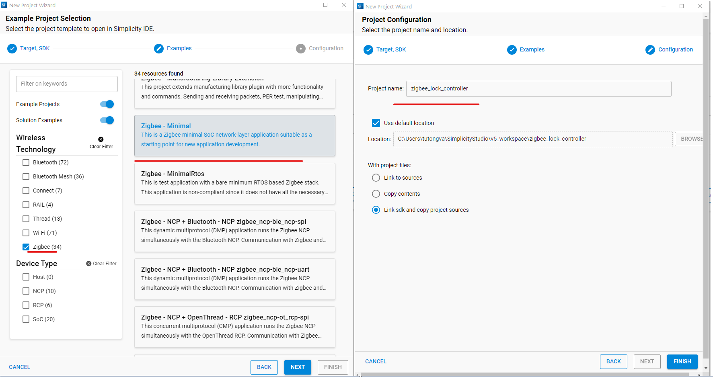

Configure the Zigbee Device

In the Project Configurator click on "Software Components" to see all the components installed in the zigbee_lock_controller.

In the search box type "Zigbee Device Config" and click on the Configure button in the Zigbee Device Config component.

In the "Primary Network Device Type" select "Router"

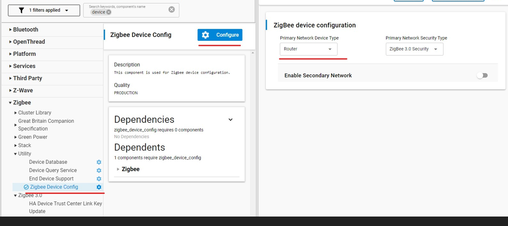

Configure Endpoint

Back to zigbee_lock_controller.slcp, select “CONFIGURATION TOOLS” box in the top bar, open “ZCL Advanced Platform (ZAP)”.

Click on “EDIT ENDPOINT”. In the Device box, search “HA Door Lock Controller” and Click SAVE

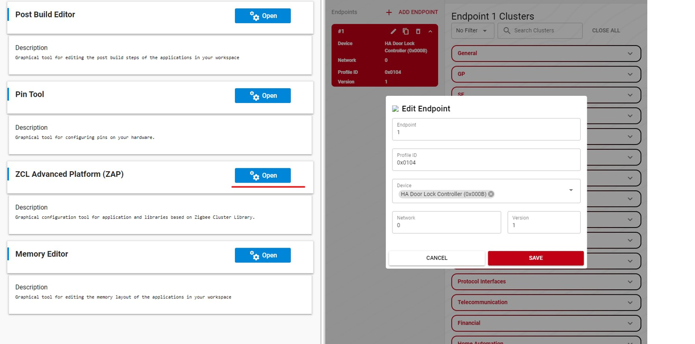

Expand “Closures”, then Click on the Gear of “Door Lock” to configure the proprieties

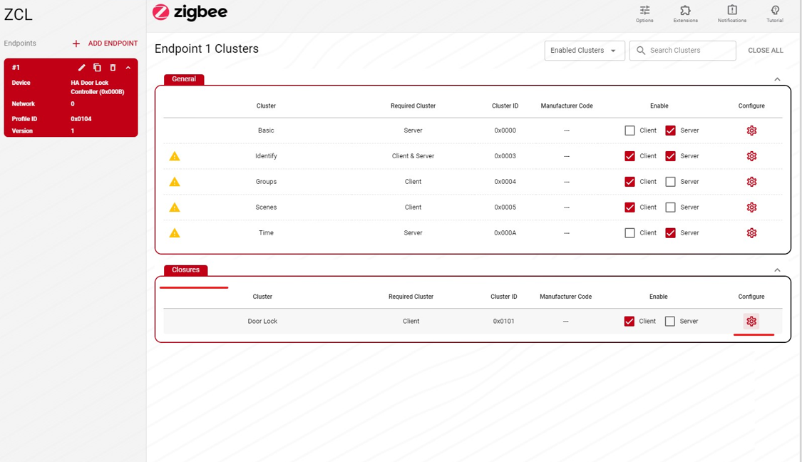

Click on “COMMANDS” , ensure that the “In” boxes are checked for the follows commands

- LockDoor
- UnlockDoor
- LockDoorResponse
- UnlockDoorResponse
- SetPinResponse
- GetPinResponse
- ClearPinResponse

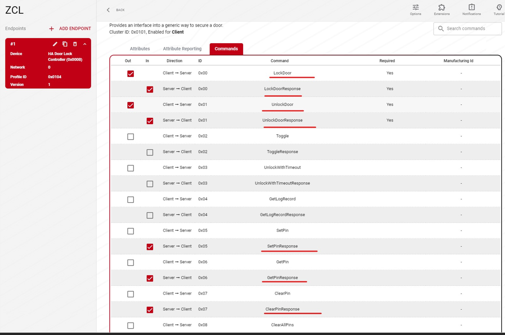

**Save the project.**

Configure the Component

- Open the .slcp file in the project. Select the *SOFTWARE COMPONENTS* tab.

  - Install the following components:
    - **[Zigbee] → [Cluster Library] -> [Common] → [Basic Server Cluster]** component.
    - **[Zigbee] → [Cluster Library] -> [Common] → [Identify Cluster]** component.
    - **[Zigbee] → [Cluster Library] -> [Common] → [Identify Feedback]** component.
    - **[Zigbee] → [Network Form and Join] → [Scan Dispatch]** component.
    - **[Zigbee] → [Stack] → [ Security Link Keys]** component.
    - **[Zigbee] → [Stack] → [ Source Route]** component.
    - **[Zigbee] → [Zigbee 3.0] → [Find and Bind Initiator]** component.
    - **[Zigbee] → [Zigbee 3.0] → [Network Steering]** component.
    - **[Zigbee] → [Zigbee 3.0] → [Update TC Link Key]** component.

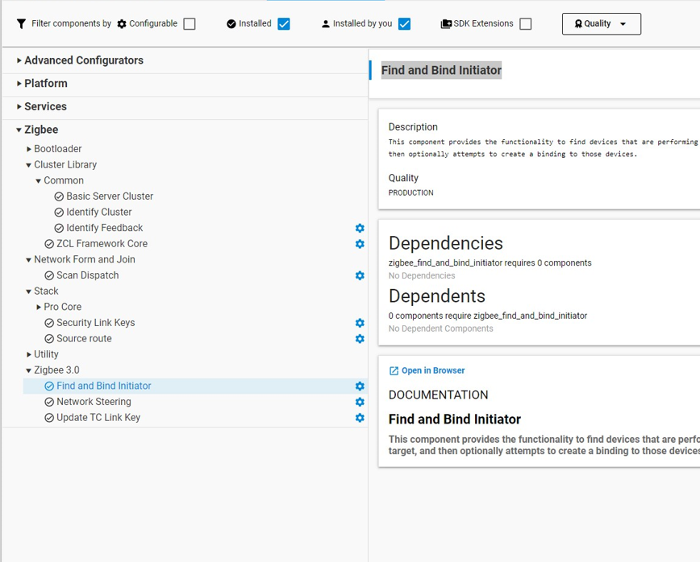

Save and build project

## Create Zigbee Lock: zigbee_lock ##

Launch Simplicity Studio. In the launcher Tab choose the device of your choice and click "Start". Click on "Create New project"


Click on the "Zigbee" checkbox on the left

Select the "ZigbeeMinimal" project

Click "Next"->Rename the project “zigbee_lock”

Click on "Finish" to create your project.

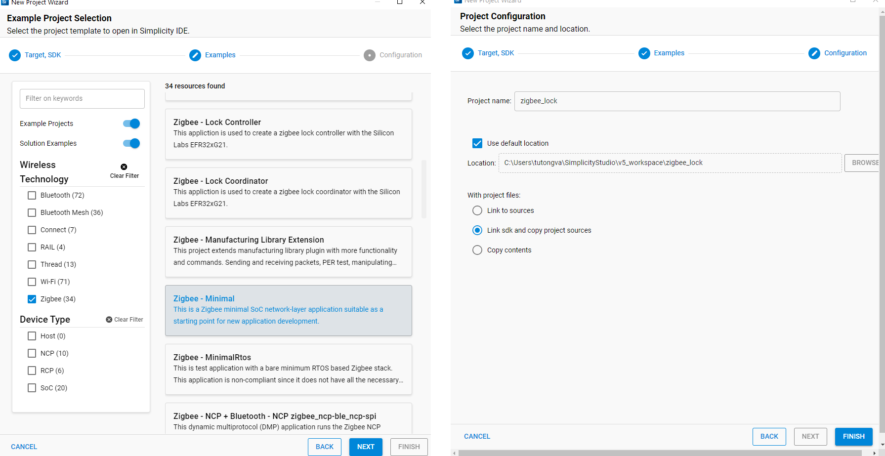

Configure the Zigbee Device

First uninstall the Zigbee Pro Stack Library Component. Then Install the Zigbee Pro Leaf Library Component.

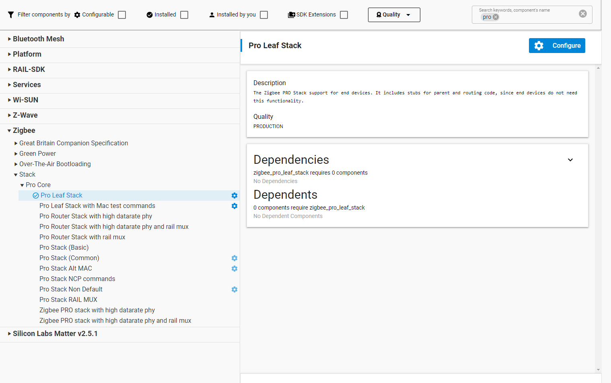

Set the zigbee_lock as an End Device.

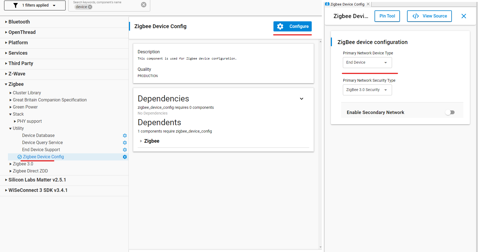

Configure Endpoint

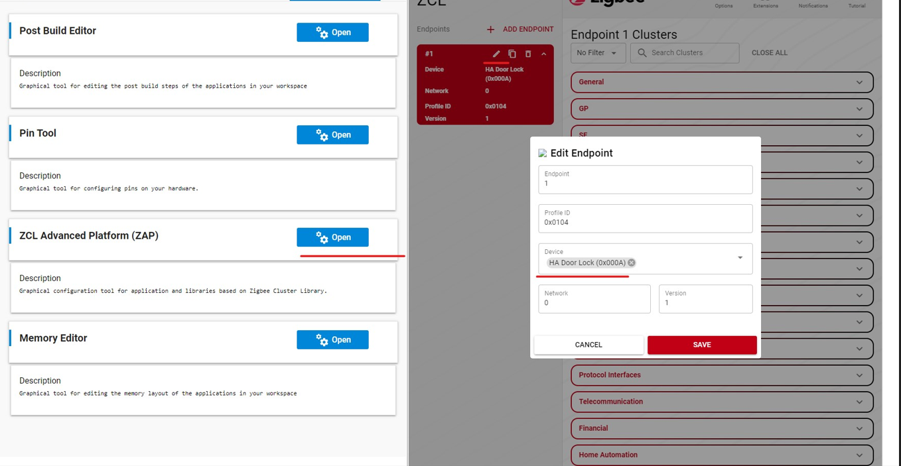

Configure “Door Lock” cluster.

- In the “ATTRIBUTES” table enable
  - lock state
  - lock type
  - actuator enabled
  - max pin length
  - min pin length
  - send pin over the air

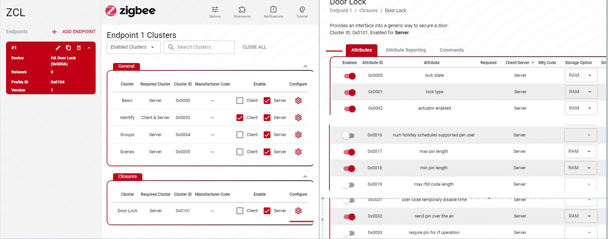

- In the “COMMANDS” enable
  - LockDoor
  - UnLockDoor
  - SetPin
  - GetPin
  - ClearPin

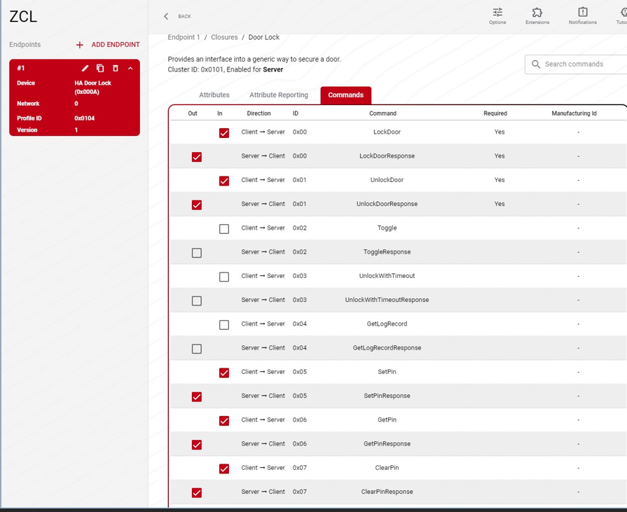

Once the cluster is configured in the ZAP Tool, save the configuration.

Migrate back to the SLCP file and click on "Software Components" to see all the components installed in the zigbee_lock.

Configure the Component

- Open the .slcp file in the project. - Select the *SOFTWARE COMPONENTS* tab.
  - Install the following components:
    - **[Zigbee] → [Cluster Library] -> [Common] → [Basic Server Cluster]** component.
    - **[Zigbee] → [Cluster Library] -> [Common] → [Identify Cluster]** component.
    - **[Zigbee] → [Network Form and Join] → [Scan Dispatch]** component.
    - **[Zigbee] → [Stack] → [ Security Link Keys]** component.
    - **[Zigbee] → [Stack] → [ Source Route]** component.
    - **[Zigbee] → [Zigbee 3.0] → [Find and Bind Initiator]** component.
    - **[Zigbee] → [Zigbee 3.0] → [Find and Bind Target]** component.
    - **[Zigbee] → [Zigbee 3.0] → [Network Steering]** component.
    - **[Zigbee] → [Zigbee 3.0] → [Update TC Link Key]** component.

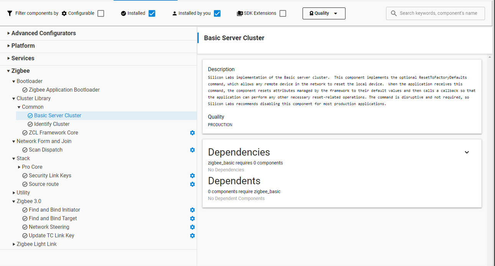

> [!IMPORTANT]
> To program the lock functionality in this demo, please make sure the “Door Lock Server Cluster” Component is not installed.

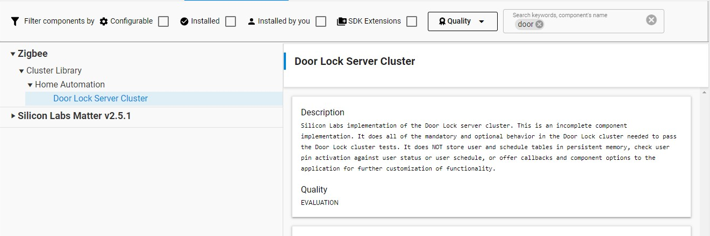

Save the zigbee_lock project.

>**Callbacks**

For more detailed information on callbacks in Simplicity SDK, please see section 6 of UG491: Zigbee Application Framework Developer’s Guide for SDK 7.0 and Higher.  

In this lab, we will work with 5 separate functions.  

    ·   sl_zigbee_af_door_lock_cluster_lock_door_cb: The function will process the incoming lock cluster commands and then verify the pin. If the pin is correct, it will set the LED on and return true.

    ·   sl_zigbee_af_door_lock_cluster_unlock_door_cb: The function will process the unlock command, then verify the pin. If the pin is correct, it will set LED off and return true.

    ·   sl_zigbee_af_door_lock_cluster_set_pin_cb : The function will process the set pin command, then verify the pin length. If the pin is in the min-max range, it will put the pin in the token.

    ·   sl_zigbee_af_door_lock_cluster_get_pin_cb: The function will process the get pin command, it will return the pin from the token.

    ·   sl_zigbee_af_door_lock_cluster_clear_pin_cb: The function will process the clear pin command, it will set the default pin in the token and there will be no active pin saved in the device.

Note that all the code in this section will be added into the app.c file.

>**Subscribing to Specific Commands**

Before we can associate a callback with a specific command, we will need to “subscribe” to the command. This will ensure that the application “listens” for the command passed into the sl_zigbee_subscribe_to_zcl_commands function as an argument.

Include the zap-id.h  and sl_simple_led_instances.h files in the app.c file. These files contain the necessary ZCL macro definitions. In the sl_zigbee_af_main_init_cb function, we must add a call as follows:

```c
sl_zigbee_subscribe_to_zcl_commands(ZCL_DOOR_LOCK_CLUSTER_ID,
0xFFFF,
ZCL_DIRECTION_CLIENT_TO_SERVER,
sl_zigbee_af_door_lock_cluster_server_command_parse);
```

>**Parsing the Lock cluster server Commands**

Next let us add a function that will parse the incoming lock cluster commands and calls a separate processing function if we receive the “ZCL” command.  

The function receives a ZCL command and checks the command ID, and then it will pass it to the next callback in the chain. See the example implementation below.

```c
uint32_t sl_zigbee_af_door_lock_cluster_server_command_parse (sl_service_opcode_t opcode,sl_service_function_context_t *context)

{


  (void)opcode;

  bool wasHandled = false;

  uint8_t* PIN;

  sl_zigbee_af_cluster_command_t *cmd =(sl_zigbee_af_cluster_command_t *)context->data;

  uint16_t payloadOffset = cmd->payloadStartIndex;


  if (!cmd->mfgSpecific) {

      switch (cmd->commandId) {

        case ZCL_LOCK_DOOR_COMMAND_ID:
        {
           sl_led_turn_on(&sl_led_led0);

           PIN = sl_zigbee_af_get_string(cmd->buffer, payloadOffset, cmd->bufLen);

           wasHandled = sl_zigbee_af_door_lock_cluster_lock_door_cb(PIN);

           break;

         }

         case ZCL_UNLOCK_DOOR_COMMAND_ID:

         {

             PIN = sl_zigbee_af_get_string(cmd->buffer, payloadOffset, cmd->bufLen);

             wasHandled = sl_zigbee_af_door_lock_cluster_unlock_door_cb(PIN);

             break;

          }

         case ZCL_SET_PIN_COMMAND_ID:

         {

             PIN = sl_zigbee_af_get_string(cmd->buffer, payloadOffset+4, cmd->bufLen);

             wasHandled = sl_zigbee_af_door_lock_cluster_set_pin_cb(PIN);

             break;

         }

         case ZCL_GET_PIN_COMMAND_ID:

         {

            wasHandled = sl_zigbee_af_door_lock_cluster_get_pin_cb(1);

            break;

         }

         case ZCL_CLEAR_PIN_COMMAND_ID:

         {

            wasHandled = sl_zigbee_af_door_lock_cluster_clear_pin_cb(1);
            break;
         }

      }
  }
      return ((wasHandled)

                ? SL_ZIGBEE_ZCL_STATUS_SUCCESS

                : SL_ZIGBEE_ZCL_STATUS_UNSUP_COMMAND);

}
```

>**Cluster init Callback**

At the beginning of the program, we must initialize the Door Lock Cluster. This will write the maximum and minimum allowable length of the door lock pin.

```c
void sl_zigbee_af_main_init_cb(void){
  doorLockPin_t initPin = DOOR_LOCK_DEFAULT_PIN;
  boolean isPinInUse = FALSE;

  sl_zigbee_af_cluster_init_cb (DOOR_LOCK_ENDPOINT,
                             ZCL_DOOR_LOCK_CLUSTER_ID);


  // Set the pin tokens
  halCommonSetToken(TOKEN_DOOR_LOCK_PIN, &initPin);
  halCommonSetToken(TOKEN_DOOR_LOCK_PIN_IN_USE, &isPinInUse);

  sl_led_init(&sl_led_led0);
  sl_zigbee_subscribe_to_zcl_commands(ZCL_DOOR_LOCK_CLUSTER_ID,
                                      0xFFFF,
                                      ZCL_DIRECTION_CLIENT_TO_SERVER,
                                      sl_zigbee_af_door_lock_cluster_server_command_parse);
} 

```

>**Tokens**

With the new project configurator, we must now define tokens through the Token Manager component.

>**Enabling Custom Tokens**

    ·   We will now add some custom tokens to the project in order to track the pin-in-use status and door-lock-pin. 
    ·   To do this, we must navigate to the Token manager component and define the token in here.
    ·   Next, we must enable custom tokens. To do so, click on the Configure button in the upper-right corner. 

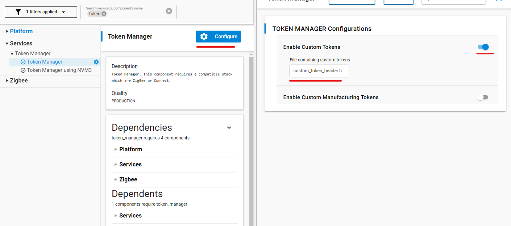

Note that we can choose in which file to define our custom tokens. In this case, we will leave the value as the default.

The file can be found in the “config” folder of the project files.

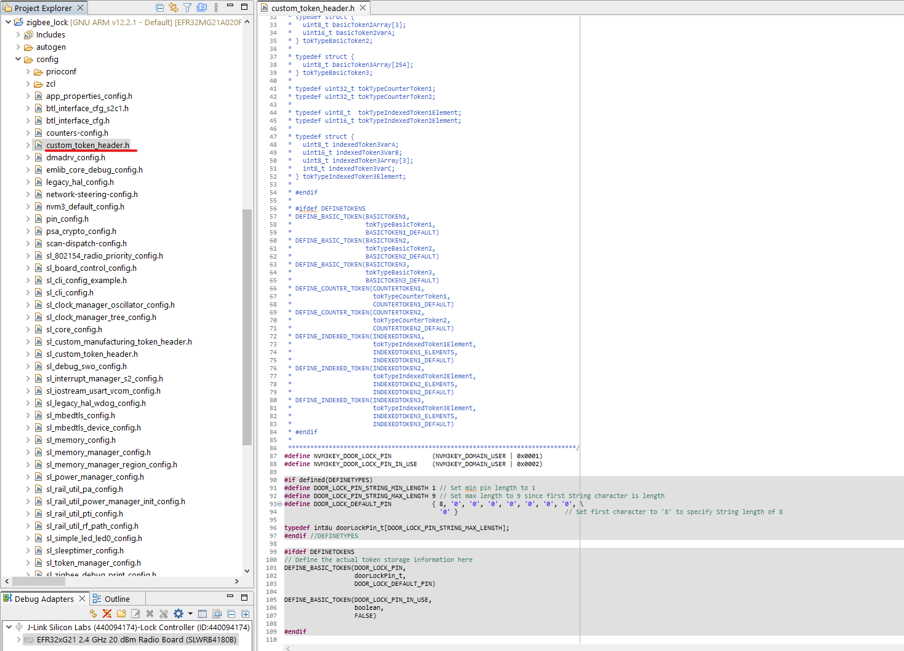

In the file, you will need to define the types used for the tokens.

>**Door Lock Pin**

In order to store the Door Lock Pin through the life of the application and through power cycles, we will define a token to store the value of the PIN.

First, we need to define the actual token at the beginning of the file

```c
#define NVM3KEY_DOOR_LOCK_PIN (NVM3KEY_DOMAIN_USER | 0x0001)
```

This will tell EmberZNet to allocate a token named DOOR_LOCK_PIN in the user domain.

We must define our pin length and the default pin. This pin will not be used until the user specifies the value of the pin. Right now this value doesn't matter, so we can set it to a list placeholder for for now. (This is technically a valid pin, but we will consider it as a placeholder until the user specifies a 1-to-8 digit numeric PIN). In the defined(DEFINETYPES) preprocessor block we can add the following.

```c
#define DOOR_LOCK_PIN_STRING_MIN_LENGTH 1 // Set min pin length to 1
#define DOOR_LOCK_PIN_STRING_MAX_LENGTH 9 // Set max length to 9 since first String character is length
#define DOOR_LOCK_DEFAULT_PIN { 8, '0', '0', '0', '0', '0', '0', '0', '0' } // Set first character to '8' to specify String length of 8
```

Next, we can define our pin type. We will define an int8u array as our pin (in the defined(DEFINETYPES) preprocessor block):

```c
typedef int8u doorLockPin_t[DOOR_LOCK_PIN_STRING_MAX_LENGTH];
```

In the DEFINETOKENS preprocessor macro block, you can add the line

```c
DEFINE_BASIC_TOKEN(DOOR_LOCK_PIN,

                   doorLockPin_t,

                   DOOR_LOCK_DEFAULT_PIN)
```

This will tell EmberZNet to define a token named DOOR_LOCK_PIN of type doorLockPin_t, with the default value of DOOR_LOCK_DEFAULT_PIN.

>**Door Lock Pin In Use**

We will also need to store a boolean variable as a flag to determine if the pin should be used or not. We will define the Door Lock Pin In Use for this purpose. As above, we first define the token in the user domain. This declaration should be at the line after the definition of NVM3KEY_DOOR_LOCK_PIN.

```c
#define NVM3KEY_DOOR_LOCK_PIN_IN_USE  (NVM3KEY_DOMAIN_USER | 0x0002)
```

Finally, since no typedef is needed, we will directly define the token in the DEFINETOKENS preprocessor block and assign a default value of FALSE.

```c
DEFINE_BASIC_TOKEN(DOOR_LOCK_PIN_IN_USE,

                   boolean,

                   FALSE)
```

For the complete version of the code, please refer to src/sl_custom_token_header.h
>**Utilities**

Check Door Lock Pin Helper Function
The only helper function we will need is a function to verify the PIN. This function will take as input an int8u array (the input pin) and it will check it against the stored pin token.

This function should also check the value of isPinInUse to ensure that the pin has been set by the user. If it has not, the function will return TRUE no matter what the input PIN is. We can define the function as below. This should be added to the app.c file, don't forget to add the function prototype at the beginning of the file.

```c
/** @brief Check Door Lock Pin
 *
 * This function checks if the door lock pin is correct. It will return TRUE if
 * the pin is correct or the pin token is set to the default pin and FALSE if
 * the pin is not correct.
 *
 * @param PIN
 */
// function to check the input pin is the correct one
boolean checkDoorLockPin(int8u* PIN)
{
  bool isPinCorrect = FALSE;
  bool isPinInUse = FALSE;
  uint8_t maxPinLength;
  uint8_t minPinLength;
  doorLockPin_t storedPin;

  halCommonGetToken(&isPinInUse, TOKEN_DOOR_LOCK_PIN_IN_USE);

  if (isPinInUse)
    sl_zigbee_app_debug_println("Lock pin in use \n");
  else
    sl_zigbee_app_debug_println("Lock pin Not in use \n");

  // Get the Max Pin Length to DOOR_LOCK_PIN_STRING_MAX_LENGTH
  sl_zigbee_af_read_server_attribute(DOOR_LOCK_ENDPOINT,
                              ZCL_DOOR_LOCK_CLUSTER_ID,
                              ZCL_MAX_PIN_LENGTH_ATTRIBUTE_ID,
                              &maxPinLength,
                              ZCL_DATA8_ATTRIBUTE_TYPE);

  // Get the Min Pin Length to DOOR_LOCK_PIN_STRING_LENGTH
  sl_zigbee_af_read_server_attribute(DOOR_LOCK_ENDPOINT,
                             ZCL_DOOR_LOCK_CLUSTER_ID,
                             ZCL_MIN_PIN_LENGTH_ATTRIBUTE_ID,
                             &minPinLength,
                             ZCL_DATA8_ATTRIBUTE_TYPE);

  // If no pin is initialized, we will return TRUE
  if (isPinInUse == TRUE)
  {
      // Get the Pin from the token
      halCommonGetToken(&storedPin, TOKEN_DOOR_LOCK_PIN);

      // First check that the PIN is within the min and Max range
      if ((storedPin[0] <= maxPinLength) && (storedPin[0] >= minPinLength))
      {
          // Check the input pin against the stored pin
          int8_t result = memcmp(storedPin, PIN, storedPin[0]);

          if (result == 0)
          {
              isPinCorrect = TRUE;
          }
      }

  }
  else
  {
      isPinCorrect = TRUE;
  }

  return isPinCorrect;
}

```

>**Defines and Typedefs**

For practicality and reuse, we will assume that we are using endpoint 1 for the Door Lock. These code snippets can be added to app.c.

```c
#define DOOR_LOCK_ENDPOINT 1 // We will use endpoint 1 for this example
```

We will also need to define an enum for the values of the ZCL attribute Door Lock State.

```c
typedef enum {
  DOOR_NOT_FULLY_LOCKED = 0x00,
  DOOR_LOCKED = 0x01,
  DOOR_UNLOCKED = 0x02,
  DOOR_UNDEFINED=0xFF
} doorLockState_t;
doorLockState_t doorLockStatus;
```

>**Implementing the Callbacks**

These callbacks make use of the EmberZNet API to read attributes, write attributes, construct messages, and send messages.

>**sl_zigbee_af_door_lock_cluster_lock_door_cb**

This function is called by the application framework when the node receives a Lock Door Command.

This function will lock the door if the pin is correct or there is no pin defined, as well as send a Door Lock Response with status SUCCESS if the lock operation is successful. If the pin is incorrect, it will not lock the door and send a Door Lock Response with status FAILURE.

We can implement this function as below:

```c
/** @brief Door Lock command callback function
 *
 * This function lock the door if the door lock pin is correct.
 * It will return TRUE if the pin is correct or the pin token is set to
 * the default pin and FALSE if the pin is not correct.
 *
 * @param PIN
 */
boolean sl_zigbee_af_door_lock_cluster_lock_door_cb(int8u* PIN)
{


    // Check if the pin is correct
    boolean isPinCorrect = checkDoorLockPin(PIN);

    if (isPinCorrect == TRUE)
    {
        doorLockStatus = DOOR_LOCKED;
        //light on LED to simulate the lock
        sl_led_turn_on(&sl_led_led0);

        // We will set the Door Lock State attribute to "Locked"
        sl_zigbee_af_write_server_attribute(DOOR_LOCK_ENDPOINT,
                                             ZCL_DOOR_LOCK_CLUSTER_ID,
                                             ZCL_LOCK_STATE_ATTRIBUTE_ID,
                                             &doorLockStatus,
                                             ZCL_ENUM8_ATTRIBUTE_TYPE);


        // Send a Door Lock Response with status success
        sl_zigbee_af_fill_command_door_lock_cluster_lock_door_response(SL_ZIGBEE_ZCL_STATUS_SUCCESS);
        sl_zigbee_af_send_response();
    }
    else
    {
      // If the pin is incorrect, send a Door Lock Response with status failure
        sl_zigbee_af_fill_command_door_lock_cluster_lock_door_response(SL_ZIGBEE_ZCL_STATUS_FAILURE);
      sl_zigbee_af_send_response();
      return FALSE;
    }

    return TRUE;
}

```

>**sl_zigbee_af_door_lock_cluster_unlock_door_cb**

This function will unlock the door if the pin is correct or there is no pin defined, as well as send a Door Unlock Response with status SUCCESS if the lock operation is successful. If the pin is incorrect, it will not unlock the door and send a Door Unlock Response with status FAILURE.

We can implement this function as below:

```c
/** @brief Door unLock command callback function
 *
 * This function unlock the door if lock pin is correct. It will return TRUE if
 * the pin is correct or the pin token is set to the default pin and FALSE if
 * the pin is not correct.
 *
 * @param PIN
 */

boolean sl_zigbee_af_door_lock_cluster_unlock_door_cb(int8u* PIN)
{

      doorLockState_t doorLockStatus;

      // Check if the pin is correct
      boolean isPinCorrect = checkDoorLockPin(PIN);

      if (isPinCorrect == TRUE)
      {
          doorLockStatus = DOOR_UNLOCKED;

          // LED off simulate door closed
          sl_led_turn_off(&sl_led_led0);
          // We will set the Door Lock State attribute to "unLocked"
          //sl_zigbee_af_write_server_attribute   emberAfWriteServerAttribute
          sl_zigbee_af_write_server_attribute(DOOR_LOCK_ENDPOINT,
                                               ZCL_DOOR_LOCK_CLUSTER_ID,
                                               ZCL_LOCK_STATE_ATTRIBUTE_ID,
                                               &doorLockStatus,
                                               ZCL_ENUM8_ATTRIBUTE_TYPE);


          // Send a Door Lock Response with status success
          sl_zigbee_af_fill_command_door_lock_cluster_lock_door_response(SL_ZIGBEE_ZCL_STATUS_SUCCESS);
          sl_zigbee_af_send_response();
      }
      else
      {
        // If the pin is incorrect, send a Door Lock Response with status failure
          sl_zigbee_af_fill_command_door_lock_cluster_lock_door_response(SL_ZIGBEE_ZCL_STATUS_FAILURE);
        sl_zigbee_af_send_response();
        return FALSE;
      }


    return TRUE;
}

```

>**sl_zigbee_af_door_lock_cluster_set_pin_cb**

In this function we implement the logic to set and store the received pin, as well as sending the appropriate ZCL response.

We can implement this functionality as below:

```c

boolean sl_zigbee_af_door_lock_cluster_set_pin_cb(int8u* pin)
{
  uint8_t maxPinLength;
  uint8_t minPinLength;

  // Get the Max Pin Length to DOOR_LOCK_PIN_STRING_MAX_LENGTH
    sl_zigbee_af_read_server_attribute(DOOR_LOCK_ENDPOINT,
                                ZCL_DOOR_LOCK_CLUSTER_ID,
                                ZCL_MAX_PIN_LENGTH_ATTRIBUTE_ID,
                                &maxPinLength,
                                ZCL_DATA8_ATTRIBUTE_TYPE);

    // Get the Min Pin Length to DOOR_LOCK_PIN_STRING_LENGTH
    sl_zigbee_af_read_server_attribute(DOOR_LOCK_ENDPOINT,
                               ZCL_DOOR_LOCK_CLUSTER_ID,
                               ZCL_MIN_PIN_LENGTH_ATTRIBUTE_ID,
                               &minPinLength,
                               ZCL_DATA8_ATTRIBUTE_TYPE);

   if ((pin[0] <= maxPinLength) && (pin[0] >= minPinLength))
   {
       boolean isPinInUse = TRUE;

       // Set the pin tokens
       halCommonSetToken(TOKEN_DOOR_LOCK_PIN, pin);
       halCommonSetToken(TOKEN_DOOR_LOCK_PIN_IN_USE, &isPinInUse);

       // If the pin is incorrect, send a Set Pin Response with status success
       sl_zigbee_af_fill_command_door_lock_cluster_set_pin_response(SL_ZIGBEE_ZCL_STATUS_SUCCESS);
       sl_zigbee_af_send_response(); 
   }
   else
   {
       // If the pin is incorrect, send a Set Pin Response with status failure
       sl_zigbee_af_fill_command_door_lock_cluster_set_pin_response(SL_ZIGBEE_ZCL_STATUS_NOT_AUTHORIZED);
       sl_zigbee_af_send_response();
       return FALSE;
   }

   return TRUE;
}

```

>**sl_zigbee_af_door_lock_cluster_get_pin_cb**

In this function we implement the logic to return the value of the pin. We will get the stored pin token, and send that value in a Get Pin Response.
The function can be implemented as below:

```c
boolean sl_zigbee_af_door_lock_cluster_get_pin_cb(int16u userId)
{
    bool isPinInUse = FALSE;
    doorLockPin_t storedPin;

    halCommonGetToken(&isPinInUse, TOKEN_DOOR_LOCK_PIN_IN_USE);


    // Put the stored pin into a buffer to send
    halCommonGetToken(&storedPin, TOKEN_DOOR_LOCK_PIN);

    // Send the Get Pin response containing the pin
    sl_zigbee_af_fill_command_door_lock_cluster_get_pin_response(0,
                                                                 0,
                                                                 0,
                                                                 storedPin);
    sl_zigbee_af_send_response();

    return TRUE;
}

```

>**sl_zigbee_af_door_lock_cluster_clear_pin_cb**

This function will clear the pin and the 'in use' flag for the pin. Following a successful execution of this function, the pin is no longer in use and the user can freely lock and unlock the door.
The function can be implemented as below:

```c
boolean sl_zigbee_af_door_lock_cluster_clear_pin_cb(int16u userId)
{

    if (userId == 1)
    {
        doorLockPin_t newPin = DOOR_LOCK_DEFAULT_PIN;
        boolean isPinInUse = FALSE;

        // Reset the pin and tokens
        halCommonSetToken(TOKEN_DOOR_LOCK_PIN, &newPin);
        halCommonSetToken(TOKEN_DOOR_LOCK_PIN_IN_USE, &isPinInUse);

        // If the pin is incorrect, send a Clear Pin Response with status success
        sl_zigbee_af_fill_command_door_lock_cluster_clear_pin_response(SL_ZIGBEE_ZCL_STATUS_SUCCESS);
        sl_zigbee_af_send_response();
    }
    else
    {
        // If the pin is incorrect, send a Clear Pin Response with status not authorized
        sl_zigbee_af_fill_command_door_lock_cluster_clear_pin_response(SL_ZIGBEE_ZCL_STATUS_NOT_AUTHORIZED);
        sl_zigbee_af_send_response();
    }

    return TRUE;
}

```

>**sl_zigbee_af_cluster_init_cb**

This function will be used to set the values of certain attributes that will remain invariant, as well as to set the state of the LED to indicate if the door is "locked" at initialization.

This callback is called after the Main function during the intiialization of each cluster. We will only apply changes to the Door Lock cluster.

We will set the mandatory attributes to their default values, as well as reading the Door Lock State attribute to set the LED accordingly.

This function can be implemented as below:

```c
/** @brief Cluster Init
 *
 * This function is called when a specific cluster is initialized. It gives the
 * application an opportunity to take care of cluster initialization procedures.
 * It is called exactly once for each endpoint where cluster is present.
 *
 * @param endpoint   Ver.: always
 * @param clusterId   Ver.: always
 */
void sl_zigbee_af_cluster_init_cb(int8u endpoint,
                                sl_zigbee_af_cluster_id_t clusterId)
{
  if (clusterId == ZCL_DOOR_LOCK_CLUSTER_ID)
      {
        uint8_t maxPinLength = DOOR_LOCK_PIN_STRING_MAX_LENGTH;
        uint8_t minPinLength = DOOR_LOCK_PIN_STRING_MIN_LENGTH;


        // Set the Max Pin Length to DOOR_LOCK_PIN_STRING_MAX_LENGTH
        sl_zigbee_af_write_server_attribute(DOOR_LOCK_ENDPOINT,
                                             ZCL_DOOR_LOCK_CLUSTER_ID,
                                             ZCL_MAX_PIN_LENGTH_ATTRIBUTE_ID,
                                             &maxPinLength,
                                             ZCL_DATA8_ATTRIBUTE_TYPE);

        // Set the Min Pin Length to DOOR_LOCK_PIN_STRING_LENGTH
        sl_zigbee_af_write_server_attribute(DOOR_LOCK_ENDPOINT,
                                                   ZCL_DOOR_LOCK_CLUSTER_ID,
                                                   ZCL_MIN_PIN_LENGTH_ATTRIBUTE_ID,
                                                   &minPinLength,
                                                   ZCL_DATA8_ATTRIBUTE_TYPE);

        // Read the Door Lock State
        sl_zigbee_af_read_server_attribute(DOOR_LOCK_ENDPOINT,
                                             ZCL_DOOR_LOCK_CLUSTER_ID,
                                             ZCL_LOCK_STATE_ATTRIBUTE_ID,
                                             &doorLockStatus,
                                             sizeof(doorLockStatus));

        // Set the LED on for locked, off for unlock
        if (doorLockStatus == DOOR_LOCKED)
        {
            sl_led_turn_on(&sl_led_led0);
        }
        else
        {
            sl_led_turn_off(&sl_led_led0);
        }
      }
}

```

For the complete version of the code, please refer to the src/app.c.

## Build and Flash the Lock ##

Now that everything is correctly set up, build and flash the Coordinator, the Lock Controller, and the Lock, and we can proceed to the next steps.

## How It Works ##

Once the Coordinator has created the network, we can join the Lock and Lock Controller. To be sure that we start from fresh network settings, or that the devices are not already on a network, run the following command on both devices (launch the CLI console similar to how you did on the Coordinator):

>network leave

Before proceeding, note that it's a good idea to turn on Network Analyzer here, as it will be easier to obtain the network key and analyze the network in real-time. If you don't, you'll have to get the network key from the keys print command and put it in manually to Network Analyzer.

## Creating and Joining the Network ##

### Creating the Network ###

On the Coordinator, execute the following command .

>plugin network-creator start 1
>
>plugin network-creator-security open-network

### Joining the Network ###

On the Lock Controller:

>plugin network-steering start 0

On the Lock:

>plugin network-steering start 0

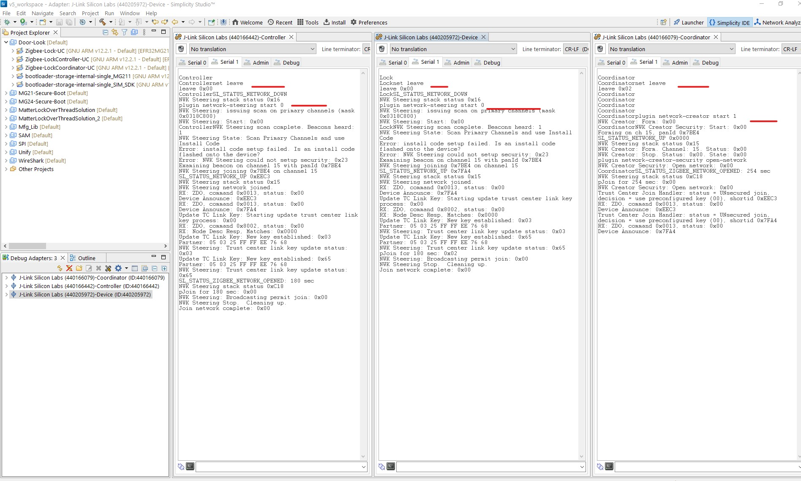

Once both devices have successfully joined the network, we can move on.

### Find and Bind ###

We need some sort of functionality to get our Lock Controller to look for and find our Lock and then join with the Lock so that it can easily send messages instead of needing to know the address. Additionally, the switch and light need some means of discovering if they share common clusters, like the on-off cluster. To assist with this, Zigbee provides finding & binding as a standard means of performing just this action.

We will use the Find and Bind plugin on the Lock Controller and Lock to achieve this. The plugin provides a shorthand way of allowing the devices to find and remember the addresses of other devices on the network that share common clusters.

The Lock will be the "target" as it will be the one eventually receiving commands from the controller. We can set the Lock to wait for find-and-bind messages by using the following command:

>plugin find-and-bind target 1

The Lock Controller will be the "initiator" as it will be the one eventually sending commands to the lock. Using the following command, the Lock Controller will send out a message asking for nodes with common clusters that we can "bind" to to identify themselves.

>plugin find-and-bind initiator 1

There will be some traffic in the console. Successful operation will show the following line:

>Find and Bind Initiator: Complete: 0x00

Once the find and bind is complete, you can execute the following command to see the binding table.

>option binding-table print

The output will look something like this:

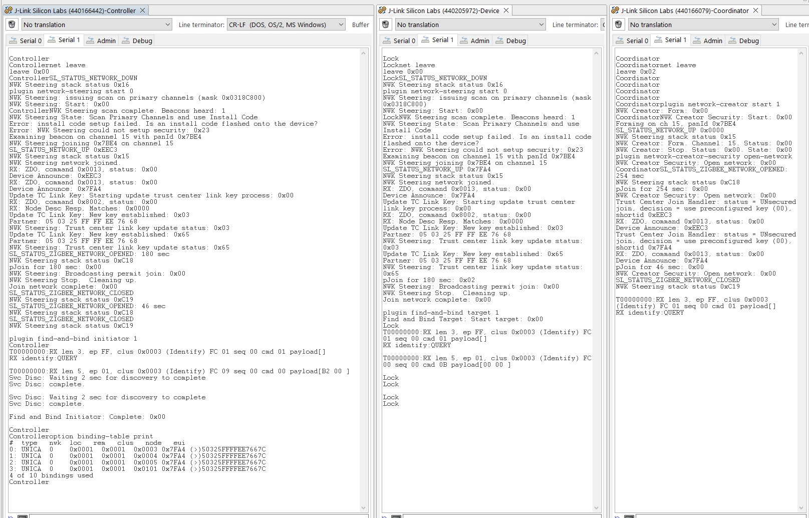

It displays which clusters for which nodes it has a binding. You should be able to identify the Door Lock Cluster (0x0101) in the "clus" column, as well as the node ID of the Door Lock in the "node" column. In our case, entry number 3 indicates that our Door Lock of Node ID 0x6BE6 has a binding on the Door Lock cluster.

>**Note on ZCL Strings**

The String data type is a special case in the ZCL. All strings are MSB with the first byte being the length byte for the string. There is no null terminator or similar concept in the ZCL. Therefore a 5-byte string is actually 6 bytes long, with the first byte indicating the length of the proceeding string. For example, “05 68 65 6C 6C 6F” is a ZCL string that says “hello.”

This means that the first character of the Door Lock PIN code will have to specify the length of the PIN.

## Running and Testing the Application ##

Now, from the Lock Controller, you can control the lock using CLI commands.

To execute a command, you must first construct the command, and then execute a second command to actually send the command.
As no pin is yet defined, for now the door will freely lock and unlock. You can send a lock command by entering the following to construct the command buffer:

>zcl door-lock lock "101"

Finally, to send the message, we use

>bsend 1

This will cause endpoint 1 to send the message to any bindings it has on the given cluster.

Following the execution of these commands, you should be able to observe the LED turning on. From the network analyzer, you can see command received correctly:

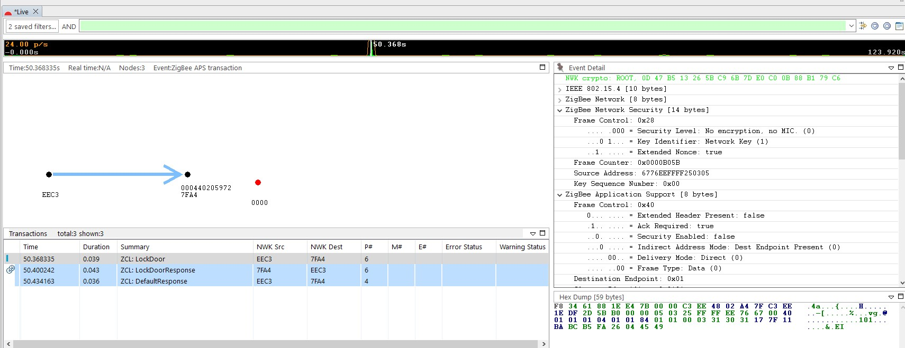

We can then subsequently send a Door Unlock Command to unlock the door.

>zcl door-lock unlock "101"
>
>bsend 1

The LED will turn off.
We can now set a pin code to secure the lock.

>zcl door-lock set-pin 0 0 0 "101"
>
>bsend 1

Once the message is sent, we can try to lock the door again, but try using an incorrect pin. For example:

>zcl door-lock lock "10111100"
>
>bsend 1

The LED will not be turning on.
Using the command:

>zcl door-lock lock "101"
>
>bsend 1

The LED will turn back on. In the Network Analyzer we see that when using the correct pin, the Lock Door Response returns a status of 0x00 (SUCCESS).

You can also try the Get Pin command to query the value of the pin.

>zcl door-lock get-pin 0
>
>bsend 1

To disable the pin, use the following command:

>zcl door-lock clear-pin 0
>
>bsend 1

At this point, the Lock and Unlock commands will again succeed on each execution.
