# Zigbee - AI/ML Human Detection #


[-green)](https://www.sparkfun.com/products/14844)
[%20board-green)](https://www.sparkfun.com/products/14532)


## Overview ##

This project aims to implement human detection using the MLX90640 low-resolution IR camera. The detection integrates into a Zigbee application, emulating an ultrasonic presence sensor (0x0406) in an always-on Zigbee End Device. Besides updating the cluster attributes, the device can bind and report whether a human is present. The device also reports whether a human is present on an SSD1306 OLED display.

The following picture shows the system view of how it works.

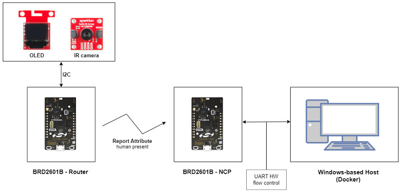

## SDK version ##

- [SiSDK v2024.12.0](https://github.com/SiliconLabs/simplicity_sdk/releases/tag/v2024.12.0)
- [Third Party Hardware Drivers v4.1.1](https://github.com/SiliconLabs/third_party_hw_drivers_extension)
- [AI/ML - Alpha - 2.0.0](https://github.com/SiliconLabsSoftware/aiml-extension)

## Software Required ##

- [Simplicity Studio v5 IDE](https://www.silabs.com/developers/simplicity-studio)

## Hardware Required ##

- Zigbee Gateway (host + NCP architecture)

  - 1x [xG24-DK2601B EFR32xG24 Dev Kit](https://www.silabs.com/development-tools/wireless/efr32xg24-dev-kit?tab=overview) running Zigbee NCP example
  - 1x Windows-based (Docker) running Zigbee Host Application
    - For details regarding setting up Docker for windows, refer to the app note:
    [AN1389: Running Zigbee Host Applications in a Docker Container](https://www.silabs.com/documents/public/application-notes/an1389-running-host-applications-in-docker-containers.pdf)

- Zigbee End device (SoC architecture)

  - [EFR32xG24 Dev Kit (BRD2601B)](https://www.silabs.com/development-tools/wireless/efr32xg24-dev-kit)
  - [SparkFun Micro OLED Breakout (Qwiic) board](https://www.sparkfun.com/products/14532)
  - [Sparkfun MLX90640 IR Array (MLX90640 FIR sensor)](https://www.sparkfun.com/products/14844)

## Connections Required ##

- Zigbee Coordinator: The EFR32xG24 Dev Kit (NCP) can be connected to the Desktop (Host) via a Micro USB cable.

  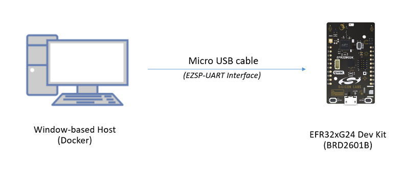

- Zigbee End device: The SparkFun Micro OLED Breakout (Qwiic) board and the Sparkfun MLX90640 IR Array can be easily connected with the EFR32xG24 Dev Kit by using the Qwiic cable.

  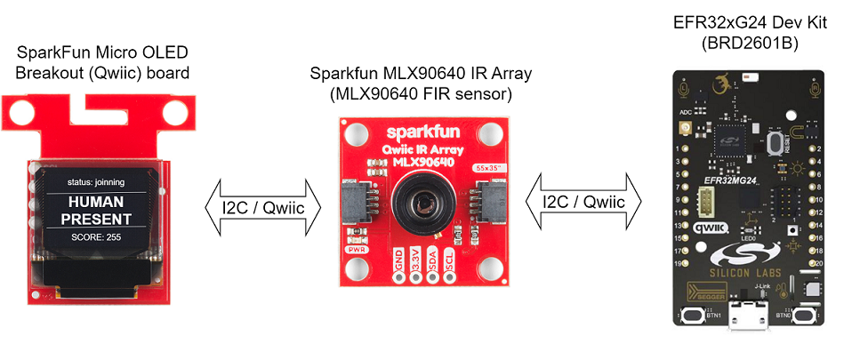

> [!NOTE]
> *If the Zigbee End Device is implemented on the SparkFun Thing Plus Matter - BRD2704A board* which does not have an internal button (which is used to join or leave the network without CLI commands), you should connect an external button to the board using a ceramic capacitor (ex: Ceramic Capacitor 104) and a resistor to avoid the anti-vibration button used in the project as below.

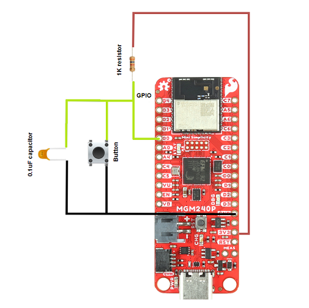

## Setup ##

### Zigbee Gateway ###

#### Create a Zigbee NCP ####

1. From the Launcher Home, add your hardware to My Products, click on it, and click on the **EXAMPLE PROJECTS & DEMOS** tab. Find the example project filtering by "ncp uarthw".

2. Click **Create** button on the **Zigbee - NCP UartHw** example. Example project creation dialog pops up -> click Create and Finish and Project should be generated.

   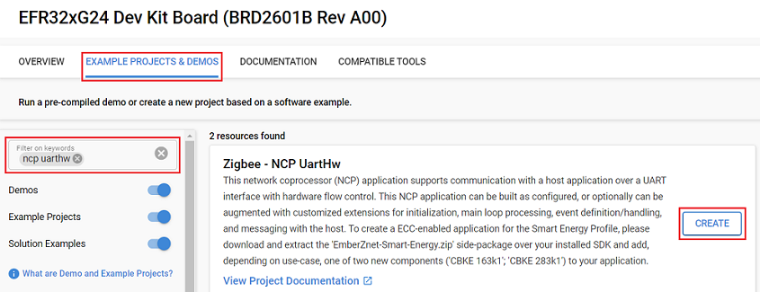

3. Build the project and flash it to your device.

> [!NOTE]
> A bootloader needs to be flashed to your device before flashing the 'Zigbee - NCP UartHw' project.

#### Create a Zigbee Host ####

You can either create a project based on an example project or start with a 'Zigbee - Z3Switch' project based on your hardware.

> [!TIP]
> This code example has a related app note, which may be worth reading before: [AN1389: Running Zigbee Host Applications in a Docker Container](https://www.silabs.com/documents/public/application-notes/an1389-running-host-applications-in-docker-containers.pdf)

##### Create a Zigbee Host based on an example project #####

1. From the Launcher Home, add "Linux 32 Bit" to My Products, click on it, and click on the **EXAMPLE PROJECTS & DEMOS** tab. Find the example project filtering by **"human"**.

2. Click **Create** button on the **Zigbee - AI/ML Human Detection (Host)** example. This example project creation dialog pops up -> click Create and Finish and Project should be generated.
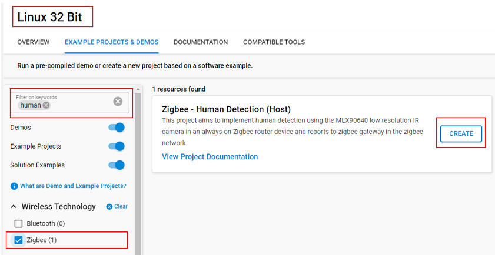

3. Build and run the Host App in the Container.

##### Create a Zigbee Host from a 'Zigbee - Z3Switch' #####

1. Create a 'Zigbee - Z3Switch' project for the device 'Linux 32 Bit' with **Copy contents** using Simplicity Studio 5.
2. Copy all attached files in `src/zigbee_human_detection_host` folder into the project root folder (overwriting existing).
3. Select Z3Gateway.slcp and install the following component for the device:

   - [Zigbee] → [Zigbee 3.0] → [Find and Bind Target]

4. Build and run the Host App in the Container.

### Zigbee End Device ###

You can either create a project based on an example project or start with a "Zigbee - Minimal" project based on your hardware.

> [!NOTE]
> Make sure that Make sure that the [Third Party Hardware Drivers extension](https://github.com/SiliconLabs/third_party_hw_drivers_extension) is installed as part of the SiSDK and the [zigbee_applications](https://github.com/SiliconLabs/zigbee_applications) repository is added to [Preferences > Simplicity Studio > External Repos](https://docs.silabs.com/simplicity-studio-5-users-guide/latest/ss-5-users-guide-about-the-launcher/welcome-and-device-tabs).

#### Create a Zigbee End Device based on an example project ####

1. From the Launcher Home, add your hardware to My Products, click on it, and click on the **EXAMPLE PROJECTS & DEMOS** tab. Find the example project filtering by **"human"**.

2. Click **Create** button on the **Zigbee - AI/ML Human Detection (End Device)** example. This example project creation dialog pops up -> click Create and Finish and Project should be generated.

   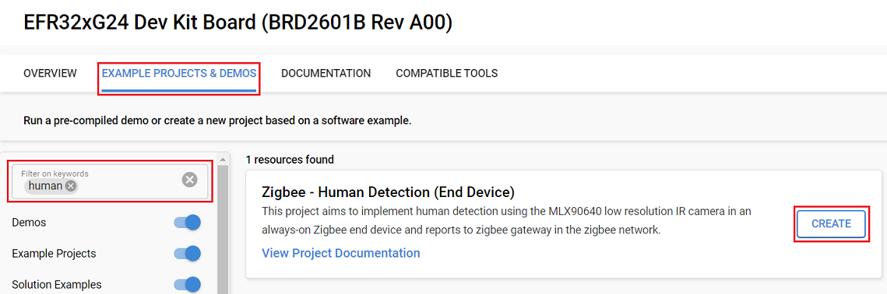

3. Build and flash this example to your board.

#### Create a Zigbee End Device from a 'Zigbee - Minimal' ####

> [!TIP]
> *If you want to create the projects from scratch for a different radio board or kit, follow these steps: The relevant source code files for the custom application code of the Host and the End Device are located in the [src](https://github.com/SiliconLabs/zigbee_applications/tree/master/zigbee_human_detection/src) and [inc](https://github.com/SiliconLabs/zigbee_applications/tree/master/zigbee_human_detection/inc) folders.*

1. Create a **Zigbee - Minimal** project for your board using Simplicity Studio 5.

2. Copy all attached files in `inc/zigbee_human_detection_end_device` and `src/zigbee_human_detection_end_device` folders into the project root folder (overwriting existing).

3. Load the model file into the project:

   - Create a tflite directory inside the config directory of the project and then copy the `config/tflite/ir_human_detection.tflite` model file into it. The project configurator provides a tool that will automatically convert .tflite files into sl_tflite_micro_model source and header files.

4. Cluster configuration:

   - Make sure endpoint 1 has Device ID is HA Occupancy Sensor (0x0107) and Profile ID is 0x0104.

      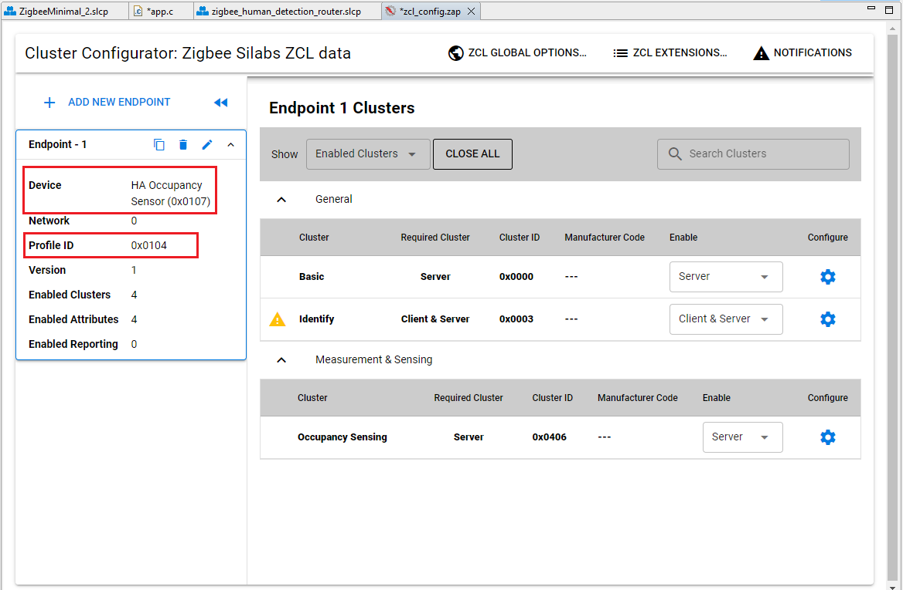

   - Save the Cluster configuration.

5. Open the .slcp file. Select the SOFTWARE COMPONENTS tab and install the software components:

   - [Zigbee] → [Utility] → [Zigbee Device Config] → Configure as End Device
   - [Zigbee] → [Stack] → [Pro Core] → [Pro Leaf Stack]
   - [Zigbee] → [Stack] → [Pro Core] → [Pro Stack (Common)] → Uninstall
   - [Zigbee] → [Cluster Library] → [Common] → [Reporting]
   - [Zigbee] → [Zigbee 3.0] → [Network Steering]
   - [Zigbee] → [Zigbee 3.0] → [Find and Bind Initiator]
   - [Zigbee] → [Bootloader] → [Zigbee Application Bootloader] → Uninstall
   - [Platform] → [Driver] → [Button] → [Simple Button] → [btn0]
   - [Platform] → [Driver] → [LED] → [Simple LED] → [led0]
   - [Platform] → [Driver] → [I2C] → [I2CSPM] → Use **qwiic** instance and configure speed mode to fast mode (400kbit/s).

     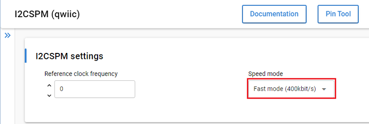

   - [Service] → [IO Stream] → [IO Stream: USART] → [vcom]
   - [AI/ML - Alpha v2.0.0] → [Machine Learning] → [TensorFlow] → [Debug] → [Debug Logging using IO Stream]
   - [AI/ML - Alpha v2.0.0] → [Machine Learning] → [TensorFlow] → [Kernels] → [Reference Kernels]
   - [AI/ML - Alpha v2.0.0] → [Machine Learning] → [TensorFlow] → [TensorFlow Lite Micro] → Configure this component to use 20000 Tensor Arena size

     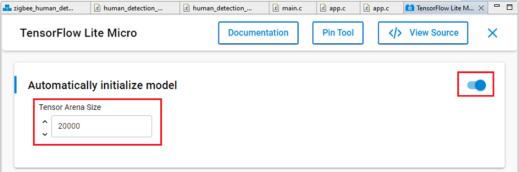

   - [Services] → [Memory Manager region] → Set this component to use 10240 Stack size

     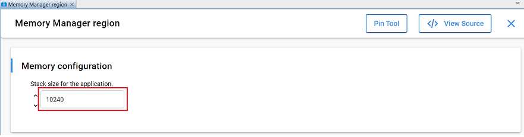

   - [Third Party Hardware Drivers] → [Display & LED] → [SSD1306 - Micro OLED Breakout (Sparkfun) - I2C] → use default configuaration

     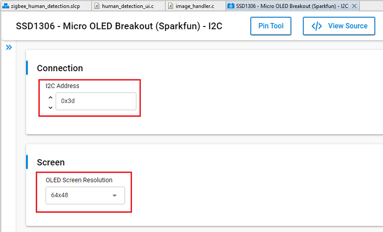

   - [Third Party Hardware Drivers] → [Service] → [GLIB - OLED Graphics Library]
   - [Third Party Hardware Drivers] → [Sensors] → [MLX90640 - IR Array Breakout (Sparkfun)]

6. Build and flash this project to your board.

## How It Works ##

### System Overview Diagram ###

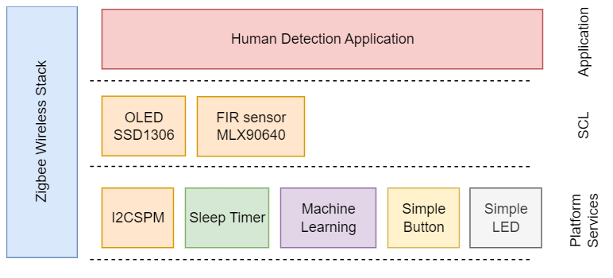

### Application Workflows ##

#### Startup and initialization ####

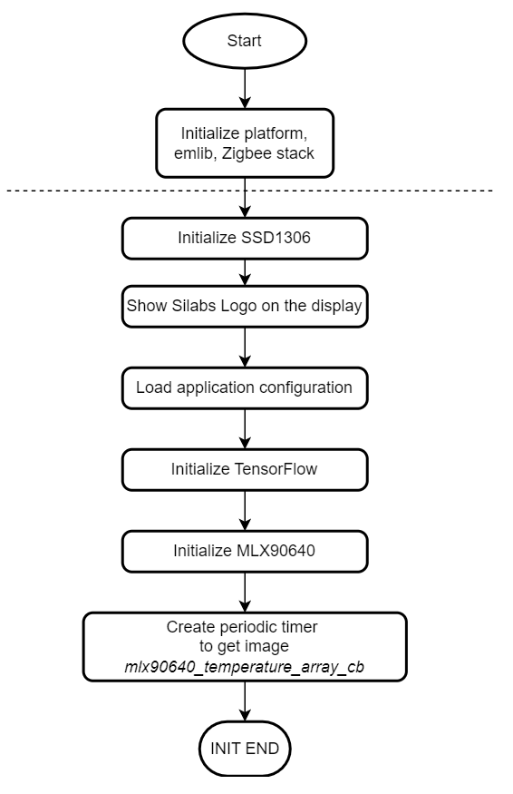

#### Application event loop ####

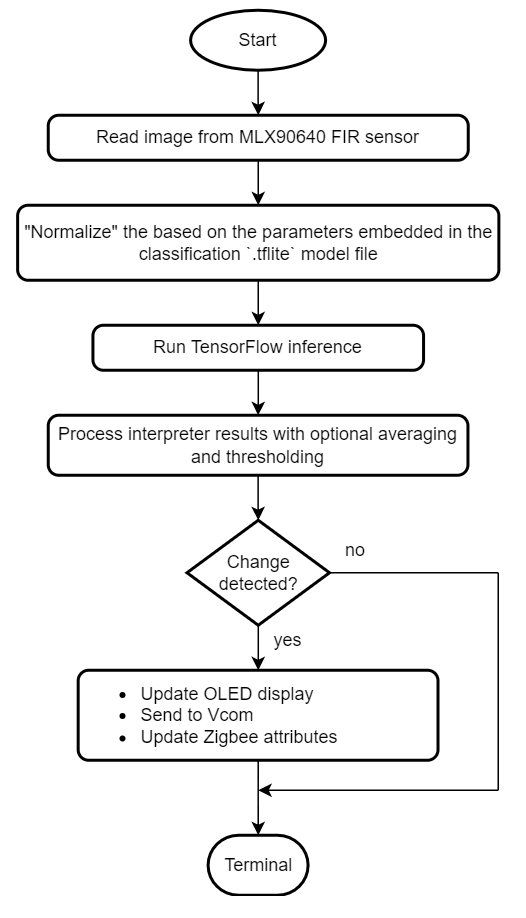

#### Zigbee integration & Button UI ####

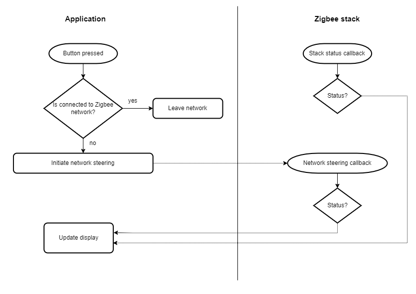

#### User Configuration ####

```c
// These are parameters that are optionally embedded
// into the .tflite model file
typedef struct AppSettings
{
  // norm_img = img * rescale
  float samplewise_norm_rescale;
  // norm_img = (img - mean(img)) / std(img)
  bool samplewise_norm_mean_and_std;
  // Drop all inference results older than this value
  uint32_t average_window_duration_ms;
  // The minimum number of inference results to average
  uint32_t minimum_count;
  // Minimum averaged model output threshold for a class
  // to be considered detected, 0-255; 255 = highest confidence
  uint8_t detection_threshold;
  // The number of samples that are different than the last detected sample
  // for a new detection to occur
  uint32_t suppression_count;
} app_settings_t;
```

## Testing ##

### Network formation ###

First, we form a centralized network on the coordinator, details regarding Z3 network formation can be found in the following [KBA](https://community.silabs.com/s/article/how-to-form-zigbee-3-0-network-with-emberznet-stack-x?language=en_US). The following command can be used in the Docker command line:

`plugin network-creator start 1`

After formation, you can use the info command to see the details of the network (EUI64, panID, nodeID, extended panID...) and the NCP endpoint configurations. The following image shows an example of the expected output for both commands:

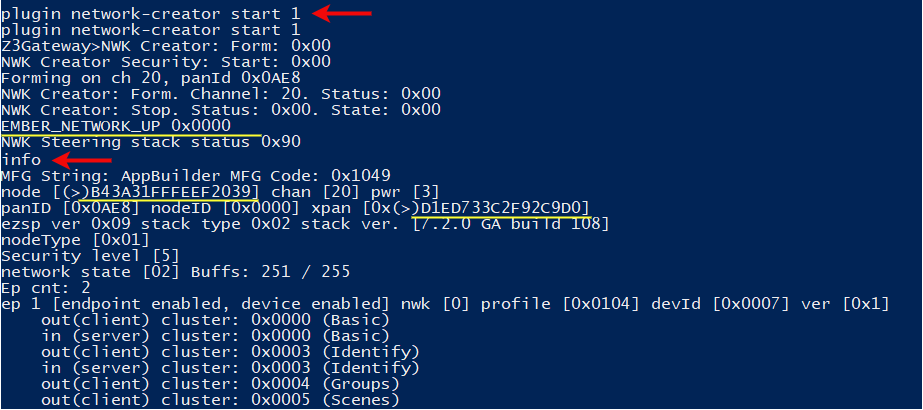

Now we need to open the network for other devices to join, we use the following command:

`plugin network-creator-security open-network`

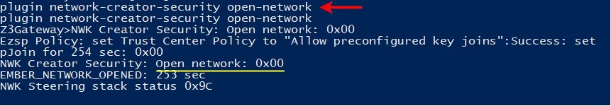

The network will automatically close after 180 seconds. Now we need to allow our coordinator to act as a "find and bind" target. This way our End Device will add a binding entry to its table immediately. We use the following command:

`plugin find_and_bind target 1`

### Joining the network and observing reported measurements ###

Lastly, press button 0 in the End Device, this will trigger the network steering process of the device allowing it to join the coordinator's network, identify the coordinator as a "find and bind" target and create a new binding entry in its binding table which as mentioned before is a requirement for the "Reporting" plugin. From this point onwards the End Device sends a report to the coordinator for changes in human presence. The coordinators' application will parse the received payload and print the value in the right format, this can be seen in the function `emberAfReportAttributesCallback()`. The following picture shows the expected CLI output log from the Host and the End Device:

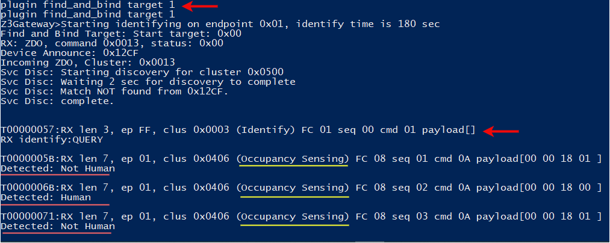

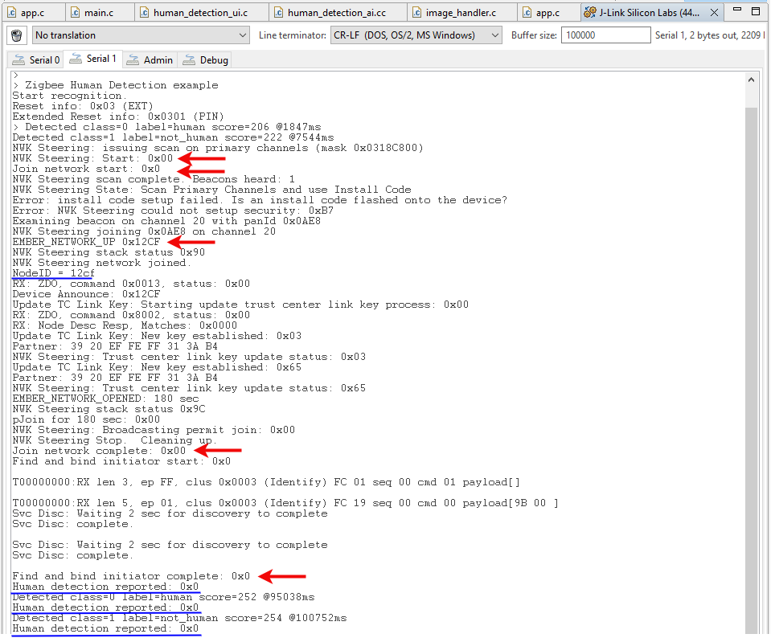

### Display ###


**Note:** score is the probability score of the detected gesture as a uint8 (i.e. 255 = highest confidence that the correct gesture was detected)

## Human Detection Model ##

### Model overview ###

Before continuing with this project, it is recommended to review the [MLTK Overview](https://siliconlabs.github.io/mltk/docs/overview.html), which provides an overview of the core concepts used by this project.

Image classification is one of the most important applications of deep learning and Artificial Intelligence. Image classification refers to assigning labels to images based on certain characteristics or features present in them. The algorithm identifies these features and uses them to differentiate between different images and assign labels to them [[1]](https://www.simplilearn.com/tutorials/deep-learning-tutorial/guide-to-building-powerful-keras-image-classification-models).

In this project, we have a dataset with two different image types:

- **Human** - Images of a human
- **Not Human** - Random images not containing human

We assign an ID, a.k.a. **label**, 0 and 1, to each of these classes.  
We then "train" a machine learning model so that when we input an image from one of the classes given to the model, the model's output is the corresponding class ID. In this way, at runtime on the embedded device when the camera captures an image of a human, the ML model predicts its corresponding class ID which the firmware application uses accordingly. i.e.

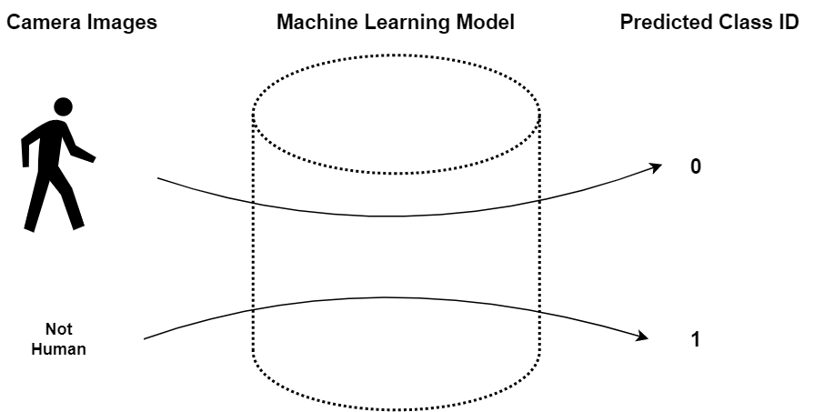

### Dataset Model ###

The most important part of a machine learning model is the dataset that was used to train the model.

Class: [Human](dataset/human.zip)

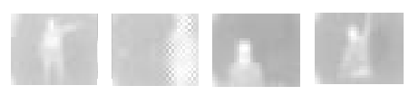

Class: [Nothing](dataset/not_human.zip)


### Model Input ###

The model input should have the shape:  `<image height>  x <image width> x <image channels>` (24,32,1)

The datatype should be `float32`.

### Model Input Normalization ###

The application supports "normalizing" the input.

If the `samplewise_norm.rescale` [model parameter](https://siliconlabs.github.io/mltk/docs/guides/model_parameters.html#imagedatasetmixin)
is given, then each element in the image is multiplied by this scaling factor, i.e.:

```c
model_input_tensor = img * samplewise_norm.rescale
```

If the `samplewise_norm.mean_and_std` [model parameter](https://siliconlabs.github.io/mltk/docs/guides/model_parameters.html#imagedatasetmixin)
is given, then each element in the image is centered about its mean and scaled by its standard deviation, i.e.:

```c
model_input_tensor = (img  - mean(img)) / std(img)
```

In both these cases, the model input data type must be `float32`.

### Model Output ###

The model output should have the shape `1 x <number of classes>`  
where `<number of classes>` should be the number of classes that the model is able to detect.

The datatype should be `float32`:

- 0: human

- 1: Not human

### Model Evaluation ###

```txt
Name: ir_human_detection
Model Type: classification
Overall accuracy: 99.432%
Class accuracies:
- not_human = 99.625%
- human = 95.890%
Average ROC AUC: 99.242%
Class ROC AUC:
- not_human = 99.242%
- human = 99.242%
```

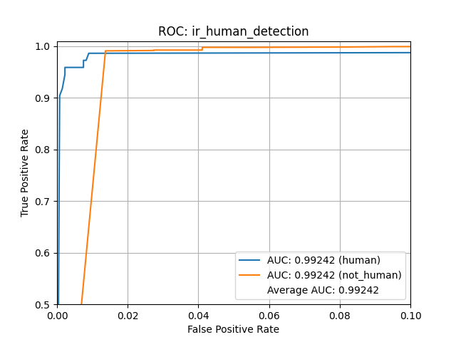
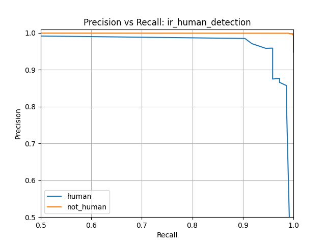
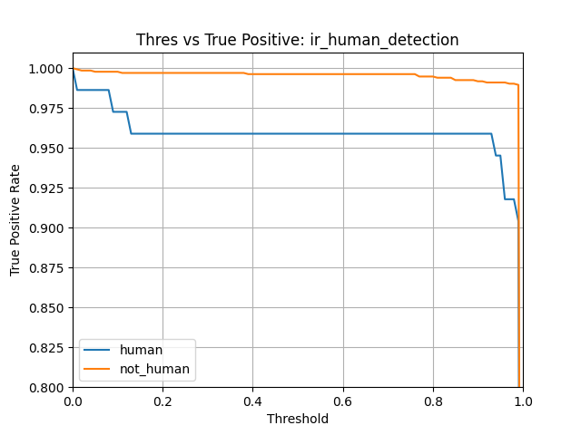
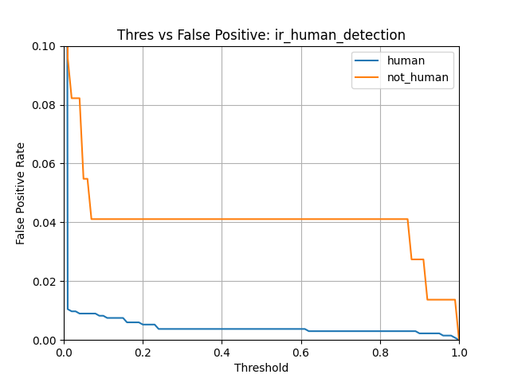
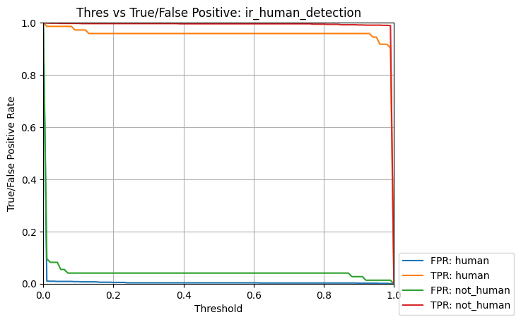
