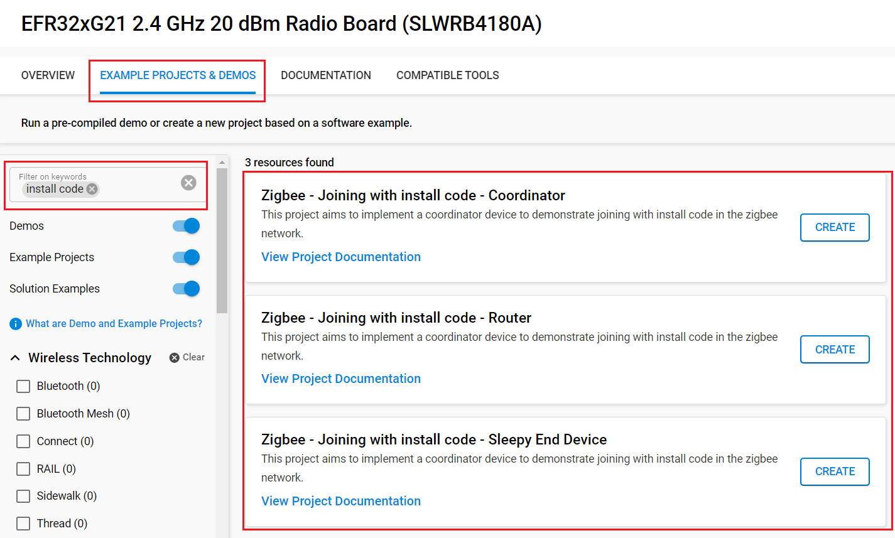

# Joining Policies : With Install-Code #

## Summary ##

This Project has the goal to demonstrate packet exchanges when a device join a network based on install-code.
Each device has a token in FLASH memory which contains an install-code. From this install-code, we obtain a derived link key by AES-MMO algorithm.
This key is then added manually (not in the air) to the transient link key table of TC.
When a device is joining, the TC is then sending the NWK key encrypted with this derived link key. It is then unnecessary to store this link key.

## SDK version ##

- [SiSDK v2024.12.0](https://github.com/SiliconLabs/simplicity_sdk/releases/tag/v2024.12.0)

## Software Required ##

- [Simplicity Studio v5 IDE](https://www.silabs.com/developers/simplicity-studio)

## Hardware Required ##

- 3x Wireless Starter Kit Main Board
- 3x Silicon Labs EFR32xG21 Radio Board (BRD4180A)

## Connections Required ##

Connect the radio boards to the WSTK mainboards. Connect your desired gateway device via serial connection to a computer.

## Setup ##

### Create a project based on an example project ###

> [!NOTE]
> Make sure that the [zigbee_applications](https://github.com/SiliconLabs/zigbee_applications) repository is added to [Preferences > Simplicity Studio > External Repos](https://docs.silabs.com/simplicity-studio-5-users-guide/latest/ss-5-users-guide-about-the-launcher/welcome-and-device-tabs).

1. From the Launcher Home, add your hardware to My Products, click on it, and click on the 'EXAMPLE PROJECTS & DEMOS' tab. Find the example project filtering by "install code".

2. Click the Create button on the project corresponding to your device type (coordinator, router and sleepy end device). The project creation dialog pops up -> click Create and Finish and the Project should be generated.

    

3. Build and flash the **Zigbee - Joining with install code - Coordinator** project to one board (Coordinator).

4. Build and flash the **Zigbee - Joining with install code - Router** project to another one (Router).

5. Build and flash the **Zigbee - Joining with install code - Sleepy End Device** project to the last one (Sleepy End Device).

## How It Works ##

### Preparing the Boards ###

You MUST SET a custom Install-code with the program : program_install_code.bat
To use it : You can choose your install-code by changing DEFAULT_INSTALL_CODE

You need to use this program for both the SED and Router board

### Using the Application ###

1. Form the network on the coordinator by sending `form` through the serial.
2. If you want to capture packets, use `keys print` to get the NWK key and add it to your keys.
3. Use `open {Index Transient Entry} {EUI64 of Joining Node} {INSTALL CODE + CRC}` to Open the network
    - example:
        > open 1 {3425B4FFFEA0B5F8} {83FED3407A939723A5C639B26916D505C3B5}
        - EUI64: 3425B4FFFEA0B5F8
        - Install code: 83FED3407A939723A5C639B26916D505
        - CRC: C3B5
    - Note: You can get the current Install Code and its CRC by using this command on the joining devices:
        > commander tokendump --tokengroup znet --token TOKEN_MFG_INSTALLATION_CODE
4. Send `join` to both the Router and SED to allow them to join the network

## Traces & other documents ##

This directory also contains trace captures on Network Analyzer (NA) and Wireshark directly in the repositories

- trace_joining_router_sed.isd : Capture for NA
- trace_joining_router_sed.pcapng : Capture for Wireshark

**To use Wireshark Capture**
You need to add the derived link key of the install-code and the well-known key to your wireshark keys to decode packets.
Go to : [Edit -> Preferences -> Protocols -> ZigBee -> Edit] and add :
**5A:69:67:42:65:65:41:6C:6C:69:61:6E:63:65:30:39** as the well-known key
**66:B6:90:09:81:E1:EE:3C:A4:20:6B:6B:86:1C:02:BB** as the derived key

To get more informations : [AN1089: Using Installation Codes with Zigbee Devices](https://www.silabs.com/documents/public/application-notes/an1089-using-installation-codes-with-zigbee-devices.pdf)
