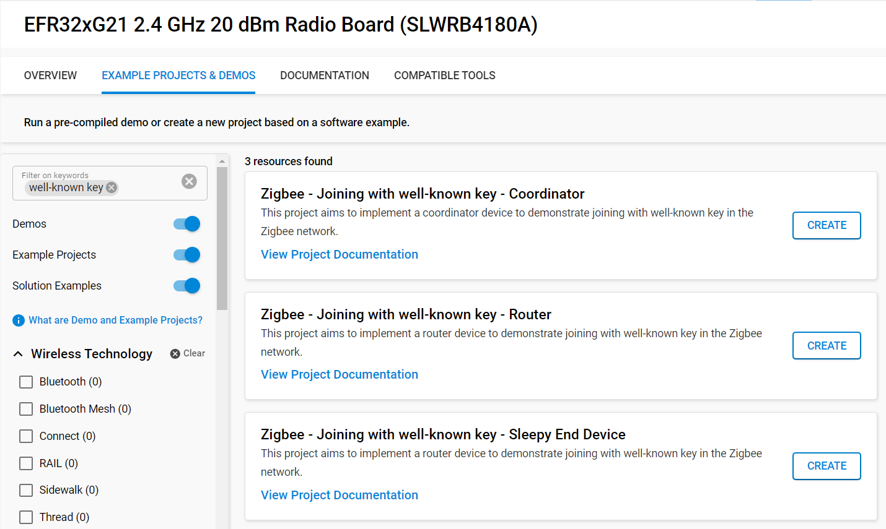
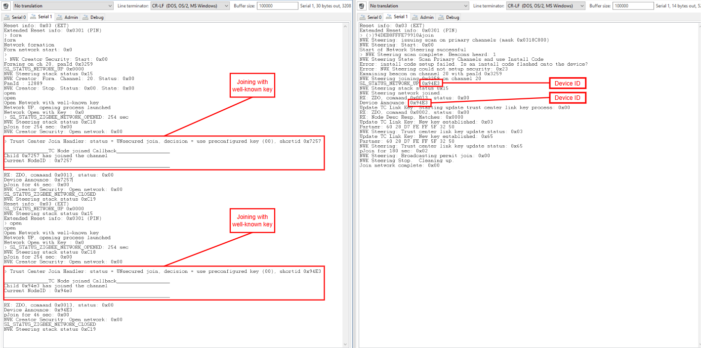

# Joining Policies : With Well-known key #

## Summary ##

To connect to a network, you can use either the well-known key which is "ZigbeeAlliance09" or install-code, there is also the touchlink commissionning. When a device is joining with the well-known key, the TC is then sending the NWK key encrypted with the well-known link key.

## SDK Version ##

- [SiSDK v2025.6.0](https://github.com/SiliconLabs/simplicity_sdk/releases/tag/v2025.6.0)

## Software Required ##

- [Simplicity Studio v5 IDE](https://www.silabs.com/developers/simplicity-studio)

## Hardware Required ##

- 3x Wireless Starter Kit Main Board
- 3x Silicon Labs EFR32xG21 Radio Board (BRD4180A)

## Connections Required ##

Connect the radio boards to the WSTK mainboards. Connect your desired gateway device via serial connection to a computer.

## Setup ##

### Create a project based on an example project ###

> [!NOTE]
> Make sure that the [zigbee_applications](https://github.com/SiliconLabs/zigbee_applications) repository is added to [Preferences > Simplicity Studio > External Repos](https://docs.silabs.com/simplicity-studio-5-users-guide/latest/ss-5-users-guide-about-the-launcher/welcome-and-device-tabs).

1. From the Launcher Home, add your hardware to My Products, click on it, and click on the 'EXAMPLE PROJECTS & DEMOS' tab. Find the example project filtering by "well-known key".

2. Click the Create button on the project corresponding to your device type (coordinator, router and sleepy end device). The project creation dialog pops up -> click Create and Finish and the Project should be generated.

    

3. Build and flash the **Zigbee - Joining with well-known key - Coordinator** project to one board (Coordinator).

4. Build and flash the **Zigbee - Joining with well-known key - Router** project to another one (Router).

5. Build and flash the **Zigbee - Joining with well-known key - Sleepy End Device** project to the last one (Sleepy End Device).

## How It Works ##

The **Coordinator** is responsible for forming the Zigbee network. When joining the network using the well-known key, a warning may appear regarding the absence of an install code; this warning can be safely ignored. Once the network is formed, it will operate under an open security policy for a limited period.

Both the **Router** and the **Sleepy End Device** (SED) will join the network using the well-known key.

> [!NOTE]
> The default well-known key is **ZigBeeAlliance09**.

## Testing ##

1. Form the network on the coordinator by issuing the `form` command through the serial interface.

2. To capture packets, use the `keys print` command to retrieve the NWK key and add it to your packet analyzer's key list.

3. Use the `open` command to enable the network for joining.

4. Send the `join` command to both the Router and Sleepy End Device (SED) to initiate their network joining process.

5. The result shall be as followed (the result is the same for sleepy end device and router device):

   

## Traces & other documents ##

This directory also contains trace captures on Network Analyzer or Wireshark directly in the repositories:

- trace_joining_well_known_key.isd : Capture for Network Analyzer.
- trace_joining_well_known_key.pcapng: Capture for Wireshark.

**To use Wireshark Capture**
You need to add the well-known key to your wireshark keys to decode packets. Go to : [Edit -> Preferences -> Protocols -> ZigBee -> Edit] and add : **5A:69:67:42:65:65:41:6C:6C:69:61:6E:63:65:30:39** as the well-known key
To get more information please refer to the following documents:

- [AN1233: Zigbee Security](https://www.silabs.com/documents/public/application-notes/an1233-zigbee-security.pdf)
- [UG391: Zigbee Application Framework dev guide](https://www.silabs.com/documents/public/user-guides/ug391-zigbee-app-framework-dev-guide.pdf)
