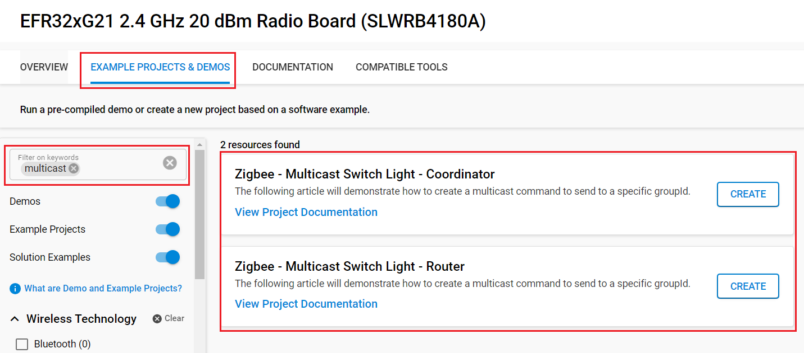

# Multicast On/Off Lights with Switch #

## Overview ##

The following article will demonstrate how to create a multicast command to send to a specific
groupId. It is sending ON/Off command to lights present in the network.
It also provides files to create Network (for Coordinator), joining, and create groups.

## SDK version ##

[SiSDK v2025.6.2](https://github.com/SiliconLabs/simplicity_sdk/releases/tag/v2025.6.2)

## Software Required ##

- [Simplicity Studio v5 IDE](https://www.silabs.com/developers/simplicity-studio)

## Hardware Required ##

- 3x Wireless Starter Kit Main Board
- 3x Silicon Labs EFR32xG21 Radio Board (BRD4180A) - 1 switch & 2 lights

## Connections Required ##

Connect the radio boards to the WSTK mainboards. Connect your desired gateway device via serial connection to a computer.

## Setup ##

> [!NOTE]
> Make sure that the [zigbee_applications](https://github.com/SiliconLabs/zigbee_applications) repository is added to [Preferences > Simplicity Studio > External Repos](https://docs.silabs.com/simplicity-studio-5-users-guide/latest/ss-5-users-guide-about-the-launcher/welcome-and-device-tabs).

1. From the Launcher Home, add your hardware to My Products, click on it, and click on the EXAMPLE PROJECTS & DEMOS tab. Find the example project filtering by "multicast".

2. Click the Create button on the project corresponding to your device type (coordinator, router and sleepy end device). The project creation dialog pops up -> click Create and Finish and the Project should be generated.

   

3. Build and flash the **Zigbee - Multicast Switch Light - Coordinator** application to one board (Switch).

4. Build and flash the **Zigbee - Multicast Switch Light - Router** application to the 2 other boards (Lights).

## How It Works ##

- Form the network on the coordinator (switch) by sending `form` through the serial.
- If you want to capture packets, use `keys print` to get the NWK key and add it to the keys.
- Use `open` to Open the network
- Send `join` to the 2 lights to allow them to join the network.

Now, our network has been initialized, we can start to create the group, the group used is :
GROUP_ID = 0x4123  & Group_Name = "Lights"

- Now, send `group` on the coordinator to send a command to the 2 other devices which joined.
- Then, you can now press the BTN0 on the switch to change the state of the LED 0.

### Traces & other documents ###

This directory also contains trace captures on Network Analyzer (NA) and Wireshark directly in the repositories

- multicast_process_trace.isd : Capture for NA
- multicast_process_trace.pcapng : Capture for Wireshark

**To use Wireshark Capture**
You need to add the well-known key to your wireshark keys to decode packets.
Go to : [Edit -> Preferences -> Protocols -> ZigBee -> Edit] and add :
**5A:69:67:42:65:65:41:6C:6C:69:61:6E:63:65:30:39** as the well-known key
