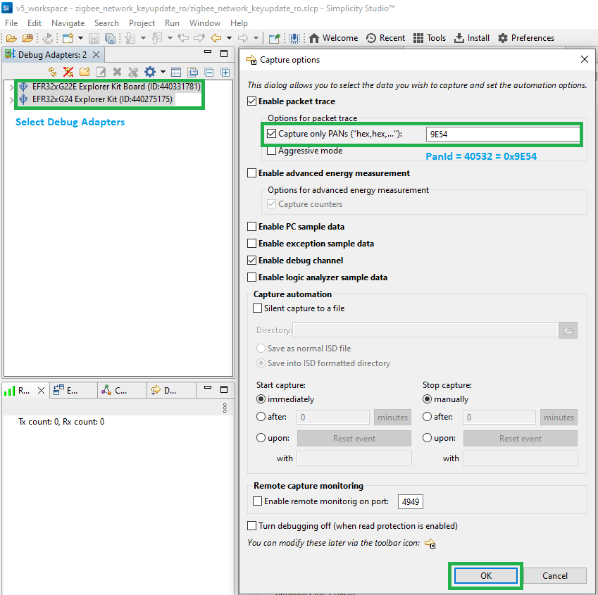

# Network Key Update #

## Summary ##

To make sure that every device does not reach the maximum value of the frame counter, the coordinator (TC) needs to perform an network key (NWK) update. This update should be done periodically at long intervals. The case of sleepy end device (SED) is very specific. For example, if the SED is in the sleep state, it is not going to receive any message and therefore miss the NWK key Update. It then needs to perform a rejoin to the NWK.

## SDK version ##

- [SiSDK v2025.6.2](https://github.com/SiliconLabs/simplicity_sdk/releases/tag/v2025.6.2)

## Software Required ##

- [Simplicity Studio v5 IDE](https://www.silabs.com/developers/simplicity-studio)

## Hardware Required ##

- 3x Wireless Starter Kit Main Board
- 3x Silicon Labs EFR32xG21 Radio Board (BRD4180A)

## Connections Required ##

Connect the radio boards to the WSTK mainboards. Connect your desired gateway device via serial connection to a computer.

## Setup ##

### Create a project based on an example project ###

> [!NOTE]
> Make sure that the [zigbee_applications](https://github.com/SiliconLabs/zigbee_applications) repository is added to [Preferences > Simplicity Studio > External Repos](https://docs.silabs.com/simplicity-studio-5-users-guide/latest/ss-5-users-guide-about-the-launcher/welcome-and-device-tabs).

1. From the Launcher Home, add your hardware to My Products, click on it, and click on the 'EXAMPLE PROJECTS & DEMOS' tab. Find the example project filtering by "key update".

2. Click the Create button on the project corresponding to your device type (coordinator, router and sleepy end device). The project creation dialog pops up -> click Create and Finish and the Project should be generated.

    

3. Build and flash the **Zigbee - Network Key Update - Coordinator** project to one board (Coordinator).

4. Build and flash the **Zigbee - Network Key Update - Router** project to another one (Router).

5. Build and flash the **Zigbee - Network Key Update - Sleepy End Device** project to the last one (Sleepy End Device).

## How It Works ##

The users follow the steps below to see how the program works:

1. Form the network on the coordinator by sending the `form` command through the serial.
2. If you want to get the current network key, use the `keys print` command to get the NWK key and add it to your keys.
3. Use the `open` command to open the network
4. Send the `join` command to both the Router and SED to allow them to join the network
5. On the coordinator, send the `updateNwk` command to update the key when your 2 devices join the network

After doing the whole process, it is possible to see that the Trust Center and the router updated their NWK key.

### Before the NWK Key Update on the TC ###

### After the NWK Key Update on the TC ###

### After the NWK Key Update on the SED ###

From what we can see, the SED missed the NWK Update. It will need to perform a rejoin process in order to get the NWK Key.

### Working with Network Analyzer ###

The users can monitor the actions of each device in the system more closely through the Network Analyzer tool. Follow the steps below to set it up:

1. Form the network on the coordinator by sending `form` command through the serial. After that user can see the PanId, get this value and convert it to HEX format to use in the Network Analyzer.

    

2. From Simplicity Studio → Window → Perspective → Network Analyzer to open Network Analyzer window.

3. From Debug Adapter, select all of the connected boards then right-click it and select "Start capture with option...". Check the "Capture only PANs ("hex, hex..")" box and then fill the PanId in HEX value. Click "OK" button to start capture data.

    

4. On the coordinator side, use the **open** command to open the network.  When the opening network process is done, send the **join** command to both the Router and SED to allow them to join the network. After that, on the Coordinator side (TC), send the **updateNwk** command to update the key. The user can use the "keys print" command to get the current Network Key or trace it via the Network Analyzer window to see the change of key before and after executing the **updateNwk** command.

    

## Traces & other documents ##

This directory also contains trace captures on Network Analyzer (NA) and Wireshark directly in the repositories

- trace_nwk_key_update.isd : Capture for NA
- trace_nwk_key_update.pcapng : Capture for Wireshark

**To use Wireshark Capture**
You need to add the well-known key to your wireshark keys to decode packets. Go to : [Edit -> Preferences -> Protocols -> ZigBee -> Edit] and add : **5A:69:67:42:65:65:41:6C:6C:69:61:6E:63:65:30:39** as the well-known key
To get more information please refer to the following documents:

- [AN1233: Zigbee Security](https://www.silabs.com/documents/public/application-notes/an1233-zigbee-security.pdf)
- [UG391: Zigbee Application Framework dev guide](https://www.silabs.com/documents/public/user-guides/ug391-zigbee-app-framework-dev-guide.pdf)
