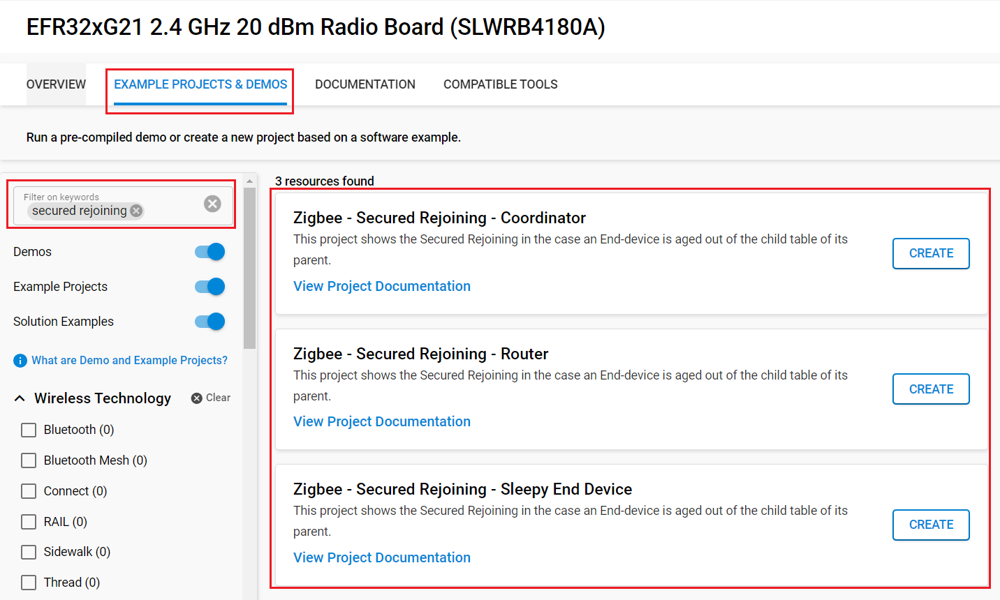
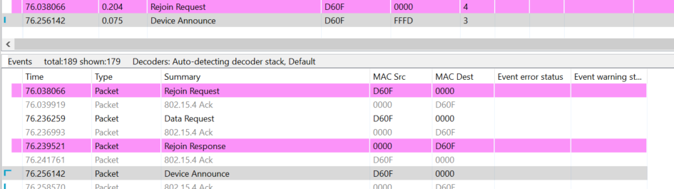
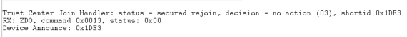

# Secured Rejoining :  with Sleepy-End Device #

## Overview ##

When a device looses its parent, or miss a network key update, it needs to do a rejoining process. This rejoining process can be two types : Secured Rejoining or Unsecured rejoined.
This project shows the Secured Rejoining in the case an End-device is aged out of the child table of its parent.

## SDK version ##

- [SiSDK v2024.12.0](https://github.com/SiliconLabs/simplicity_sdk/releases/tag/v2024.12.0)

## Software Required ##

- [Simplicity Studio v5 IDE](https://www.silabs.com/developers/simplicity-studio)

## Hardware Required ##

- 3x Wireless Starter Kit Main Board
- 3x Silicon Labs EFR32xG21 Radio Board (BRD4180A)

## Connections Required ##

Connect the radio boards to the WSTK mainboards. Connect your desired gateway device via serial connection to a computer.

## Setup ##

### Create a project based on an example project ###

> [!NOTE]
> Make sure that the [zigbee_applications](https://github.com/SiliconLabs/zigbee_applications) repository is added to [Preferences > Simplicity Studio > External Repos](https://docs.silabs.com/simplicity-studio-5-users-guide/latest/ss-5-users-guide-about-the-launcher/welcome-and-device-tabs).

1. From the Launcher Home, add your hardware to My Products, click on it, and click on the 'EXAMPLE PROJECTS & DEMOS' tab. Find the example project filtering by "link key".

2. Click the Create button on the project corresponding to your device type (coordinator, router and sleepy end device). The project creation dialog pops up -> click Create and Finish and the Project should be generated.

    

3. Build and flash the **Zigbee - Secured rejoining - Coordinator** project to one board (Coordinator).

4. Build and flash the **Zigbee - Secured rejoining - Router** project to another one (Router).

5. Build and flash the **Zigbee - Secured rejoining - Sleepy End Device** project to the last one (Sleepy End Device).

### Setup of the aging out ###

In order to speed up the aging out of the SED, we set the value SL_ZIGBEE_END_DEVICE_POLL_TIMEOUT to SECONDS_10. Each end device that is not polling in this period is aged out of the child table and then need to perform a rejoining. We are using the `sl_zigbee_find_and_rejoin_network()` to launch the process.

## How It Works ##

- Form the network on the coordinator by sending `form` through the serial.
- If you want to capture packets, use `keys print` to get the NWK key and add it to your keys.
- Use `open` to Open the network
- Send `join` to both the Router and SED to allow them to join the network
- Wait for approximately 15 seconds and then the rejoin event is triggered.

### Interpretation ###

The rejoin process is composed of 3 messages which are Rejoin Request, Rejoin response and device announce
as you can see on the following capture.\
\
On the TC, the rejoin is successful.

### Traces & other documents ###

This directory also contains trace captures on Network Analyzer (NA) and Wireshark directly in the repositories

- trace_nwk_key_update.isd : Capture for NA
- trace_nwk_key_update.pcapng : Capture for Wireshark

**To use Wireshark Capture**
You need to add the well-known key to your wireshark keys to decode packets.\
Go to : [Edit -> Preferences -> Protocols -> ZigBee -> Edit] and add :
**5A:69:67:42:65:65:41:6C:6C:69:61:6E:63:65:30:39** as the well-known key\

To get more informations : [AN1233: Zigbee Security](https://www.silabs.com/documents/public/application-notes/an1233-zigbee-security.pdf)\
[UG391: Zigbee Application Framework dev guide](https://www.silabs.com/documents/public/user-guides/ug391-zigbee-app-framework-dev-guide.pdf)
