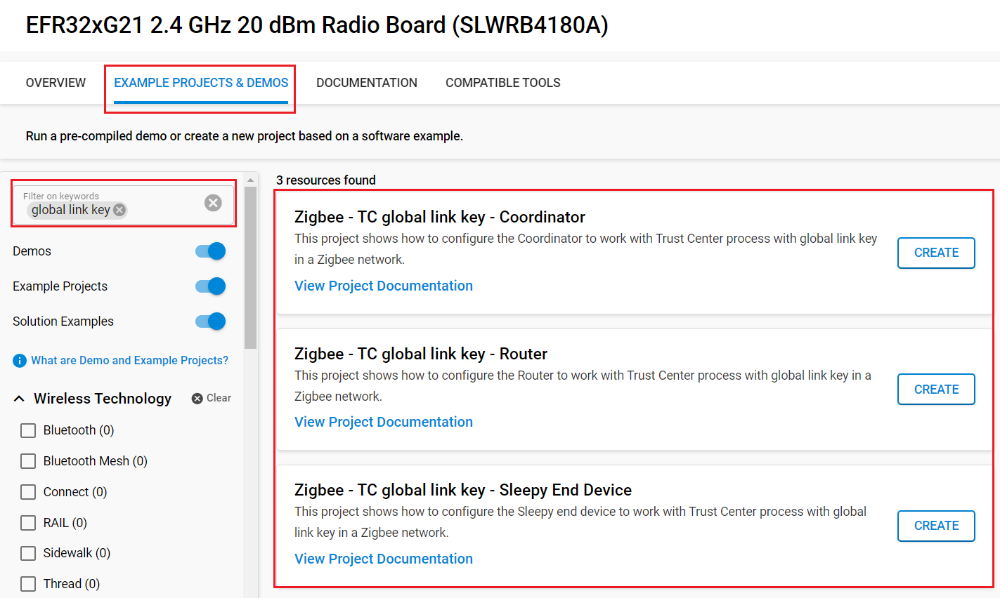
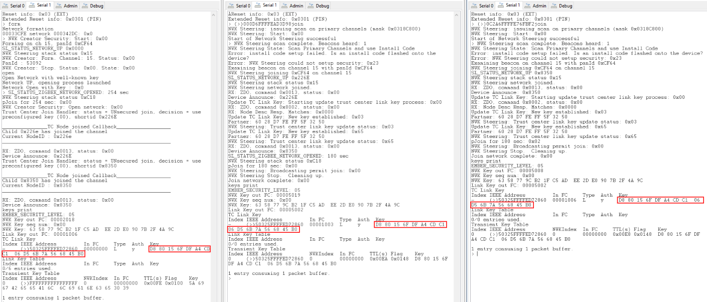
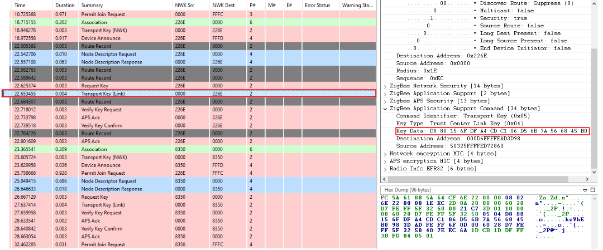
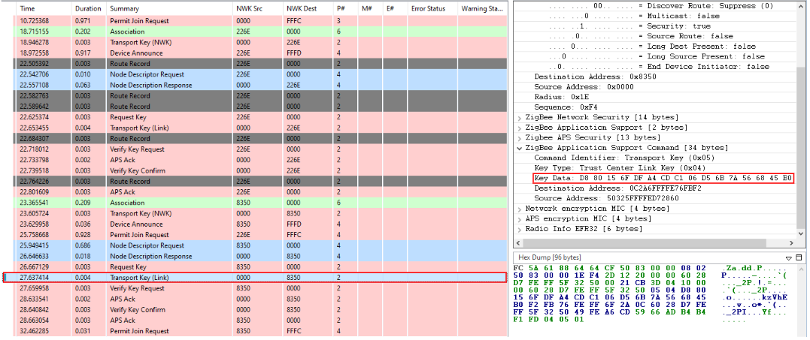

# TC Policies : Global Link Key #


## Summary ##

To establish secure end-to-end communication with the Trust Center upon joining a network, each node requires a Trust Center (TC) Link Key. This key can either be unique—derived as a hashed link key based on a global key and the node's unique identifier—or shared across all nodes in the network. In the latter case, the "end-to-end" communication is accessible to all nodes within the network, as they share the same TC Link Key.

## SDK Version ##

- [SiSDK v2025.6.0](https://github.com/SiliconLabs/simplicity_sdk/releases/tag/v2025.6.0)

## Software Required ##

- [Simplicity Studio v5 IDE](https://www.silabs.com/developers/simplicity-studio)

## Hardware Required ##

- 3x Wireless Starter Kit Main Board
- 3x Silicon Labs EFR32xG21 Radio Board (BRD4180A)

## Connections Required ##

Connect the radio boards to the WSTK mainboards. Connect your desired gateway device via serial connection to a computer.

## Setup ##

### Create a project based on an example project ###

> [!NOTE]
> Make sure that the [zigbee_applications](https://github.com/SiliconLabs/zigbee_applications) repository is added to [Preferences > Simplicity Studio > External Repos](https://docs.silabs.com/simplicity-studio-5-users-guide/latest/ss-5-users-guide-about-the-launcher/welcome-and-device-tabs).

1. From the Launcher Home, add your hardware to My Products, click on it, and click on the 'EXAMPLE PROJECTS & DEMOS' tab. Find the example project filtering by "global link key".

2. Click the Create button on the project corresponding to your device type (coordinator, router and sleepy end device). The project creation dialog pops up -> click Create and Finish and the Project should be generated.

    

3. Modify Network Creator Security

   - To achieve the desired functionality, it is **critical** to modify a specific function in the `network-creator-security` file to disable the use of hashed link keys. This change can be made in the `network-creator-security.c` file within the SiSDK. Locate the `sl_zigbee_af_network_creator_security_start()` function and comment out the following line:

   ```c
   // Use hashed link keys for improved storage and speed.
   state.bitmask |= SL_ZIGBEE_TRUST_CENTER_USES_HASHED_LINK_KEY;
   ```

   By commenting out this line, the use of hashed link keys will be disabled.

4. Build and flash the **Zigbee - TC global link key - Coordinator** project to one board (Coordinator).

5. Build and flash the **Zigbee - TC global link key - Router** project to another one (Router).

6. Build and flash the **Zigbee - TC global link key - Sleepy End Device** project to the last one (Sleepy End Device).

> [!TIP]
> When creating the project, you should select the **Copy contents** option. By this way, modifying the Network Creator Security in the `network-creator-security.c` file will not be applied directly to the SiSDK.

## How It Works ##

The **Coordinator** is responsible for forming the Zigbee network. When joining the network using the well-known key, a warning may appear regarding the absence of an install code; this warning can be safely ignored. Once the network is formed, it will operate under an open security policy for a limited period.

Both the **Router** and the **Sleepy End Device** (SED) will join the network using the well-known key.

**Note:** The default well-known key is **ZigBeeAlliance09**.

## Testing ##

1. Form the network on the coordinator by issuing the `form` command through the serial interface.
2. To capture packets, use the `keys print` command to retrieve the NWK key and add it to your packet analyzer's key list.
3. Use the `open` command to enable the network for joining.
4. Send the `join` command to both the Router and Sleepy End Device (SED) to initiate their network joining process.
5. The result shall be as followed:

   

It is possible to see in the traces that the same link key is send to both the Router and SED.

**For the router** :



**For the SED** :



## Traces & other documents ##

This directory also contains trace captures on Network Analyzer (NA) and Wireshark directly in the repositories

- trace_global_link_key.isd : Capture for NA
- trace_global_link_key.pcapng : Capture for Wireshark

**To use Wireshark Capture**
You need to add the well-known key to your wireshark keys to decode packets.\
Go to : [Edit -> Preferences -> Protocols -> ZigBee -> Edit] and add :
**5A:69:67:42:65:65:41:6C:6C:69:61:6E:63:65:30:39** as the well-known key\

To get more informations : [AN1233: Zigbee Security](https://www.silabs.com/documents/public/application-notes/an1233-zigbee-security.pdf)
