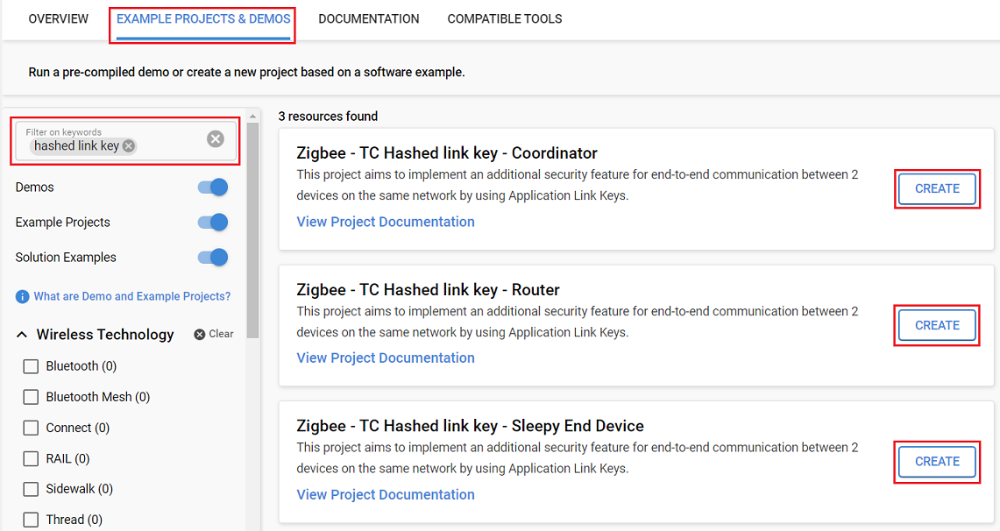
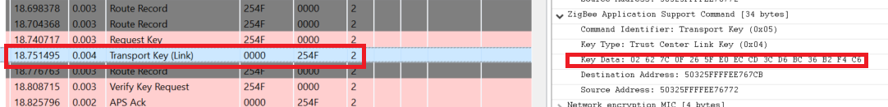
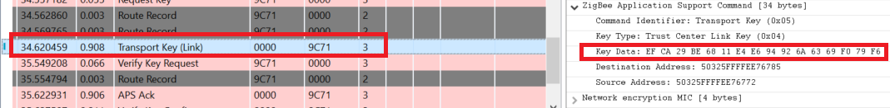
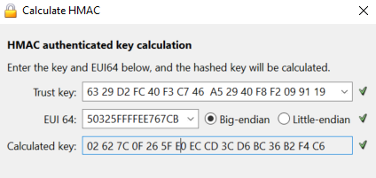

# TC Policies : Hashed Link Key #

## Summary ##

When you join network and the end-to-end communication with the trust center is allowed, each node requires a TC Link key. This link key can be a unique, hashed link key based on a global key, which is hashed by the ID of the corresponding node. It can also be the same link key of every node, which means that the "end-to-end" communication can be decrypted by every node of the network. In this example, we are using hashed link keys, because this method has a lot of advantages, such as less RAM requirement, since it is only needed to store one unique link key.

## SDK version ##

- [SiSDK v2024.12.0](https://github.com/SiliconLabs/simplicity_sdk/releases/tag/v2024.12.0)

## Software Required ##

- [Simplicity Studio v5 IDE](https://www.silabs.com/developers/simplicity-studio)

## Hardware Required ##

- 3x Wireless Starter Kit Main Board
- 3x Silicon Labs EFR32xG21 Radio Board (BRD4180A)

## Connections Required ##

- Connect the radio boards to the WSTK mainboards. Connect your desired gateway device via serial connection to a computer.

## Setup ##

### Create a project based on an example project ###

> [!NOTE]
> Make sure that the [zigbee_applications](https://github.com/SiliconLabs/zigbee_applications) repository is added to [Preferences > Simplicity Studio > External Repos](https://docs.silabs.com/simplicity-studio-5-users-guide/latest/ss-5-users-guide-about-the-launcher/welcome-and-device-tabs).

1. From the Launcher Home, add your device to My Products, click on it, and click on the EXAMPLE PROJECTS & DEMOS tab. Find the example project filtering by "hashed link key".

2. Click the Create button on the project corresponding to your device type (coordinator, router and sleepy end device). The project creation dialog pops up -> click Create and Finish and the Project should be generated.

3. Build and flash the **Zigbee - TC Hashed link key - Coordinator** project to one board (Coordinator).

4. Build and flash the **Zigbee - TC Hashed link key - Router** project to another one (Router).

5. Build and flash the **Zigbee - TC Hashed link key - Sleepy End Device** project to the last one (Sleepy End Device).

    

## How It Works ##

Users can follow the steps below to see how the program works:

- Form the network on the coordinator by sending `form` through the serial.
- Use `open` to Open the network
- Send `join` to both the Router and SED to allow them to join the network
- If you want to capture packets, use `keys print` to get the NWK key and add it to your keys.

It is possible to see in the traces that we have two keys that are different for the router and SED.

- **For the router** :
    

- **For the SED** :
    

In order to check that the key are the Trust key hashed by the EUI64 of the node, you can use the tool Calculate HMAC present in the Preferences window > Network Analyzer > Decoding > Security keys.

You need to enter the `Trust Key` which is located in the TC Link key table when you use the `keys print` command and the eui64 of the node.
For the router, we have the following result :

It matches with the one found in the trace !
