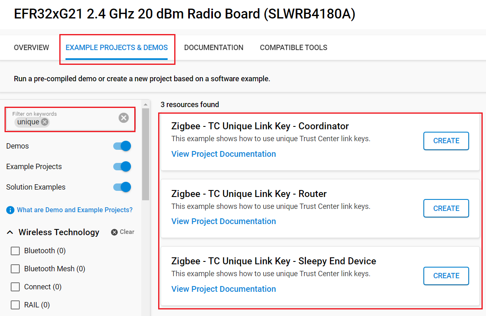
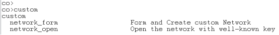
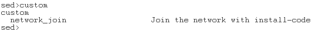
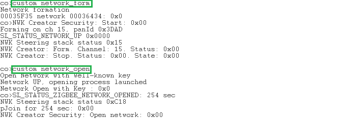
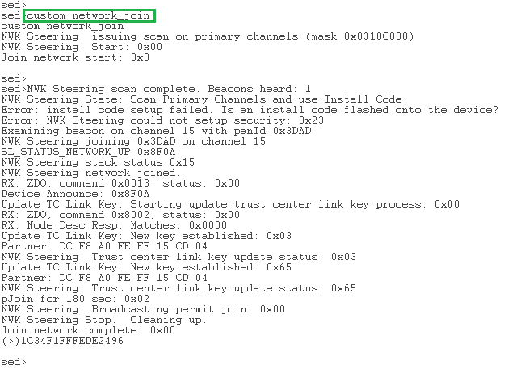
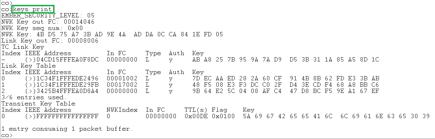

# TC Policies : Unique Link Key #

## Summary ##

When joining a network and to be allowed to communicate end-to-end with the Trust Center (TC), each node requires a TC Link key. This link key can be unique, hashed link key based on a global key which is hashed by the ID of the corresponding node, or the same link key for every node which means the "end-to-end" communication can be decrypted by every node of the network.
In this project, we are using unique TC link keys. Basically, each device is going to get a random TC Link key to communicate with the Trust Center. This TC Link key is unique for each device in the network. It seems more secure to use this method but it requires more RAM to store all the keys.

## SDK version ##

- [SiSDK v2025.6.2](https://github.com/SiliconLabs/simplicity_sdk/releases/tag/v2025.6.2)

## Software Required ##

- [Simplicity Studio v5 IDE](https://www.silabs.com/developers/simplicity-studio)

## Hardware Required ##

- 3x Wireless Starter Kit Main Board
- 3x Silicon Labs EFR32xG21 Radio Board (BRD4180A)

## Connections Required ##

Connect the radio boards to the WSTK mainboards. Connect your desired gateway device via serial connection to a computer.

## Setup ##

### Create a project based on an example project ###

> [!NOTE]
> Make sure that the [zigbee_applications](https://github.com/SiliconLabs/zigbee_applications) repository is added to [Preferences > Simplicity Studio > External Repos](https://docs.silabs.com/simplicity-studio-5-users-guide/latest/ss-5-users-guide-about-the-launcher/welcome-and-device-tabs).

1. From the Launcher Home, add your hardware to My Products, click on it, and click on the 'EXAMPLE PROJECTS & DEMOS' tab. Find the example project filtering by "unique".

2. Click the Create button on the project corresponding to your device type (coordinator, router and sleepy end device). The project creation dialog pops up -> click Create and Finish and the Project should be generated.

    

3. Build and flash the **Zigbee - TC Unique Link Key - Coordinator** project to one board (Coordinator).

4. Build and flash the **Zigbee - TC Unique Link Key - Router** project to another one (Router).

5. Build and flash the **Zigbee - TC Unique Link Key - Sleepy End Device** project to the last one (Sleepy End Device).

## How It Works ##

Devices store their unique link key in the TC Link key table. This encryption allows you to do end-to-end communication between a node and the coordinator (TC). You can find unique link key in the link key table of the Trust Center.

Coordinator supports 2 custom commands: `network_form` and `network_open`

Router and SED supports one custom command: `network_join`

The following figure shows the desired output of these commands:

## Interpretation ##

After doing the whole process, it is possible to see that all TC Link keys are stored into the link key table of the Trust Center.
    

## Traces & other documents ##

This directory also contains trace captures on Network Analyzer (NA) and Wireshark directly in the repositories

- trace_tc_unique_linkkey.isd : Capture for NA
- trace_tc_unique_linkkey.pcapng : Capture for Wireshark

**To use Wireshark Capture:** You need to add the well-known key to your wireshark keys to decode packets.
Go to : [Edit -> Preferences -> Protocols -> ZigBee -> Edit] and add : `5A:69:67:42:65:65:41:6C:6C:69:61:6E:63:65:30:39` as the well-known key

To get more informations : [AN1233: Zigbee Security](https://www.silabs.com/documents/public/application-notes/an1233-zigbee-security.pdf)
