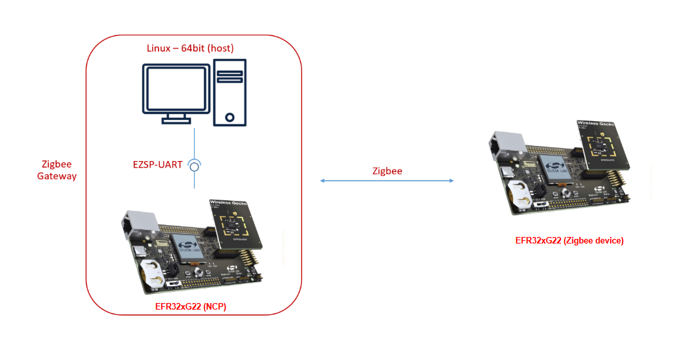

# Zigbee - RTC Time Synchronization #

## Summary ##

In a common Zigbee network, the gateway normally has the capability of connecting to the internet, so it can get the date and time through NTP (Network Time Protocol), which is a networking protocol for clock synchronization between computer systems over packet-switched, variable-latency data networks. Therefore, the gateway can act as the time server to provide the time source for the other Zigbee devices. This example demonstrates how we synchronize the date and time in the Zigbee network. On the device side, the local date and time will be kept by the plugin **Simple Clock**.

## SDK version ##

- [SiSDK v2024.12.0](https://github.com/SiliconLabs/simplicity_sdk/releases/tag/v2024.12.0)

## Software Required ##

- [Simplicity Studio v5 IDE](https://www.silabs.com/developers/simplicity-studio)

## Hardware Required ##

- **Zigbee Gateway (host + NCP architecture)**
  - 1x Silicon Labs Series 2 device running Zigbee NCP example, such as: [BRD4183A](https://www.silabs.com/development-tools/wireless/slwrb4183a-efr32xg22-wireless-gecko-radio-board?tab=overview) + [BRD4002A](https://www.silabs.com/development-tools/wireless/wireless-pro-kit-mainboard?tab=overview#overview)
  - 1x Windows-based (Docker) running Zigbee Host Application
    - For details regarding setting up Docker for windows, refer to the app note:
    [AN1389: Running Zigbee Host Applications in a Docker Container](https://www.silabs.com/documents/public/application-notes/an1389-running-host-applications-in-docker-containers.pdf)

- **Zigbee Devices (SoC architecture)**
  - 1x Silicon Labs Series 2 device that is capable of Zigbee, such as: [BRD4183A](https://www.silabs.com/development-tools/wireless/slwrb4183a-efr32xg22-wireless-gecko-radio-board?tab=overview) + [BRD4002A](https://www.silabs.com/development-tools/wireless/wireless-pro-kit-mainboard?tab=overview#overview)

- Use of other radio boards or EFR32 development kits is possible. Modifications are required in terms of GPIO selection, **always refer to your development kit/radio board user guide for details**.

## Connections Required ##

The hardware connection is shown in the image below:

## Setup ##

### Zigbee Gateway - Time server ###

#### Create a Zigbee NCP ####

1. From the Launcher Home, add your hardware to My Products, click on it, and click on the **EXAMPLE PROJECTS & DEMOS** tab. Find the example project filtering by "ncp uarthw".

2. Click **Create** button on the **Zigbee - NCP UartHw** example. Example project creation dialog pops up -> click Create and Finish and Project should be generated.

   

3. Build the project and flash it to your device.

> [!NOTE]
> A bootloader needs to be flashed to your device before flashing the 'Zigbee - NCP UartHw' project.

#### Create a Zigbee Host ####

> [!TIP]
> This code example has a related app note, which may be worth reading before: [AN1389: Running Zigbee Host Applications in a Docker Container](https://www.silabs.com/documents/public/application-notes/an1389-running-host-applications-in-docker-containers.pdf)

1. From the Launcher Home, add "Linux 64 Bit" to My Products, click on it, and click on the **EXAMPLE PROJECTS & DEMOS** tab. Find the example project filtering by "host gateway".

2. Click **Create** button on the **Zigbee - Host Gateway** example. Example project creation dialog pops up -> click Create and Finish and Project should be generated.

   

3. Copy all attached files in `src/gateway` folder into the project root folder (overwriting existing).

4. Open the .slcp file:

   - Select the **SOFTWARE COMPONENTS** tab and install these software components:
      - [Zigbee] → [Cluster Library] → [Common] → [Time Server Cluster]
   - Select the **CONFIGURATION TOOLS** tab and open **Zigbee Cluster Configurator**:
      - Enable the server side of the Time cluster.

        

5. Save all the configurations.

6. In the project root folder, open the terminal and build with the following command:

    `make -f Z3Gateway.Makefile`

    *note: replace 'Z3Gateway.Makefile' with the makefile in your project*

   

7. Run the Zigbee gateway device by connecting the Zigbee host to your NCP with the following command:

    `./build/debug/Z3Gateway -n 0 -p /dev/ttyACM0`

   

> [!NOTE]
> Replace 'Z3Gateway' with the output file in your project

#### Zigbee Device - Time Client ####

To create a Zigbee Device (Time Client), you can either create a project based on an example project or start with a "Zigbee - Minimal" project based on your hardware.

##### Create a Zigbee Device project based on an example project #####

> [!NOTE]
> Make sure that the [zigbee_applications](https://github.com/SiliconLabs/zigbee_applications) repository is added to [Preferences > Simplicity Studio > External Repos](https://docs.silabs.com/simplicity-studio-5-users-guide/latest/ss-5-users-guide-about-the-launcher/welcome-and-device-tabs).

1. From the Launcher Home, add your hardware to My Products, click on it, and click on the **EXAMPLE PROJECTS & DEMOS** tab. Find the example project filtering by "rtc".

2. Click **Create** button on the **Zigbee - Device RTC Time Synchronize** example. This example projects creation dialog pops up -> click Create and Finish and the project should be generated.
   

3. Build and flash this example to your board.

##### Create a Zigbee Device project with a "Zigbee - Minimal" project #####

1. Create a **Zigbee - Minimal** project in Simplicity Studio 5.

2. Copy all attached files in `src/end_device` folder into the project root folder (overwriting existing).

3. Open the .slcp file:

   - Select the **SOFTWARE COMPONENTS** tab and install these software components:
      - [Zigbee] → [Utility] → [Simple clock]
      - [Zigbee] → [Bootloader] → [Zigbee Application Bootloader] → Uninstall
   - Select the **CONFIGURATION TOOLS** tab and open **Zigbee Cluster Configurator**:
      - Change the device type of endpoint 1 to **Zigbee Custom → LO On/Off Light**, then enable the client side of the Time cluster.

4. Build and flash this project to your board.

## How It Works ##

Firstly, form a centralized network with the Zigbee gateway and open the network.

In the Simplicity Studio, launch the console for the Zigbee device

Start joining a network with a Zigbee device.

When the Zigbee device joins the network, it will query the time from the gateway after the network is up.

Then you can use the command `print time` to query the local time.

