# Optimization on EM2 Current Consumption of the Zigbee - Soc Switch #

## Summary ##

This application is used to create a Zigbee sleepy end device with the Silicon Labs EFR32xG21 Bluetooth Starter Kit board. It puts the device into EM2 mode for saving energy. For reaching optimization, this example disables some features like virtual VCOM, debug in EM2 mode, debug printing and so on. You can see the current consumption reduce significantly through this application.

## SDK version ##

- [SiSDK v2025.6.2](https://github.com/SiliconLabs/simplicity_sdk/releases/tag/v2025.6.2)

## Software Required ##

- [Simplicity Studio v5 IDE](https://www.silabs.com/developers/simplicity-studio)

## Hardware Required ##

- 1x [Silicon Labs EFR32xG21 Bluetooth Starter Kit](https://www.silabs.com/development-tools/wireless/efr32xg21-bluetooth-starter-kit?tab=overview) (EFR32xG21 - BRD4180A radio board and WSTK BRD4001A mainboard).

- An external button.

## Connections Required ##

The following picture shows the system view of how it works.

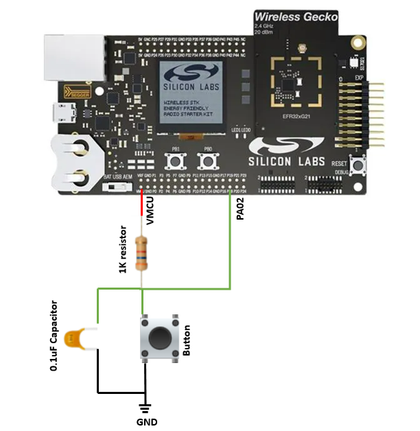

> [!NOTE]
> btn0 and btn1 connect to PD02 and PD03 on BRD4180A, seperately. Pins on port C and port D do not have EM2/3 wake functionality. Thus, it is impossible to use btn0 on the switch to control the light, when the switch stays in EM2. Please change to another pin that connects to port A or B for such a function. For further information, please refer to the schematic of BRD4180A.

## Setup ##

To test this application, you can either create a project based on an example project or start with a "Zigbee - SoC Switch" project based on your hardware.

### Create a project based on an example project ###

> [!NOTE]
> Make sure that the [zigbee_applications](https://github.com/SiliconLabs/zigbee_applications) repository is added to [Preferences > Simplicity Studio > External Repos](https://docs.silabs.com/simplicity-studio-5-users-guide/latest/ss-5-users-guide-about-the-launcher/welcome-and-device-tabs).

1. From the Launcher Home, add your hardware to **My Products**, click on it, and click on the **EXAMPLE PROJECTS & DEMOS** tab. Find the example project filtering by **"sleepy switch"**.

2. Click Create button on the **Zigbee - SoC Sleepy Switch** example. Example project creation dialog pops up -> click Create and Finish and Project should be generated.
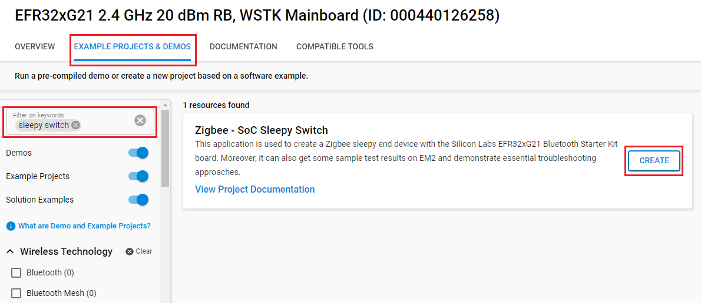

3. Build and flash this example to the board.

### Start with a "Zigbee - SoC Switch" project ###

1. Create a **Zigbee - SoC Switch** project for your hardware using Simplicity Studio 5.

2. Copy all attached files in the inc and src folders into the project root folder (overwriting existing).

3. Copy the `config/zcl/zcl_config.zap` file in this folder into the `config/zcl` folder in the project (overwriting existing).

4. Open the .slcp file. Select the SOFTWARE COMPONENTS tab and change some features in the software components:

    - [Zigbee] → [Utility] → [Zigbee Device Config]: configure to **Sleepy End Device** as below:
    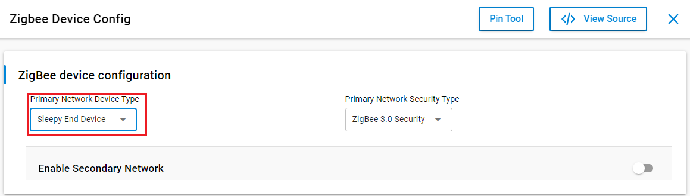

    - [Zigbee] → [Cluster Library] → [ZCL Framework Core]: disable **Enable Command Line for Legacy CLI** as below:
    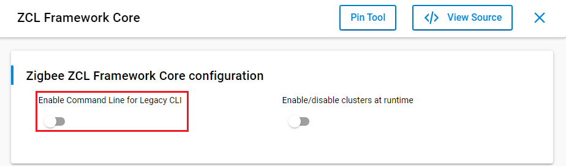

    - [Zigbee] → [Utility] → [Debug Print]: disable some items as below:
    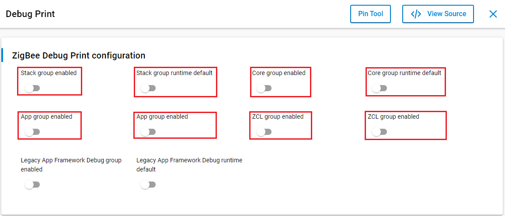

    - [Platform] → [Board] → [Board Control]: disable **Enable Virtual COM UART** as below:
    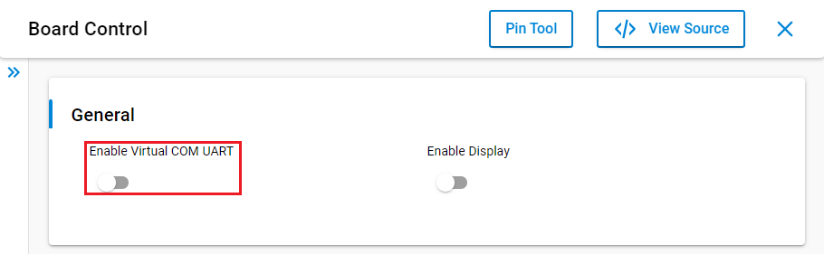

    - [Platform] → [Driver] → [Button] → [Simple Button]: uninstall **btn1** instance and install **btn0** instance, then configure it as below:
    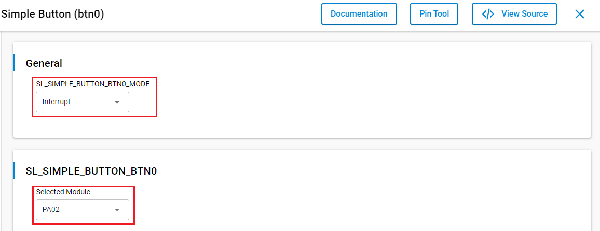

    - [Service] → [Device Initialization] → [Peripherals] → [Energy Management Unit (EMU)]: disable **Allow debugger to remain connected in EM2** as below:
    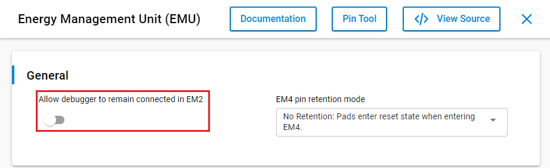

    - [Zigbee] → [Utility] → [Watchdog periodic refresh sample implementation]: configure refresh duration to **5000** as below:
    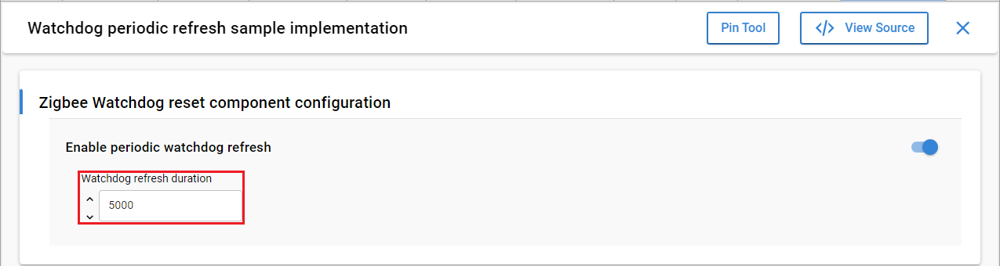

    - [Zigbee] → [Bootloader] → [Zigbee Application Bootloader] → Uninstall

5. Build and flash the project to your device.

## How It Works ##

For functional tests, **btn0** on the switch can be used to start joining an existing network. A centralized network is required. The user can use the "zigbee_z3_gateway" example, the gateway can form a centralized network, and the light and the switch can join the centralized network by performing network steering. The gateway provides CLI commands application interface to the user. The CLI command "plugin network-creator start 1" can be issued to form a centralized network. The gateway application can then be triggered to allow other devices onto the network with the CLI command "plugin network-creator-security open-network".
After joining the network, **btn0** can be used to send a toggle command to control the LED in the light device.

Energy Profiler is used to implement the EM2 current test. In accordance with "AEM Accuracy and Performance" section from [UG172: WGM110 Wizard Gecko Module Wireless Starter Kit User's Guide](https://www.silabs.com/documents/public/user-guides/ug172-brd4320a-user-guide.pdf), when measuring currents below 250 uA, the accuracy is 1 uA. For more precise results, it is necessary to measure the current using a high-accuracy DC analyzer.  

Before current measurement, it is recommended to let the switch join a centralized network with a light, furthermore, use the command "aem calibrate" to run AEM calibration first.

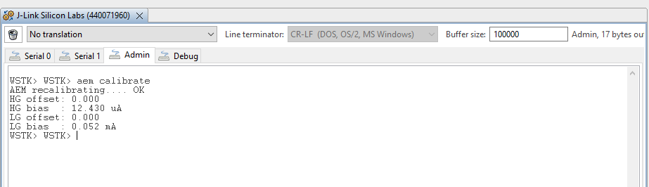

When running **Zigbee - SoC Switch** example without any optimizations, the current of the device is approximately 12.8 mA.

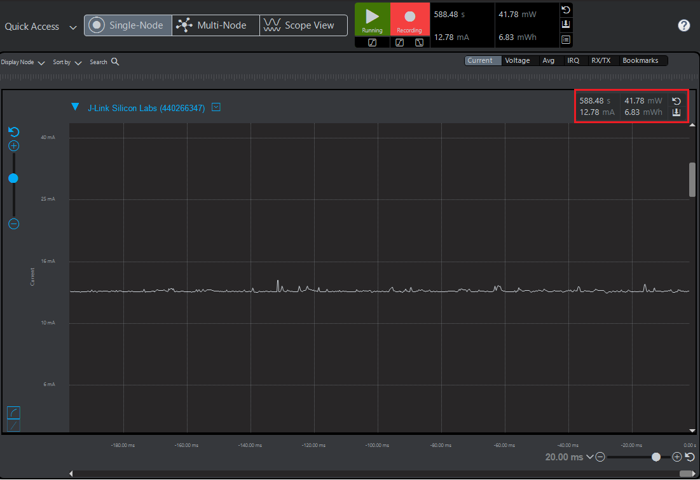

The EM2 current of the switch after optimizing in the screenshot below is about  5.65 uA.

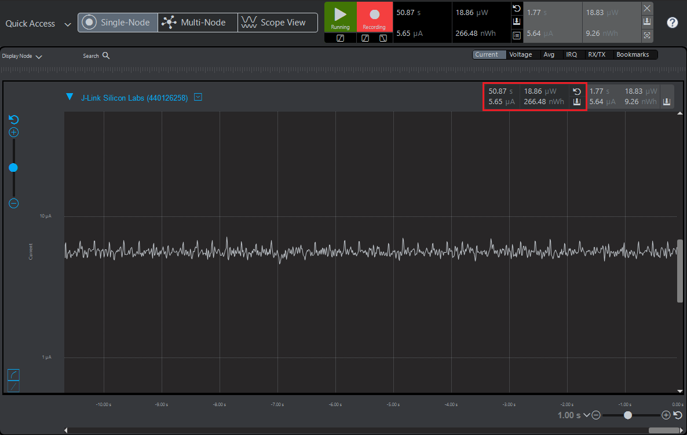
