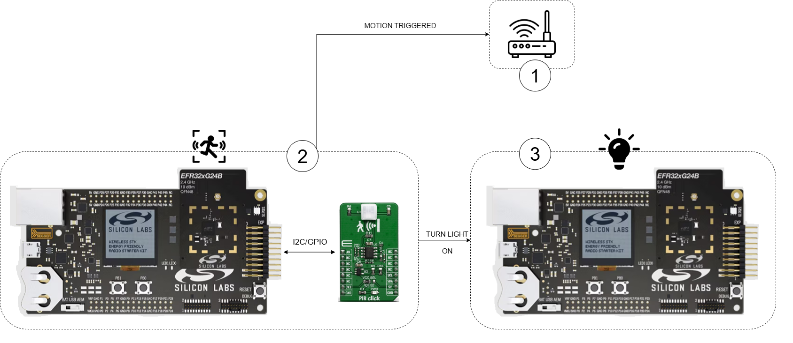
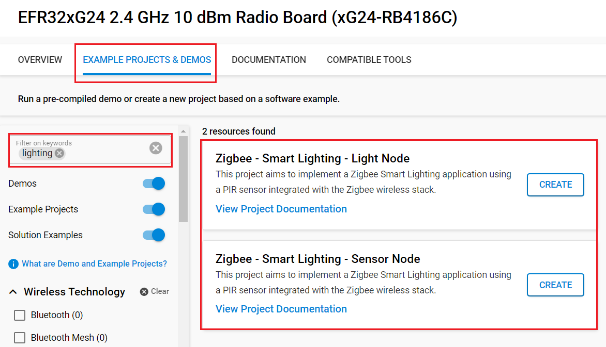
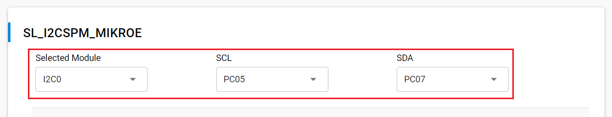
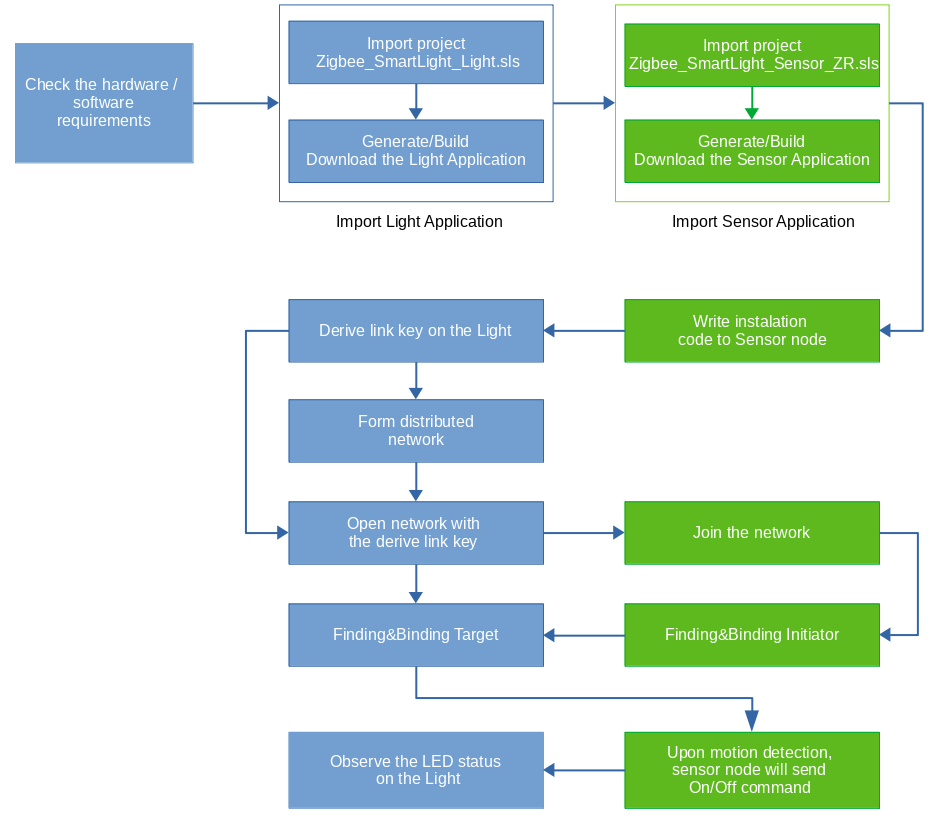

# Zigbee - Smart Lighting With Motion Sensor PIR #


[](https://www.mikroe.com/pir-click)


## Overview ##

This project aims to implement a Zigbee Smart Lighting application using a PIR sensor integrated with the Zigbee wireless stack. The PIR sensor on the PIR Click board reads a voltage when exposed to infrared radiation by ADC and converts it to a scaled value in millivolts (mV). By moving in front of the sensor, you can see how the measured voltage values change. Whenever certain motion of the human body is detected, the system will either turn on the light or the alarm. The setup will have at least 2 nodes, 1 for motion detection, 1 for light control. A Zigbee gateway may be involved.



In figure above, node 1 is the Zigbee Gateway. Node 2 is the motion sensor. Node 3 is the light. Upon motion detection, node 2 will notify the gateway and turn on the light.

## SDK version ##

- [SiSDK v2025.6.2](https://github.com/SiliconLabs/simplicity_sdk/releases/tag/v2025.6.2)
- [Third Party Hardware Drivers v4.4.0](https://github.com/SiliconLabs/third_party_hw_drivers_extension)

## Software Required ##

- [Simplicity Studio v5 IDE](https://www.silabs.com/developers/simplicity-studio)

## Required Hardware ##

For the occupancy sensor node (Node 1):

- 1x [BRD4002A WSTK board](https://www.silabs.com/development-tools/wireless/wireless-pro-kit-mainboard?tab=overview)
- 1x [EFR32xG24 Wireless 2.4 GHz +10 dBm Radio Board](https://www.silabs.com/development-tools/wireless/xg24-rb4186c-efr32xg24-wireless-gecko-radio-board?tab=overview)
- 1x [PIR Click board](https://www.mikroe.com/pir-click) based on a PL-N8230-01 infrared sensor

For the light node (Node 2):

- 1x [BRD4002A WSTK board](https://www.silabs.com/development-tools/wireless/wireless-pro-kit-mainboard?tab=overview)
- 1x [EFR32xG24 Wireless 2.4 GHz +10 dBm Radio Board](https://www.silabs.com/development-tools/wireless/xg24-rb4186c-efr32xg24-wireless-gecko-radio-board?tab=overview)

## Hardware Connection ##

We can use some [Wire Jumpers Female to Female](https://www.mikroe.com/wire-jumpers-female-to-female-30cm-10pcs) to connect between Silicon Labs board and the PIR Click board as shown below.

  | Description  | BRD4186C + BRD4002A  | PIR Click          |
  | -------------| -------------------- | ------------------ |
  | I2C_SDA      | ULP_GPIO_6 [EXP_16]  | SDA                |
  | I2C_SCL      | ULP_GPIO_7 [EXP_15]  | SCL                |
  | GND          | GND [EXP_1]          | GND                |
  | 3V3          | 3V3 [EXP_20]         | 3V3                |

## Setup ##

You can either create a project based on an example project or start with a 'Zigbee - Minimal' example project.

> [!NOTE]
> Make sure that the [Third Party Hardware Drivers extension](https://github.com/SiliconLabs/third_party_hw_drivers_extension) is installed as part of the SiSDK and the [zigbee_applications](https://github.com/SiliconLabs/zigbee_applications) repository is added to [Preferences > Simplicity Studio > External Repos](https://docs.silabs.com/simplicity-studio-5-users-guide/latest/ss-5-users-guide-about-the-launcher/welcome-and-device-tabs).

### Create a project based on an example project ###

1. From the Launcher Home, add the BRD4186C to My Products, click on it, and click on the **EXAMPLE PROJECTS & DEMOS** tab. Find the example project filtering by "lighting".

2. Click **Create** button on the examples: **Zigbee - Smart Lighting - Light Node** and **Zigbee - Smart Lighting - Sensor Node**. Example project creation dialog pops up -> click Create and Finish and Project should be generated.


3. Build and flash these examples to the boards.

### Start with a Zigbee - Minimal example project ###

#### Zigbee - Smart Lighting - Sensor Node ####

1. Create a "Zigbee - Minimal" project for the "EFR32xG24 Radio Board (BRD4186C)" using Simplicity Studio v5. Use the default project settings.

2. Copy the files from the `zigbee_smart_lighting_sensor/src` folder into the project root folder (overwriting existing files).

3. Copy the `zigbee_smart_lighting_sensor/config/zcl/zcl_config.zap` file into the `config/zcl` folder of project (overwriting existing zcl_config.zap).

4. Open the .slcp file. Select the **SOFTWARE COMPONENTS** tab and install the software components:

   - [Application] → [Utility] → [Timer]
   - [Platform] → [Driver] → [I2CSPM] → use the instance: mikroe → Configure this component as below:
   
   - [Third Party Hardware Drivers] → [Sensor] → [PL-N823-01 - PIR Click (Mikroe)]
   - [Platform] → [Driver] → [LED] → [Simple LED] → use the default instances name: **led0** and **led1**
   - [Platform] → [Driver] → [Button] → [Simple Button] → use the default instances name: **btn0** and **btn1**
   - [Platform] → [Driver] → [GLIB Graphics Library]
   - [Services] →  [IO Stream] → [IO Stream: USART] → use the default instance name: vcom
   - [Zigbee] → [Cluster Library] → [Common] → [Basic Server Cluster]
   - [Zigbee] → [Cluster Library] → [Common] → [Reporting]
   - [Zigbee] → [Stack] → [Pro Core] → [Pro Stack (Common)] → Uninstall
   - [Zigbee] → [Stack] → [Pro Core] → [Pro Leaf Stack]
   - [Zigbee] → [Stack] → [Source route]
   - [Zigbee] → [Utility] → [Application Framework Common]
   - [Zigbee] → [Utility] → [End Device Support]
   - [Zigbee] → [Utility] → [Zigbee Device Config] → Change 'Primary Network Device Type' to 'Sleepy End Device'
   - [Zigbee] → [Utility] → [Interpan]
   - [Zigbee] → [Zigbee 3.0] → [Find and Bind Initiator] 
   - [Zigbee] → [Zigbee 3.0] → [Network Steering]
   - [Zigbee] → [Zigbee 3.0] → [Update TC Link Key]
   - [Zigbee] → [Bootloader] → [Zigbee Application Bootloader] → Uninstall

5. Build and flash the project to your board

#### Zigbee - Smart Lighting - Light Node ####

1. Create a "Zigbee - Minimal" project for the "EFR32xG24 Radio Board (BRD4186C)" using Simplicity Studio v5. Use the default project settings.

2. Copy the files from the `zigbee_smart_lighting_light/src` folder into the project root folder (overwriting existing files).

3. Copy the `zigbee_smart_lighting_light/config/zcl/zcl_config.zap` file into the `config/zcl` folder of project (overwriting existing zcl_config.zap).

4. Open the .slcp file. Select the **SOFTWARE COMPONENTS** tab and install the software components:

   - [Platform] → [Driver] → [LED] → [Simple LED] → use the default instances name: **led0** and **led1**
   - [Platform] → [Driver] → [Button] → [Simple Button] → use the default instance name: **btn0**
   - [Services] →  [IO Stream] → [IO Stream: USART] → use the default instance name: vcom
   - [Zigbee] → [Cluster Library] → [Common] → [Basic Server Cluster]
   - [Zigbee] → [Cluster Library] → [Common] → [Reporting]
   - [Zigbee] → [Stack] → [Pro Core] → [Pro Stack]
   - [Zigbee] → [Stack] → [Source route]
   - [Zigbee] → [Stack] → [Security Link Keys]
   - [Zigbee] → [Utility] → [Application Framework Common]
   - [Zigbee] → [Utility] → [Interpan]
   - [Zigbee] → [Utility] → [Zigbee Device Config] → Change 'Primary Network Device Type' to 'Coordinator or Router'
   - [Zigbee] → [Zigbee 3.0] → [Find and Bind Target]
   - [Zigbee] → [Zigbee 3.0] → [Network Steering]
   - [Zigbee] → [Zigbee 3.0] → [Update TC Link Key]
   - [Zigbee] → [Zigbee 3.0] → [Network Creator]
   - [Zigbee] → [Zigbee 3.0] → [Network Creator Security]
   - [Zigbee] → [Cluster Library] → [Home Automation] → [On/Off Server Cluster]
   - [Zigbee] → [Zigbee Light Link] → [ZLL Identify Server]
   - [Zigbee] → [Bootloader] → [Zigbee Application Bootloader] → Uninstall

5. Build and flash the project to your board

## How It Works ##

The gateway provides CLI commands application interface to the user

- To form a centralized network:

  ```bash
  plugin network-creator start 1
  ```

- To allow other devices onto the network:

  ```bash
  plugin network-creator-security open-network
  ```

- To close the network and no longer allow devices onto the network of the gateway:

  ```bash
  plugin network-creator-security close-network
  ```

Devices can then join the network by manually entering the install code derived link key into the gateway using the CLI command:

```bash
plugin network-creator-security set-joining-link-key
```

The light board provides a very simplistic user interface. On power up, the light will perform network steering automatically. If the light does not find a suitable network to join, it forms its own distributed network. The light will not open its network for joining as soon as the network comes up, so this must be done manually. Once a distributed network is formed and opened, the sensor may join its network by performing network steering itself. Once the light is on a network, it will set its built-in LED #0. When the light starts identifying as a find and bind target, it will blink its built-in LED #0. The light will start identifying as a find and bind target automatically when it brings its network up, but users can reopen the find and bind target window by pushing button PB1 on the light at any time when it is on a network. LED #1 is used as a simulative light. The state of light is depended on state of motion sensor on the sensor device.

The occupancy sensor board provides a simple application interface to the user. When the sensor is not on a network, it can initiate network steering to join a network using button PB1. After the sensor has successfully joining a network, it will perform the finding and binding procedure for an initiator. After this takes place, the sensor should have at least a binding to the light in its binding table for the On/Off cluster. While the sensor is performing its network commissioning, it will blink its LED #0. When the sensor is active on the network, it will set its LED #0. Once the sensor has finished finding and binding, if motion is detected, on/off cluster command is sent to the light. Users can reopen the commisioning mode by pushing button PB1 on the sensor board at any time when it is on a network. Button PB0 can be used to change the state of the motion sensor. The button behaves as a toggle, swapping the state every time it is pressed. Built-in LCD is used to displayed current state of the motion sensor is enabled or disabled. LED D1 on Occupancy Sensor Kit shows the state of motion detected. Two states are depicted:

- Solid On: The motion is detected.
- Off: The motion isn’t detected or the sensor is disabled.

The current debug printing settings in these applications are only for the purpose of aiding users in understanding and debugging this sample scenario. Debug printing should be turned off in order to save code size on a final product.

### Setup steps for a network without the gateway ###

The figure below illustrates the working flow for the network with 2 nodes: a light and an occupancy sensor



Make sure both devices are not on any network. Go to the CLI for both and enter the command:

```
network leave
```

This tells the device to invoke the network command to leave the current network. The output similar to the following:

```
NWK Steering: Start: 0x91  
Join network start: 0x91  
EMBER_NETWORK_DOWN  
NWK Steering stack status 0x91
```

**Putting the install code on the sensor**  
The install code itself is a random value installed on the joining device at manufacturing time and is used to encrypt the initial network key transport from the coordinator to the joining device, via an unique link key. To emulate this, we are going to use commander to flash the install code onto our board. We have included a file install.txt on this page to give you an install code to work with for this example. While you can use any code you want, this code matches the commands you will see in this example and will allow you to easily follow along with our example. To install this via commander, use this command:

```
commander flash --tokengroup znet --tokenfile install.txt --device efr32mg24b
```

Here is a sample install code file. The CRC for that code is 0xB5C3 and is not included in the file.  

```
Install Code: 83FED3407A939723A5C639B26916D505  
```

Once you have flashed the install code, you can check that it was stored correctly with the following command:

```
commander tokendump --tokengroup znet --device efr32mg24b
```

Near the bottom, that the install code is stored on your device:

```
#’MFG_INSTALLATION_CODE (Smart Energy Install Code)' token group  
# Install Code Flags : 0x0006  
Install Code       : 83FED3407A939723A5C639B26916D505  
# CRC                : 0xB5C3  
```

**Start commissioning proceduce on the light**  
Reset the light by manually press RESET button or enter the command to CLI:

```
reset
```

After reseting, the light's output similar to the following:

```
Reset info: 0x06 ( SW)  
Extended Reset info: 0x0601 (RBT)  
init pass  
NWK Steering: issuing scan on primary channels (mask 0x0318C800)  
NWK Steering: Start: 0x00  
Join network start: 0x00  
NWK Steering scan complete. Beacons heard: 0  
NWK Steering: issuing scan on secondary channels (mask 0x04E73000)  
NWK Steering scan complete. Beacons heard: 0  
NWK Steering Stop.  Cleaning up.  
Join network complete: 0xAB  
Form network start: 0x00  
Scan complete. Channel: 255. Status: 0x00  
Energy scan results.  
NWK Creator: Channel: 11. Rssi: -53  
Energy scan results.  
NWK Creator: Channel: 15. Rssi: -58  
Energy scan results.  
NWK Creator: Channel: 20. Rssi: -74  
Energy scan results.  
NWK Creator: Channel: 25. Rssi: -82  
Scan complete. Channel: 0. Status: 0x00  
NWK Creator Security: Start: 0x00  
EMBER_NETWORK_UP 0xFCEF  
NWK Steering stack status 0x90  
NWK Creator: Form. Channel: 15. Status: 0x00  
Form distributed network complete: 0x00  
NWK Creator: Stop. Status: 0x00. State: 0x00  
Find and Bind Target: Start target: 0x00  
Find and bind target start: 0x00  
```

**Joining the sensor board to the network**  
From the light’s CLI, we are going to tell the light the EUI64, the install code and the CRC of the sensor, from this information it will hash out the sensor link key. To do this, enter the following on the sensor’s CLI:

```
option install-code <link key table index> {<Joining Node's EUI64>} {<16-byte install code + 2-byte CRC>}  
```

For example:

```
option install-code 0 {58 8E 81 FF FE 72 F8 80} {83 FE D3 40 7A 93 97 23 A5 C6 39 B2 69 16 D5 05 C3 B5}
```

If this command works correctly, you should see the following:

```
Success: Set joining link key
```

From this we will then get our new link key from the key table. This is done from the CLI entering:

```
keys print
```

This command displays most of the security information for our network. What you are looking for on this display is the key table, which should display information like this:

```
Transient Key Table
Index IEEE Address         In FC     TTL(s) Flag    Key    
0     (>)588E81FFFE72F880  00000000  0x0122 0x0000  66 B6 90 09 81 E1 EE 3C  A4 20 6B 6B 86 1C 02 BB  
```

Open the network for joining and provide the link key of the joining device:

```
plugin network-creator-security open-with-key {58 8E 81 FF FE 72 F8 80} {66 B6 90 09 81 E1 EE 3C  A4 20 6B 6B 86 1C 02 BB}
```

From the sensor’s CLI, start joining the network:

```
plugin network-steering start 0
```
